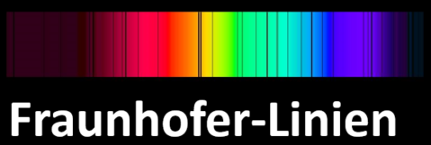
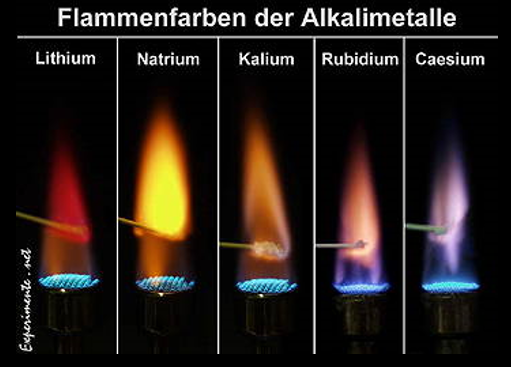
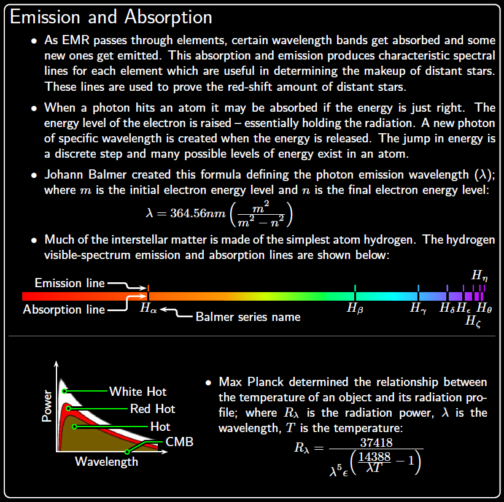
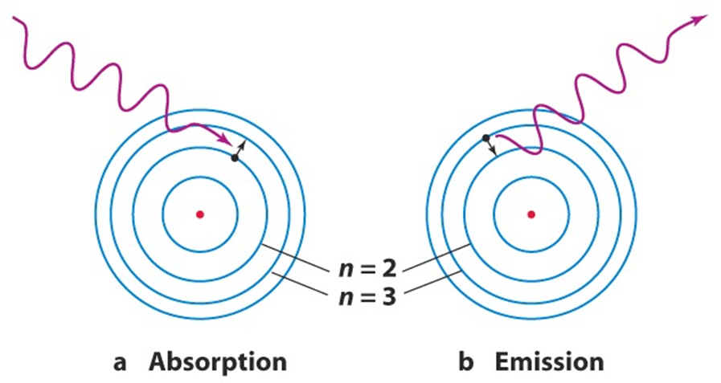

---
tags:
  - Chemie/Anorganisch
aliases:
  - Licht
subject:
  - chemie
source:
  - Fritz Struber
created: 25th August 2022
---

# Spektralanalyse

## Entstehung Eines Spektrums

Beim Zerlegen von Sonnenlicht oder dem Licht einer Glühlampe durch ein Glasprisma, erhält man ein **Spektrum**:  
Ein Farbband von Rot nach Violett  
  
Weißes Licht besteht aus der Mischung mehrerer Farben

Kurzwelliges Licht wird im Prisma Stärker gebrochen als langwelliges.  
Daher kann Sonnenlicht in seine Wellenanteile zerlegt werden.

Jede Farbe entspricht einer bestimmten **Wellenlänge** und einem bestimmten **Energieinhalt**.

Rotes Licht ist langwellig und energiearm.  
Violettes/Blaues Licht ist kurzwellig und energiereich.

## Elektromagnetisches Spektrum

## Spektrum Des Sonnenlichts

### Prismen-Spektroskop

>  
> Fraunhofer untersuchte das Sonnenlicht mit einem Prismen-Spektroskop.  
> Der Physiker beobachtete im Jahr 1814 dunkle Linien im Spektrum des Sonnenlichts. Fraunhofer katalogisierte 570 Fraunhofer-Linien.  
> Allerdings konnte er das Phänomen noch nicht erklären.

### Spektroskop Nach Kirchhoff Und Bunsen

  
  
**Funktionsweise:**
- Das Licht fällt durch einen Spalt in das **Spaltrohr** über eine Linse auf ein Prisma. Der Durchmesser des Spalts kann variiert werden.
- Am Prisma werden die Wellenanteile des Lichts unterschiedlich gebrochen.
- Sie gelangen in das verstellbare **Beobachtungsrohr**, wo durch ein optisches System mit Linsen und Okular ein scharfes Bild erzeugt wird.
- Das Skalenrohr projiziert eine Skala in den **Strahlengang**, mit der die Wellenlängen ablesbar sind.

### Zusammenhang Mit Den Chemischen Elementen

  
Kirchhoff und Bunsen beobachteten, dass bestimmte chemische Elemente die Gasflammen eines Gasbrenners färben.  
Sie konnten nachweisen, dass die von Fraunhofer beschriebenen schwarzen D-Linien im Sonnenspektrum bei etwa 589 Nanometer mit der von Natriumsalzen in der Flamme emittierten gelben Linie übereinstimmt.  
Die beiden Chemiker entwickelten 1859 das erste spektralanalytische Verfahren.  
Mit Hilfe dieses Verfahrens entdeckten sie die bis dahin unbekannten Elemente Rubidium und Cäsium.

## Absorption Und Emission

  

1. Wird einem Atom **Energie zugeführt** (Flamme, Lichtbogen), können Elektronen auf **höhere Energieniveaus** gehoben werden.
2. Es entsteht ein angeregter Zustand. Er ist nur **kurz** beständig, danach fällt das Elektron wieder in den **Grundzustand** zurück.
3. Dabei wird die **Energie**, die bei der Anregung **aufgenommen** (absorbiert) wurde, **in Form von Licht abgegeben** (emittiert).
4. Da bei jedem Element nur ganz bestimmte Energiedifferenzen zwischen den [Schalen](Orbitalmodell.md) vorkommen, emittiert jedes Element Licht ganz bestimmter Farbe.

### Spektren Typen

  
Kontinuierliches Spektrum: Enthält keine diskreten Linien (Banden), da es Licht aller Wellenlängen aufweist.

Emissionsspektrum: Enthält diskrete Linien (daher auch Linien-spektrum) , welche durch den Elektronenübergang von angeregten Atomen in den Grundzustand entstehen.

Absorptionsspektrum: Entsteht wenn Atome dem eingestrahlten Licht Energie entnehmen, um in den angeregten Zustand überzugehen. Die Farbe, deren Energie zur Anregung geeignet ist wird dabei geschwächt.

---

# Tags