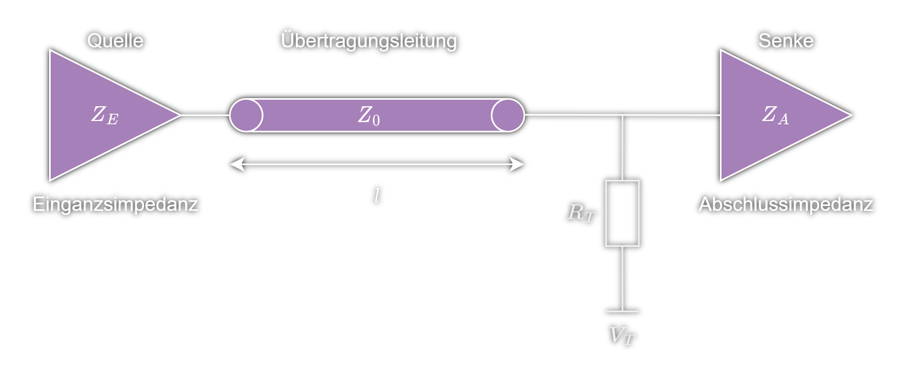

# Impedanz
 
# Abschlussimpedanz

> [!IMPORTANT] Für hochfrequente Logik-Signale ([elektrisch kurz](../HF-Technik/Leitungstheorie.md) im vergleich zur Flankenanstiegszeit) führen Fehlanpassungen an einer der Impedanzen $Z_{S}$, $Z_{0}$ bzw. $Z_{L}$ zu [Reflexionen](../HF-Technik/Reflexionsfaktor.md).
> Probleme:
> - Overshoot oder Undershoot durch [Reflexionen](../HF-Technik/Reflexionsfaktor.md)
> - Signalintegritätsprobleme ([SI](Signalintegrität.md)) (Logik-Schwellen, Überschreitung von maximum ratings)
> - Probleme mit [EMV](Elektromagnetische%20Verträglichkeit.md) (erhöhte Frequenzanteile, Abstrahlungen)

> [!INFO] Eine Anpassung der [Leitungstheorie](../HF-Technik/Leitungstheorie.md) unterdrückt diese Probleme
> Leitungen können länger sein
> Die Datenrate kann erhöht werden
> Bessere [SI](Signalintegrität.md) und [EMC](Elektromagnetische%20Verträglichkeit.md)

> [!WARNING] Es gibt verschiedene Arten von Abschlussanpassung:
> - Seriell (Widerstand am Ausgang der Quelle (Treiber))
> - Parallel (Widerstand parallel zur Senke, Verbunden mit einer *Terminationvoltage* oder Masse)
> - weitere: AC parallel, Thevenin, [Diode](Halbleiter/Diode.md)

## Paralleler Abschlusswiderstand

> [!INFO] Oft ist die Impedanz der Quelle und der Leitung niedrig ($10\Omega-100\Omega$) gegenüber der Abschlussimpedanz ($>1000\Omega$)
> Ohne Maßnahmen treten Reflexionen in hohem Maße auf

> [!CHECK] TL wird an der Quell-Seite mit einem parallelen Abschlusswiderstand $R_{T}$ terminiert. 
> Der Widerstand wird so gewählt dass: $Z_{A}\mid\mid R_{T} = Z_{0}$.
> Aufgrund der hohen Impedanz der Last gilt: $R_{T}\approx Z_{0}$ (kleinere Widerstände dominieren in Parallelschaltungen)
> Widerstand absorbiert die Reflektierte Energie
> 

> [!QUESTION] Wann wird ein paralleler Abschluss benötigt?
> Flankenanstiegszeiten beachten
> Ist die Leitung elektrisch lang?
> Anwendungen:
> - DDR ($V_{TT}$ Abschluss)
> - CAN (Split-Parallelabschluss)
> - LVDS

> [!BUG] Nachteile
> - Die Quelle stark genug sein das Signal an der Last, sowie die abfallende Leistung an $R_{T}$  zu versorgen.
> - Wenn die Quelle im passiven Zustand eine Spannung $\neq V_{T}$ ausgibt wird 

## Serieller Abschlusswiderstand

# Tags

[Induktivitäten](Induktivitäten.md)

[Kapazität](Kapazität.md)

