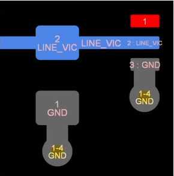
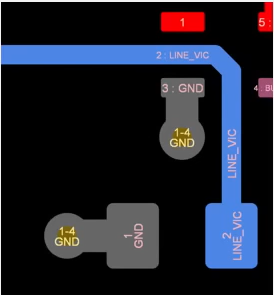

# Paralleler Abschlusswiderstand

> [!INFO] Oft ist die Impedanz der Quelle und der Leitung niedrig ($10\Omega-100\Omega$) gegenüber der Abschlussimpedanz ($>1000\Omega$)
> Ohne Maßnahmen treten Reflexionen in hohem Maße auf

> [!CHECK] Transmissionline (TL) wird an der Quell-Seite mit einem parallelen Abschlusswiderstand $R_{T}$ terminiert. 
> Der Widerstand wird so gewählt dass: $Z_{A}\mid\mid R_{T} = Z_{0}$.
> Aufgrund der hohen Impedanz der Last gilt: $R_{T}\approx Z_{0}$ (kleinere Widerstände dominieren in Parallelschaltungen)
> Widerstand absorbiert die Reflektierte Energie
> 

> [!QUESTION] Wann wird ein paralleler Abschluss benötigt?
> Flankenanstiegszeiten beachten
> Ist die Leitung elektrisch lang?
> Anwendungen:
> - DDR ($V_{TT}$ Abschluss)
> - CAN (Split-Parallelabschluss)
> - LVDS

> [!BUG] Nachteile
> - Die Quelle stark genug sein das Signal an der Last, sowie die abfallende Leistung an $R_{T}$  zu versorgen.
> - Wenn die Quelle im passiven Zustand eine Spannung $\neq V_{T}$ ausgibt wird passiv Strom verbraucht.
> - Große parallele Busse (z.B. DDR) die für jede Leitung einen $R_{T}$ benötigen:
> 	- Obere Aspekte haben stärkeren Einfluss
> 	- komplexes Routing
> 	- benötigt viel Platz

> [!TIP] Tips
> - $V_{TT}$ wählen, dass wenig Leistung wie möglich verschwendet wird.
> - Toleranz bei $Z_{0}$ ($5\%, 10\%$) beachten
> - Toleranz bei $R_{T}$ ($1\%, 10\%$) beachten
> - Um Undershoot ($R_{T}<Z_{0}$) zu vermeiden $\to$ *$R_{T}$ $10\%$ höher als $Z_{0}$ wählen*

## PCB Layout

|            Routing            |                               |                                     |
|:-----------------------------:|:-----------------------------:|:-----------------------------------:|
|  |  |  |
|                               |                               |                                     |
