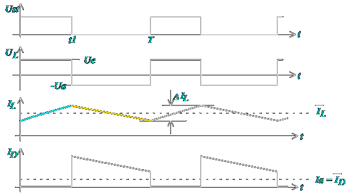
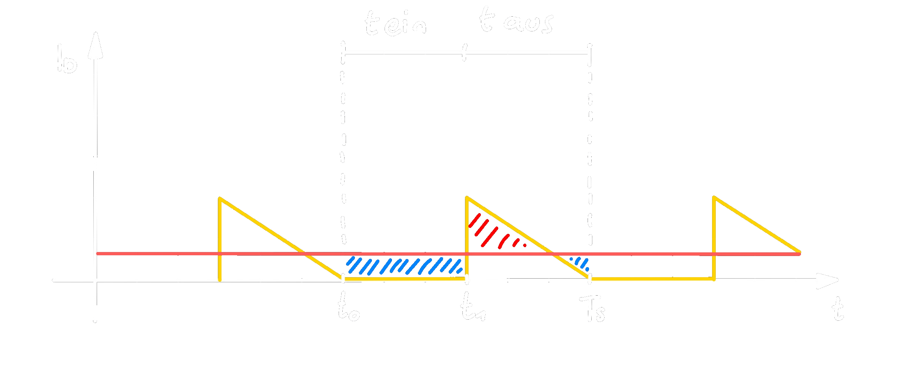

# Inverswandler

- Der Inverswandler arbeitet nach dem [Sperrwandler](Sperrwandler.md)-Prinzip
- Die Ausgangsspannung $U_{e}$ kann größer oder kleiner als $U_{e}$ sein.

## Schaltbild

Der [Transistor](../Halbleiter/{MOC}%20Transistor.md) arbeitet als Schalter ($S$) der mittels PWM ($U_{st}$) angesteuert wird.  
Dabei wird eine $U_{a}$ mit umgekehrtem Vorzeichen zur Eingangsspannung erzeugt.

## Lauf-Zeit-Diagramm

> $\Delta I_{L1}$  
> $\Delta I_{L2}$ 

### Kontinuierlicher Betrieb

> $I_{a,max}$ = $\overline{I_{D}}$ 

### Diskontinuierlicher Betrieb

> $I_{a,min}$ = $\overline{I_{D}}$ 

## Schalter $S$ bzw. [Transistor](../Halbleiter/{MOC}%20Transistor.md) $T$

### Herleitung der Dimensionierung

#### $0<t<t_{1}$: $S_{geschlossen}$

$$
\begin{align*}
\Delta I_{L1} &= \frac{1}{L}\int^{t_{1}}_{0}{U_{e}dt}\\
&= \frac{1}{L}\cdot U_{e}\cdot t_{1} \qquad (1)
\end{align*}
$$

#### $t_{1} < t < T_{S}$: $S_{offen}$

$$
\begin{align*}
\Delta I_{L2} &= \frac{1}{L} \int^{T_{s}}_{t_{1}}{(-1)\cdot (-U_a+U_{Fo})dt}\\
&=-\frac{1}{L}\cdot (U_{a}+U_{Fo})(T_{s}-t_{1})\qquad (2)
\end{align*}
$$

#### $\Delta I_{L1}= -\Delta I_{L2}$

$$
\begin{align*}
\frac{1}{L}\cdot U_{e}\cdot t_{1} &= \frac{1}{L}\cdot (-U_{a}+U_{Fo})(T_{s}-t_{1})\\
&\dots\\
&U_{a}\approx -U_{e} \frac{t_{1}}{T_{s}-t_{1}} 
\end{align*}
$$

## [Induktivität](../../Elektrodynamik/Induktivitäten.md)

Gleich wie beim Boost Converter: $\rightarrow$ [Induktivität](Boost%20Converter.md#[Induktivität](../Induktivitäten.md))

## [Kapazität](../../Elektrodynamik/Kapazität.md)

Gleich wie beim Boost Converter: $\rightarrow$ [Kapazität](Boost%20Converter.md#[Kapazität](../Kapazität.md))

---

# Tags

