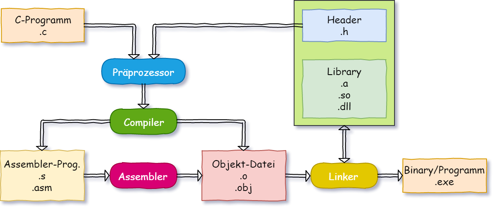

# Module

In größeren Projekten ist es unumgänglich Software in Teile aufzuteilen, die Gründe dafür sind:

- Arbeiten in Teams sind mit einer einzelnen Quellcodedatei nicht möglich
- Übersichtlichkeit
- Wiederverwendbarkeit/Wartbarkeit ist einfacher mit kleineren Teilen
- Verarbeitung (Editieren und Compilieren) ist aufwendiger (ein Softwarebuild kann in großen Projekten viele Stunden dauern)

In C werden Programme daher in sogenannte Module aufgeteilt.

- Ein Modul besteht aus Daten und Funktionen (in einer hund einer c-Datei)
- Eine Applikation (Programm) besteht aus den notwendigen Modulen.

Um Funktionen verwenden zu können, muss ein Prototyp vor der Verwendung definiert werden. Ist die Funktion in einer anderen c-Datei (Modul). Um den Prototypen vor das aufrufende Programm zu setzen wird er in der *h-Datei* der Funktion definiert und über ein *include* eingebunden (Die `#include` Direktive kopiert die Datei einfach an der entsprechenden Zeile ein).

## Ein Beispiel

### Code

Die Datei `func.c` stellt die Funktion `myFunc()` zur Verfügung:

```c
#include <stdio.h>

void myFunc() {
	printf("Hallo aus myFunc!");
}
```

Um aufrufenden Funktionen einen geeigneten Prototypen zur Verfügung zu stellen, wird dieser mit der Header-Datei `func.h` zur Verfügung gestellt:

```c
#ifndef FUNC_H_INCLUDED		// wenn FUNC_H_INCLUDED noch nie definiert wurde weiter, sonst #endif
#define FUNC_H_INCLUDED		// beim ersten Aufruf wird hier FUNC_H_INCLUDED definiert

void myFunc();

#endif // FUNC_H_INCLUDED	// Ende der Verzweigung
```

Die Präprozessoranweisungen werden von Codeblocks (und anderen IDEs) automatisch eingefügt und sind notwendig um ein doppeltes Einbinden zu unterdrücken. Die beiden *func*-Dateien bilden gemeinsam das *func*-Modul.

Diese h-Datei wird vom aufrufenden Modul mit eingebunden, hier zum Beispiel in einem `main.c`:

```c
#include <stdio.h>
#include <stdlib.h>
#include "func.h"

int main() {
    myFunc();
    return 0;
}
```

An der Stelle `#include "func.h"` wird der Inhalt der Datei einkopiert, womit der Prototyp an dieser Stelle landet. Für eigene h-Dateien wird der Name unter Anführungsstriche gesetzt, wohingegen System-h-Dateien von spitzen Klammer umschlossen werden. Mit spitzen Klammern umschlossene h-Dateien werden vom Compiler im Pfad der Standardbibliotheken gesucht, jene unter Anführungsstrichen werden zuerst im Pfad des Programms gesucht.

### Programmerstellung

Üblicherweise kommen Entwicklungsumgebungen automatisch mit obigen Dateien zurecht. Soll das Programm in der Kommandozeile erzeugt werden dann sind folgende Anweisungen notwendig:

```
>gcc -c func.c

>gcc -c main.c

>gcc main.o func.o -o myProg.exe
```

Wird anschließend lediglich in der func.c etwas geändert, dann muss die main.c Datei nicht mehr kompiliert werden. Die neu kompilierte func.o muss lediglich mit main.o zusammen-gelinkt werden.

### Bibliothek-Erstellung

Soll der Code als Bibliothek anderen Anwendungen zur Verfügung gestellt werden, dann muss diese explizit erstellt werden. Es wird unterschieden zwischen statischen (Bibliotheken, die mittels Linker zur Anwendung gelinkt werden) und dynamischen Bibliotheken (die Bibliotheken werden zur Laufzeit der Anwendung aufgerufen).

### Linux

Wir wollen unsere *myFunc* Funktion in einer Bibliothek zur Verfügung stellen (Object-File *func.o* muss schon vorhanden sein) (ar=archive, ähnlich tar):

```
>ar r libfunc.a func.o
ar: creating libfunc.a
```

Erstellen eines Index innerhalb der Bibliotheksdatei (damit die Funktionen gefunden werden können):

```
>ranlib libfunc.a
```

Anstatt der Object-Datei kann nun die Bibliothek zu unser main gebunden werden:

```
>gcc main.o -L. -lfunc.a -o myProg.exe
```

Der Parameter `-L `gibt den Suchpfad für die Bibliothek an (. = aktueller Pfad). `-lfunc.a` gibt den Bibliotheksnamen an (die UNIXund die Windows-Varianten unterscheiden sich hier ein wenig, für die Libs müssen oft die Switches -l vor *func* eingefügt werden, dafür darf .a nicht dabeistehen). Das oben vorn angestellte *lib* kann entfallen, es wird vorausgesetzt.

## Module



- Cund ein H-Quelldateien werden mittels Präprozessor und Compiler als Objekt-Dateien erstellt
- Ein Linker erzeugt daraus das Binary - das ausführbare Programm
- Der Weg über ein Assembler-Programm und den Assembler ist eine mögliche Variante, die vielfach nicht zur Anwendung kommt.
- Der Linker bindet eventuell notwendige (statische) Bibliotheken zu den Objekt-Dateien. Wenn das Programm aus mehreren C-Dateien besteht, dann werden auch diese an dieser Stelle zusammengebunden.

- Die Einzelnen Schritte können durch die verfügbaren Tools vielfach auch als ein einzelner Schritt ausgeführt werden. Das Tool führt die Schritte dann eben intern aus.

### Windows-DLL (320)

In Windows-Systemen können Bibliotheksfunktionen mittels DLLs dynamisch eingebunden werden. Unter dynamisch ist zu verstehen, dass die Funktionen nicht Teil des ausführbaren Binaries sind, sondern in einer separaten Datei abgelegt sind. Das hat die Vorteile

- Code-Teile können verändert werden, ohne das Programm neu kompilieren zu müssen
- Code-Teile können von verschiedenen Programmen ausgeführt werden und müssen nur einfach im Speicher vorhanden sein (gerade für kleine, leistungsschwache entscheidend)

Nachteilig ist hingegen, dass das Programm nicht ausführbar ist, wenn die Bibliotheksfunktion nicht/nicht mehr verfügbar ist.

#### Erzeugen

In der H-Datei *func.h* wird der Prototyp und in der C-Date *func.c* wird dazu angegeben:

```c
__declspec(dllexport) int myFunc(int a, int b);
```

Mit *dllexport* wird angegeben, dass diese Funktion nach außen verfügbar ist. Die Datei muss dazu nicht explizit eine main()-Funktion haben.

Erstellen der Bibliothek *mylib.dll*:

```
gcc -c func.c -o func.o
gcc -shared -o mylib.dll func.o
```

Testen ob die Erstellung funktioniert hat:

```
rundll32.exe mylib.dll myFunc 23,12
```

#### Verwenden

Bei der Verwendung von Funktionen aus der DLL ist lediglich die H-Datei zu inkludieren.

```c
#include "func.h"
...
int res = myFunc(3,4);
```

Beim Linken muss die DLL dann mit eingebunden werden:

```
gcc -c main.c -o main.o
gcc -o out main.o -L. -lmylib
```

mit dem Argument `-L` kann ein Suchpfad für eine Bibliothek angegeben werden (hier das aktuelle Verzeichnis) und mit `-l` wird der Name der Bibliothek angegeben, oben wurde ja die Bibliothek `mylib.dll` erzeugt.  
Zur Ausführung des erzeugten Programms, muss dann ebenfalls die DLL verfügbar sein.

## Fragen

- Wofür werden Module in C benötigt?
- Woraus bestehen Module in C?
- Warum soll der Prototyp in einer eigenen h-Datei stehen?
- Wofür werden Makefiles benötigt?

---

- [Makefile](Makefile.md)
- [CMake](CMake.md)