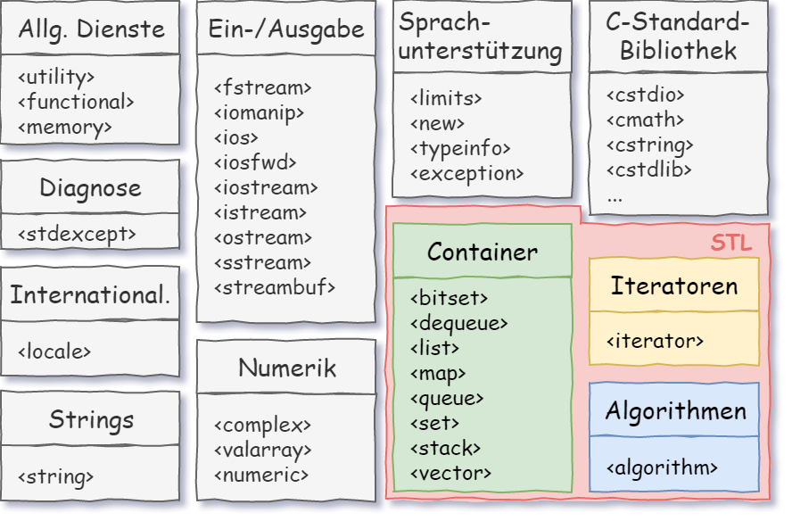

---
tags:
  - Cpp/STL
aliases:
  - STL
  - Standard Template Library
created: 29. November 2022
---

# STL - Standard Template Library

Häufig verwendete Funktionen wurden in dieser Bibliothek erstellt und, weil sinnvoll, in den ANSI/ISO Standard übernommen:

- Datenstrukturen/**Container** und Algorithmen

Die Container und Algorithmen sind im Standard-Namespace *std* definiert. Die folgenden Vorgaben wurden getroffen:

- möglichst für alle Datentypen verfügbar (**generisch** - Realisierung mittels Templates)
- möglichst **effizient**; selbstgeschriebenes soll nicht schneller sein
- möglichst alles betroffene wird **vollständig** abgedeckt
- möglichst einfach (**primitiv**). Kein Vereinen unterschiedlicher Lösungen
- möglichst **erweiterbar**



Um Algorithmen möglichst von den Datenstrukturen/Containern unabhängig zu machen, sind die Algorithmen so entworfen, dass sie über einheitlich definierte Iteratoren funktionieren.


```dataview
LIST FROM #cpp/STL 
SORT file.naem
```

# Hilfsstrukturen

In den Standard-Bibliotheken sind neben den STL-Elementen (Container, Algorithmen und Iteratoren) auch noch weitere hilfreiche Strukturen. In den *Utilities* etwa:

## Pair

Manchmal sollen zwei Werte immer miteinander geführt werden. Wesentlich schneller als mit einer Klasse oder Struktur geht das mit einem *pair*:

```cpp
#include <utility>
...
auto pp = make_pair(myVal, 5);	// pp besteht aus einem myVal-Typ und einem int
std::pair<int, float> p1;			  // p1 besteht aus einem int und einem float
std::pair<int, double> p2(42, 0.123);	// p2 int und double mit Initialisierung
```

Die Typen können beliebig sein. Der Zugriff auf die Werte erfolgt:

```cpp
int num = pp.second;	// Lesen des zweiten Werts
float f1 = p1.second;	
p2.first = 4;					// Schreiben des ersten Werts
```

Der Zugriff erfolgt nur über *first*/*second*. Es gibt keine Benennung. *Pair* bietet die Operatoren <, = und == an, wenn sie für die Elemente verfügbar sind (für int gibt's =, für eine eigene Klasse evtl. nicht).

> Pair: Einfaches Bündeln zweier Elemente.

## Tuple

Gleich wie in einer Struktur können in einem *Tupel* mehrere Elemente abgelegt werden. Allerdings können die Elemente nicht mittels Bezeichnung sondern nur mittels Nummer (so wie ein Index) zugegriffen werden. Sie eignen sich zum schnellen Packen von Daten unterschiedlichen Typs.

- Definition eines *Tuples* coll mit den Elementen *char*, *int* und *float*

  ```cpp
  #include <tuple>
  tuple<char, int, float> coll;
  ```

- Zuweisung mittels *make_tuple*:

  ```cpp
  coll = make_tuple('z', 3, 5.4);
  ```

- Zugriff mittels *get()*:

  ```cpp
  char z = get<0>(coll);
  int n = get<1>(coll);
  float f = get<2>(coll);
  ```

- Aber auch schreibend:

  ```cpp
  get<2>(coll) = 1.3;
  ```

- Anzahl von Elementen mittels *tuple_size*:

  ```cpp
  int size = tuple_size<decltype(coll)>::value
  ```

- Vertauschen von zwei Tuples coll1 und coll2 mittels *swap()*:

  ```cpp
  coll1.swap(coll2);
  ```

- Entpacken von Tuples mittels *tie()*:

  ```cpp
  char z;
  float f;
  tie(z, ignore, f) = coll;	// mittlerer (int) Wert wird nicht verwertet
  ```

> Tuple: Einfaches Bündeln von unterschiedlichen Elementen.

# Referenzen

- cppReferenz  
  <https://en.cppreference.com/w/>
  
- Erklärung und Beispiele:

  <http://www.ist.tugraz.at/_attach/Publish/Akswt04/STL_Robert_Fritz.pdf>

- Kurz und sehr gut:  
  <https://www.codeproject.com/Articles/563/An-Introductory-STL-tutorial>
