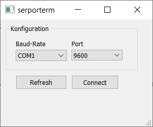
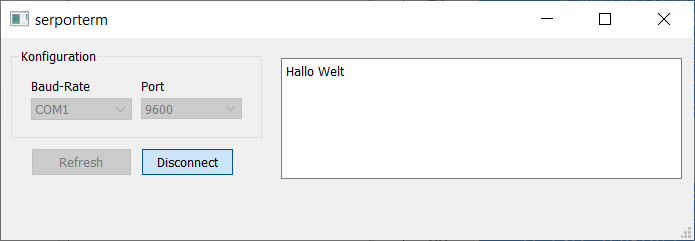
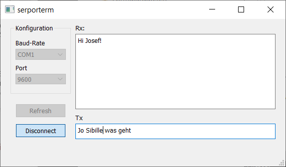

# QT - Übungen

## GOALS

Datei results.txt:

```
Graz,Salzburg,1,5
Linz,Innsbruck,4,3
Wien,St. Pölten,5,2 
```

- Funktion `QString getDta(QString fName)`  
    zum Einlesen der Daten in einen String
- Funktion `QList<GamesType> procDta(QString dta)`  
    zum Übertragen der Daten in eine Strukturen-Liste  
    Reihenfolge der Teams: Sieger|Verlierer
- Funktion `void printGames(QList<GamesType> g)`  
    zur Ausgabe der Spielergebnisse

## Raum-Temperatur

Datei perstemp.txt:

```
3
John Blond: 37.3
Heinz Mailer: 36.4
Kuns Dänlich: 38.2
Fida Hunlika: 37.8
```

- Funktion `QString getDta(QString fName)`  
    zum Einlesen der Daten in einen String

- Funktion `QList<PersTempTypes> procDta(QString dta)`  
    zum Übertragen der Daten in eine Strukturen-Liste

- Funktion `void printAlert(QList<PersTempTypes> g)`  
    zur Ausgabe in der Form (Grenze 37,6):

    ```
    Alarm:Kuns Dänlich:38,2
    Alarm:Fida Hunlika:37,8
    ```

## Sort Personen

Datei persons.txt:

```
17 Hans Meier
12 Roger Smith
14 Jim Beam
3  Gudrun Birne
```

- Funktion `QString getDta(QString fName)`  
    zum Einlesen der Daten in einen String
- Funktion `QList<PersonType> procDta(QString dta)`  
    zum Übertragen der Daten in eine Strukturen-Liste
- Funktion `QList<PersonType> sortDta(QList<PersonType> l, int elem, int order)`  
    zum Sortieren der Daten nach elem in der Reihenfolge order
- Funktion `void printPresons(QList<PersonType> pers)`  
    zur Ausgabe der Personen

## Wget - COV-Ampel

Download der aktuellen Covid-Situation von:

<https://corona-ampel.gv.at/sites/corona-ampel.gv.at/files/assets/Warnstufen_Corona_Ampel_aktuell.json>

oder

<https://corona-ampel.gv.at/sites/corona-ampel.gv.at/files/assets/Warnstufen_Corona_Ampel_Gemeinden_aktuell.json>

(Prüfen der Verfügbarkeit/Alternativen via Browser)

Automatisierter Download von entfernten Daten in die lokale Datei covdta.json:

```
wget "..." -O ./covdta.json
```

In Linux-Distributionen ist *wget* vorhanden. In Windows-Systemen muss es installiert werden. Eine Möglichkeit ist es die Compiler-Suite *MSYS2* zu installieren. Eventuell wird der enthaltene C/C++-Compiler sowieso benötigt (in Windows gäbe es neben wget auch andere Möglichkeiten …)

Oft gibt es mit dem wget-Download noch Probleme, wenn etwa die SSL-Version nicht unterstützt wird. Für Ubuntu muss dafür eine Konfiguration angepasst werden (<https://discourse.ubuntu.com/t/default-to-tls-v1-2-in-all-tls-libraries-in-20-04-lts/12464/7):>

Anpassen der Datei */etc/ssl/openssl.cnf* (die mit + markierten Zeilen werden eingefügt, die anderen Zeilen dienen zur Orientierung):

```
HOME                   = .
+openssl_conf = default_conf

ess_cert_id_alg                = sha1  # algorithm to compute certificate
                                # identifier (optional, default: sha1)
 
+[default_conf]
+ssl_conf = ssl_sect
+
+[ssl_sect]
+system_default = system_default_sect
+
+[system_default_sect]
+CipherString = DEFAULT@SECLEVEL=1
```

Mit dieser Anpassung wird eine ältere SSL-Version zugelassen was natürlich zu Sicherheitsproblemen führen könnte.

---

Nach dem Download der Datei kann die weitere Verarbeitung beginnen:

- Verarbeiten der JSON-Datei -> Suchen der Heimatgemeinde und ermitteln des Ampelzustands (COV-Warnstufe)
- Ausgabe der Warnstufe mitsamt des Datums der Einstufung und der Gemeinde in der Konsole
- Erweitern des Programms mit einer GUI welche die Ampel grafisch darstellt.

## SignalSlots (652)

Das Verändern einer Zahl z1 soll automatisch eine zweite Zahl z2 bewirken.

main.cpp

```c++
#include <QCoreApplication>
#include <QDebug>
#include "zahl.h"

int main(int argc, char *argv[]) {
  QCoreApplication a(argc, argv);

  Zahl z1, z2; // z1.getValue() == 0, z2.getValue() == 0

  qDebug() << "z1 <- 5";
  z1.setValue(5); // z1.getValue() == 5, z2.getValue() == 0
  qDebug() << "=> z1 = " << z1.getValue() << " z2 = " << z2.getValue();
  qDebug() << "z2 <- 48";
  z2.setValue(48); // z1.getValue() == 5, z2.getValue() == 48
  qDebug() << "=> z1 = " << z1.getValue() << " z2 = " << z2.getValue();

  qDebug() << "Connect von z1-Signal auf z2-Slot";
  QObject::connect(&z1, SIGNAL(onChange(int)), &z2, SLOT(setValue(int)));

  qDebug() << "z1 <- 12";
  z1.setValue(12); // z1.getValue() == 12, z2.getValue() == 12
  qDebug() << "=> z1 = " << z1.getValue() << " z2 = " << z2.getValue();

  qDebug() << "z2 <- 23";
  z2.setValue(23); // z1.getValue() == 12, z2.getValue() == 23
  qDebug() << "=> z1 = " << z1.getValue() << " z2 = " << z2.getValue();

  return 0;
}
```

zahl.h

```c++
#ifndef ZAHL_H
#define ZAHL_H

#include <QObject>

class Zahl : public QObject {
  Q_OBJECT
public:
  Zahl(QObject *parent = nullptr);
  int getValue() const;
private:
  int m_value;
public slots:
  void setValue(int value);
signals:
  void onChange(int newValue);
};

#endif // ZAHL_H
```

zahl.cpp

```c++
#include "zahl.h"

Zahl::Zahl(QObject *parent) : QObject(parent) {
  m_value = 0;
}
int Zahl::getValue() const {
  return m_value;
}
void Zahl::setValue(int value) {
  if (value != this->m_value) {
    this->m_value = value;
    emit onChange(value);
  }
}
```

## ButtonMessageBox (057)

- Erstellen Sie eine GUI-Applikation mit einer Schaltfläche *Close App*.
- Titel der Applikation: *Best App*
- Durch Drücken der Schaltfläche ist eine Message-Box zu Öffnen mit:
  - Warnung (Rufzeichensymbol)
  - Titel: "Wichtige Frage"
  - Text: "App Schließen?!"
  - 2 Schaltflächen: *Close*: Beenden der App, *Cancel* Abbruch, Programm läuft weiter

Tipps:

- Messagebox

  `int num =  QMessageBox::warning(this, "Gruß", "Antwort?", QMessageBox::Ok | QMessageBox::Yes)`

- `if (num == QMessageBox::Yes) {…}`

## ComboBox (058)

- Erstellen Sie eine GUI-Applikation mit einer Schaltfläche *Do It* und einer Combo-Box mit den Einträgen *Schließen mit Abfrage* und *Schließen*
- Titel der Applikation: *Very Best App*
- Durch Drücken der Schaltfläche wird die App entweder sofort beendet oder eine Messagebox geöffnet mit der Rückfrage "App Beenden?" und der Auswahl "Yes" / "No".

Tipps:

- Messagebox

  `int num =  QMessageBox::warning(this, "Gruß", "Antwort?", QMessageBox::Ok | QMessageBox::Yes)`

- `ui->myComboBox->currentText()`

## Namens-Liste (059)

- Erstellen Sie eine GUI-Applikation mit einer List-View und zwei Schaltflächen *Einfügen* und *Löschen*.
- Titel der Applikation: *Namensliste*
- Bei Programm-Start ist die Liste leer. Mit *Einfügen* wird ein Element in die Liste eingefügt und das Feld zum Editieren (Eingabe) aktiviert.
- Mit der Auswahl eines Elements der Liste und *Löschen* wird das gewählte Element gelöscht.

Tipps:

- Löschen eines Elements: `ui->myList->takeItem(ui->myList->currentRow());`

- Einfügen eines Elements (am Ende der Liste sonst insert): `ui->lstNamen->addItem("Jim");`

- Editieren eines Elements: 

  ```c++
  QListWidgetItem *itm = ui->myList->item( ui->myList->count()-1 ); // letztes El.
  // Editierbar setzen:
  itm->setFlags(Qt::ItemIsEditable | Qt::ItemIsEnabled | Qt::ItemIsSelectable);
  ui->lstNamen->editItem(itm);		// auf editieren schalten
  ```

## Datum (060)

- Erstellen Sie eine GUI-Applikation mit einem Label und einer Schaltfläche *aktuelles Datum*
- Nach Drücken der Schaltfläche soll das Label das aktuelle Datum anzeigen
- Für das Datum ist die früher erstellte Datum-Klasse zu verwenden. Für das aktuelle Datum ist eine statische Funktion aus der QT-Klasse QDate besser geeignet (als die veraltete localtime-Funktion).
- Fügen Sie Schaltflächen zum Incrementieren/Decrementieren dazu.

Tipps:

- Aktuelles Datum (aus qdatetime.h):

  ```c++
  QDate d = QDate::currentDate();
  int tag = d.day();
  ```

## Editor (061)

- Erstellen Sie einen Text-Editor. Platzieren Sie eine Textbox als Schreibbereich und fügen Sie in der Menüleiste *Datei* mit *Öffnen …* und *Schließen …* hinzu.
- Fügen Sie Öffnen und Schließen auch in der Tool-Bar ein.
- Das Öffnen und Schließen ist mittels Datei-Dialog darzustellen.
- Im Fenster-Titel wird der Dateiname der geladenen Datei angezeigt. Sobald der Text verändert wird, wird beim Dateinamen zusätzlich ein * angezeigt (Verhalten siehe zum Beispiel QTCreator).

Tipps:

- Titel eines Fensters mit statischer Funktion

  ```c++
  QWidget::setWindowTitle("SuperEdit - ");
  ```

## Serial Port - Beispiel (653)

Projekt-Konfiguration:

```
QT += serialport
```

serport.h

```c++
#ifndef SERPORT_H
#define SERPORT_H
#include <QThread>
#include <QSerialPort>


class SerPort : public QObject {
  Q_OBJECT
public:
  SerPort(QObject *parent);
  void writeData(const QByteArray &data);

public slots:
  void run();
  void readData();

private:
  void openSerialPort();

  QSerialPort *m_serial;
};

#endif // SERPORT_H
```

serport.cpp

```c++
#include "serport.h"
#include <QDebug>

SerPort::SerPort(QObject *parent) : QObject(parent) {
  m_serial = new QSerialPort();                                       // SerialPort-Objekt

  connect(m_serial, SIGNAL(readyRead()), this, SLOT(readData()));     // Empfang mit readData-Slot verbinden

  openSerialPort();                                                   // Port Oeffnen

  QThread *qt = new QThread();                                        // SerPort in neuen Thread verschieben
  this->moveToThread(qt);
  connect(qt, SIGNAL(started()), this, SLOT(run()));
  qt->start();
}

void SerPort::openSerialPort() {
  m_serial->setPortName("COM1");                              // Port fest konfigurieren: COM1/9600Baud ...
  m_serial->setBaudRate(QSerialPort::Baud9600);
  m_serial->setDataBits(QSerialPort::Data8);
  m_serial->setParity(QSerialPort::NoParity);
  m_serial->setStopBits(QSerialPort::OneStop);
  m_serial->setFlowControl(QSerialPort::NoFlowControl);

  if (m_serial->open(QIODevice::ReadWrite)) {
    // Successfully Connected
  } else {
    qDebug() << "Open Error";
  }
  m_serial->clear(QSerialPort::AllDirections); // Clear Serial Write and Read Internal Buffers
}

void SerPort::run() {
  while (1) {                                 // Endlosschleife:
    m_serial->waitForReadyRead(1000);       // Warten auf Nachricht
    if (m_serial->bytesAvailable() > 0) {   // Wenn Daten verfuegbar
      emit m_serial->readyRead();         // Signal: Nachricht empfangen -> Auswerten
    }
  }
}

void SerPort::writeData(const QByteArray &data) {
  m_serial->write(data);
  m_serial->flush();
}

void SerPort::readData() {  // Auswertung empfangene Nachricht (Slot) - wird durch Signal ausgeloest
  QByteArray data = m_serial->readAll();       // Alle Bytes empfangen

  qDebug() << data.toStdString().c_str();
}
```

main.cpp

```c++
#include <QCoreApplication>
#include <QtSerialPort/QtSerialPort>
#include <QDebug>
#include "serport.h"

int main(int argc, char *argv[]) {
  QCoreApplication app(argc, argv);

  SerPort sp(nullptr);
  sp.writeData("Hello World!");

  return app.exec();
}
```

## Serial Port - Schreiben

Erstellen Sie eine GUI-Anwendung:

- SerPort-Klasse mit:

  - `QList<QString> getAvailPortNames()` erstellt eine Liste der Verfügbaren Ports. Der Treiber gibt die auf diese Art zurück:  
    `QList<QSerialPortInfo> ql = QSerialPortInfo::availablePorts()`  
    (Listen-Umwandlung siehe Combo-Box)
  - `QList<QString> SerPort::getAvailBaudRates()` erstellt eine Liste der Verfügbaren Baudrates. Vom Treiber:  
    `QList<qint32> ql = QSerialPortInfo::standardBaudRates()`
  - `bool SerPort::con(QString name, int baudRate)` - Verbinden mit Port, Rückgabe true = OK, false = Error
  - `void SerPort::close()`
  - `QString SerPort::getErr()` 
  - `void SerPort::write(QString str)` - Schreiben von Daten auf Seriellen Port

- mainwindow-Klasse:

  ```c++
  #include "mainwindow.h"
  #include "ui_mainwindow.h"
  #include "serport.h"
  #include <QDebug>
  #include <QDateTime>
  
  MainWindow::MainWindow(QWidget *parent)
      : QMainWindow(parent)
      , ui(new Ui::MainWindow)
  {
      ui->setupUi(this);
  
      refreshHW();            // Verfuegbare Ports ermitteln
  }
  
  MainWindow::~MainWindow()
  {
      m_sp.close();           // Port schlieszen
      delete ui;
  }
  
  void MainWindow::refreshHW() {
      ui->cbPortNames->clear();
      ui->cbPortNames->addItems(m_sp.getAvailPortNames());
      ui->cbBaudRates->clear();
      ui->cbBaudRates->addItems(m_sp.getAvailBaudRates());
      ui->cbBaudRates->setCurrentIndex(6);    // 9600 voreinstellen
  }
  
  void MainWindow::on_btnRefresh_clicked()
  {
      refreshHW();            // Verfuegbare Ports ermitteln
  }
  
  void MainWindow::on_btnConnect_clicked()
  {
      if (ui->btnConnect->isChecked()) {      // Verbindung aufbauen
          QString name = ui->cbPortNames->itemText(ui->cbPortNames->currentIndex());
          int br = ui->cbBaudRates->itemText(ui->cbBaudRates->currentIndex()).toInt();
          if (!m_sp.con(name, br)) {      // Verbinden-Error
              ui->statusbar->showMessage(m_sp.getErr());
              ui->btnConnect->setChecked(false);
          } else {                            // Verbinden-OK
              ui->statusbar->showMessage("Verbindung aufgebaut ...", 1000);
              ui->cbBaudRates->setEnabled(false);
              ui->cbPortNames->setEnabled(false);
              ui->btnRefresh->setEnabled(false);
              m_timer = new QTimer();
              connect(m_timer, &QTimer::timeout, this, &MainWindow::tick);
              m_timer->start(1000);
              ui->btnConnect->setText("Disconnect");
          }
  
      } else {                                 // Verbindung beenden
          m_sp.close();
          m_timer->stop();
          ui->cbBaudRates->setEnabled(true);
          ui->cbPortNames->setEnabled(true);
          ui->btnRefresh->setEnabled(true);
          ui->btnConnect->setText("Connect");
      }
  }
  
  void MainWindow::tick() {                   // Timer-Task
      m_sp.write(QDateTime::currentDateTime().toString() + "\r\n");
      ui->statusbar->showMessage("... Übertrage Zeit ...", 500);
  }
  ```

- GUI zum Beispiel so:

  

  

- Mit Connect wird automatisch jede Sekunde die Uhrzeit übertragen

## Serial Port - Lesen

Erstellen Sie eine GUI-Anwendung:

- SerPort-Klasse mit:

  - `QList<QString> getAvailPortNames()` erstellt eine Liste der Verfügbaren Ports. Der Treiber gibt die auf diese Art zurück:  
    `QList<QSerialPortInfo> ql = QSerialPortInfo::availablePorts()`  
    (Listen-Umwandlung siehe Combo-Box)

  - `QList<QString> SerPort::getAvailBaudRates()` erstellt eine Liste der Verfügbaren Baudrates. Vom Treiber:  
    `QList<qint32> ql = QSerialPortInfo::standardBaudRates()`

  - `bool SerPort::con(QString name, int baudRate)` - Verbinden mit Port, Rückgabe true = OK, false = Error

  - `void SerPort::close()`

  - `QString SerPort::getErr()` 

  - `QString SerPort::readPoll()` - Lesen von Daten auf Seriellen Port alle 1000ms:

    ```c++
    m_sp.waitForReadyRead(10);		// Warten maximal 10 ms
    QByteArray arr = m_sp.readAll();
    QString str = QString::fromStdString(arr.toStdString());
    ```

- mainwindow-Klasse:

  ```c++
  #include "mainwindow.h"
  #include "ui_mainwindow.h"
  #include "serport.h"
  #include <QDebug>
  #include <QDateTime>
  #include <QObject>
  
  
  MainWindow::MainWindow(QWidget *parent)
      : QMainWindow(parent)
      , ui(new Ui::MainWindow)
  {
      ui->setupUi(this);
  
      refreshHW();            // Verfuegbare Ports ermitteln
  }
  
  MainWindow::~MainWindow()
  {
      m_SerPort.close();           // Port schlieszen
      delete ui;
  }
  
  void MainWindow::refreshHW() {
      ui->cbPortNames->clear();
      ui->cbPortNames->addItems(m_SerPort.getAvailPortNames());
      ui->cbBaudRates->clear();
      ui->cbBaudRates->addItems(m_SerPort.getAvailBaudRates());
      ui->cbBaudRates->setCurrentIndex(6);    // 9600 voreinstellen
  }
  
  void MainWindow::on_btnRefresh_clicked()
  {
      refreshHW();            // Verfuegbare Ports ermitteln
  }
  
  void MainWindow::on_btnConnect_clicked()
  {
      if (ui->btnConnect->isChecked()) {      // Verbindung aufbauen
          QString name = ui->cbPortNames->itemText(ui->cbPortNames->currentIndex());
          int br = ui->cbBaudRates->itemText(ui->cbBaudRates->currentIndex()).toInt();
          if (!m_SerPort.con(name, br)) {      // Verbinden-Error
              ui->statusbar->showMessage(m_SerPort.getErr());
              ui->btnConnect->setChecked(false);
          } else {                            // Verbinden-OK
              ui->statusbar->showMessage("Verbindung aufgebaut ...", 1000);
              ui->cbBaudRates->setEnabled(false);
              ui->cbPortNames->setEnabled(false);
              ui->btnRefresh->setEnabled(false);
              m_timer = new QTimer();
              connect(m_timer, &QTimer::timeout, this, &MainWindow::rxTick);
              m_timer->start(1000);
              ui->btnConnect->setText("Disconnect");
          }
  
      } else {                                 // Verbindung beenden
          m_SerPort.close();
          m_timer->stop();
          ui->cbBaudRates->setEnabled(true);
          ui->cbPortNames->setEnabled(true);
          ui->btnRefresh->setEnabled(true);
          ui->btnConnect->setText("Connect");
      }
  }
  
  void MainWindow::rxTick() {                   // Timer-Task        // Nur mit Polling
      QString str = m_SerPort.readPoll();
      if (str.length() > 0) {
          ui->txtRead->moveCursor (QTextCursor::End);
          ui->txtRead->insertPlainText (str);
          ui->txtRead->moveCursor (QTextCursor::End);
          ui->statusbar->showMessage("Empfange \""+ str +"\" ...", 1000);
  
      }
  }
  ```

- GUI zum Beispiel so:

  

- Mit Connect wird automatisch jede Sekunde die Uhrzeit übertragen

## Serial Port - Terminal

Erstellen Sie eine Anwendung zum Senden/Empfangen von seriellen Nachrichten auf der seriellen Schnittstelle



- mainwindow.cpp:

  ```c++
  #include "mainwindow.h"
  #include "ui_mainwindow.h"
  #include "serport.h"
  #include <QDebug>
  #include <QDateTime>
  #include <QObject>
  
  
  MainWindow::MainWindow(QWidget *parent)
      : QMainWindow(parent)
      , ui(new Ui::MainWindow)
  {
      ui->setupUi(this);
  
      refreshHW();            // Verfuegbare Ports ermitteln
  }
  
  MainWindow::~MainWindow()
  {
      m_SerPort.close();           // Port schlieszen
      delete ui;
  }
  
  void MainWindow::refreshHW() {
      ui->cbPortNames->clear();
      ui->cbPortNames->addItems(m_SerPort.getAvailPortNames());
      ui->cbBaudRates->clear();
      ui->cbBaudRates->addItems(m_SerPort.getAvailBaudRates());
      ui->cbBaudRates->setCurrentIndex(6);    // 9600 voreinstellen
  }
  
  void MainWindow::on_btnRefresh_clicked()
  {
      refreshHW();            // Verfuegbare Ports ermitteln
  }
  
  void MainWindow::on_btnConnect_clicked()
  {
      if (ui->btnConnect->isChecked()) {       // Verbindung aufbauen
          QString name = ui->cbPortNames->itemText(ui->cbPortNames->currentIndex());
          int br = ui->cbBaudRates->itemText(ui->cbBaudRates->currentIndex()).toInt();
  
          if (!m_SerPort.con(name, br)) {      // -----------> Verbinden-Error
              ui->statusbar->showMessage(m_SerPort.getErr());
              ui->btnConnect->setChecked(false);
          } else {                             // -----------> Verbinden-OK
              ui->statusbar->showMessage("Verbindung aufgebaut ...", 1000);
              ui->cbBaudRates->setEnabled(false);
              ui->cbPortNames->setEnabled(false);
              ui->btnRefresh->setEnabled(false);
              ui->txtWrite->setEnabled(true);
              ui->lblWrite->setEnabled(true);
              m_timer = new QTimer();
              connect(m_timer, &QTimer::timeout, this, &MainWindow::rxTick);
              m_timer->start(1000);
              ui->btnConnect->setText("Disconnect");
          }
  
      } else {                                 // Verbindung beenden
          m_SerPort.close();
          m_timer->stop();
          ui->cbBaudRates->setEnabled(true);
          ui->cbPortNames->setEnabled(true);
          ui->btnRefresh->setEnabled(true);
          ui->txtWrite->setEnabled(false);
          ui->lblWrite->setEnabled(false);
          ui->btnConnect->setText("Connect");
      }
  }
  
  void MainWindow::rxTick() {                   // Timer-Task        // Nur mit Polling
      QString str = m_SerPort.readPoll();
      if (str.length() > 0) {
          ui->txtRead->moveCursor (QTextCursor::End);
          ui->txtRead->insertPlainText (str);
          ui->txtRead->moveCursor (QTextCursor::End);
          ui->statusbar->showMessage("Empfange \""+ str +"\" ...", 1000);
  
      }
  }
  
  void MainWindow::on_txtWrite_textChanged()
  {
      if ((ui->txtWrite->toPlainText().length() > 0) && (ui->txtWrite->toPlainText().back() == "\n")){
          m_SerPort.write(ui->txtWrite->toPlainText());
          ui->txtWrite->clear();
      }
  }
  ```

  

