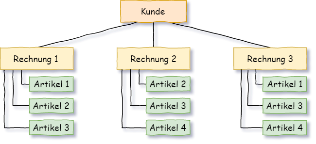

# Datenbanken

## Definition

Daten können dauerhaft (*persistent* = bleiben nach Beendigung des Systems erhalten) in Dateien gespeichert werden. Die Entscheidung auf welche Art (binär, Text, XML-Formate …) die Daten gespeichert werden, liegt bei einer Anwendung und kann mit Dateiendungen/Dateitypen (.txt, .xls …) gekennzeichnet werden. Die Zugriffsart und der konkurrierende Zugriff mehrerer Anwendungen ist nicht geregelt (entscheidet das [Betriebssystem](../Operating%20Systems/Operating%20Systems.md)). Sollen:

- große Datenmengen
- von vielen Benutzern gleichzeitig
- aus unterschiedlichen Anwendungen

abgerufen oder abgelegt werden, dann ist der Einsatz von *Datenbanken* zweckmäßig. In diesen ist durch ein eigenes Management der konkurrierende Zugriff geregelt.

## Software

Für die Einführung in Datenbanken empfiehlt sich für uns *XAMPP* (Allgemein: ein *LAMP* [Stack](../ds-algo/Stack.md) ist ein Akronym für *LinuxApacheMysqlPhp*, das *X* steht für mehrere OS, das zweite *P* für Perl). Darin ist eine *MariaDB*-Datenbank verfügbar (<https://www.apachefriends.org/de/index.html)> auf die via *MySQL* zugegriffen werden kann. In *XAMPP* ist auch ein *Apache*-Web-Server enthalten. Für diesen Webserver kann eine Web-Seite entwickelt werden die mittels *php* auf die Datenbank zugreift.

## Anforderung an Eine Datenbank

- Sammlung logisch verbundener Daten
- Speicherung der Daten mit möglichst wenig [Redundanz](../../Netzwerktechnik/Redundanz.md) (Mehrfachspeicherung)
- Abfragemöglichkeit und Änderbarkeit von Daten
- Unabhängigkeit der logischen Daten von der physischen Struktur. Wie die Daten physisch gespeichert sind, darf keinen Einfluss auf die Anwendung haben. Wird im Internet eine Information eingeholt, wollen wir uns nicht damit beschäftigen (müssen), auf welche Art die Information irgendwo gespeichert ist.
- Zugriffsschutz (Rechtevergabe)
- Integrität (Daten sollen sich durch Teiländerung nicht widersprechen)
- Mehrfachzugriff (von mehreren Benutzern)
- Zuverlässigkeit
- Ausfallsicherheit
- Kontrolle

## Begriffe

- **Datenbanksystem DBS**:  
  Beschreibung, Speicherung und Wiedergewinnung von Daten

- Ein DBS setzt sich zusammen aus der **Datenbank DB** (die Sammlung sämtlicher Daten) und dem **Datenbank-Management-System DBMS** (ein Programmsystem welches die DB verwaltet, sie fortschreibt und den Zugriff regelt)

- Abstraktionsebenen von Datenbanken. Datenbanken sind komplex. Ein einfacher Anwender der Daten aus einer Datenbank abfragt oder dort hineinschreibt, kennt oder sieht den inneren Aufbau (Dateiorganisation …) einer Datenbank nicht (ist auch gut, dass das nicht notwendig ist). Er kennt nur eine externe Sicht auf die Datenbank via Browseroder Anwendungsmasken.
  
  Ein Datenbankadministrator kennt die dahinterliegende Schicht, ein Datenmodell und hat damit eine konzeptionelle Sicht. Diese Schicht ist oft einheitlich und unabhängig vom speziellen Produkt. 
  
  Physisch ist die Datenbank unterschiedlich aufgebaut, abhängig vom Hersteller des Produkts. Auf dieser Ebene werden die Daten auf Dateien verteilt, die Pfade und die Rechte geregelt.

## Datenbankmodelle

- **Hierarchische DB**  
  Ein Ursprungknoten von dem hierarchisch Abzweige erfolgen (ähnlich wie ein Dateisystem: Laufwerk->Verzeichnis->Verzeichnis…). Veraltetes Modell; eine kleine Veränderung in der DB Struktur, kann die komplette Struktur zerstören
  
  

- **Relationale DB**  
  Organisation in Tabellen (Relationen) - sehr verbreitet, einfach, [redundant](../../Netzwerktechnik/Redundanz.md) (siehe Unten)

- **Objektorientiert** - sehr an Computerprogrammierung angepasst (Vertreter: db4o, PostgreSQL). Es können nicht nur Daten sondern auch Algorithmen abgelegt werden (~Methoden von Klassen)

- **NoSql**  
  explizit nicht-relationale Datenbank. SQL ist eine Sprache mit der üblicherweise mit relationalen Datenbanken gesprochen wird. Ursprünglich wurde häufig mit NoSql - kein SQL verbunden aktuell wird üblicherweise NoSql mit Not-Only-Sql beschrieben.

## Relationenmodell

In einer relationalen Datenbank sind die Daten in voneinander abhängigen Tabellen abgelegt. Definitionen:

- Datenbank: Gesamtheit sämtlicher, in Verbindung stehenden Relationen
- Relation = Tabelle
- Attribute: Spalten der Tabelle (auch Felder genannt)
- Domäne: Werte in der Tabelle
- Tupel: Zeile in der Tabelle (Datensatz)
- Superschlüssel: Menge von Attributen (Spalten) mittels der ein Tupel (Zeile, Datensatz) eindeutig identifiziert werden kann (es kann mehrere geben). Für einen Superschlüssel ist nicht wichtig, dass er minimal ist.
- Schlüsselkandidat: ist eine Teilmenge der Superschlüssel und zwar diejenige die mit am wenigsten möglichen Attributen auskommt.
- Primärschlüssel: Schlüssel mit eindeutiger Zuordnung. Mit dem Primärschlüssel ist die Zeile (Tupel) einer Tabelle bekannt. Ausgewählter Schlüsselkandidat. Kann in anderen Tabellen als Fremdschlüssel verwendet werden.
- Fremdschlüssel: Schlüssel für Zuordnung zu anderer Tabelle (kann mehrfach vorkommen). In dieser anderen Tabelle ist dieser Schlüssel der Primärschlüssel
- Relationsschema R(A1:D1, …, Ak:Dk) (Gesamtheit der Attribute einer Tabelle)
- Relationale Datenbank: Menge der Teil-Relationsschemen mit zugehörigen Werten
- [Redundanz](../../Netzwerktechnik/Redundanz.md): Daten sind in einer Tabelle mehrfach abgelegt. Zum Beispiel kann in einer Rechnungstabelle ein Kunde öfter aufscheinen und ist damit [redundant](../../Netzwerktechnik/Redundanz.md).
- atomar: etwas nicht mehr weiter (sinnvoll) zerlegbares. Ein Name "Max Mustermann" lässt sic in die atomaren Teile "Max" und "Mustermann" zerlegen (es kann ja mehrere Max und mehrere Mustermann geben).
- Integrität: zusammenpassende Werte. Wenn ein und die gleiche Person Max Mustermann (samt SV-Nr.) in einer DB unterschiedliche Personalnummern hat, ist die Datenbank nicht integer.
- Statische Integrität: gespeicherte Daten sind in sich integral.
- Dynamische Integrität: die Integrität wird während der Datenstandänderung gewahrt (eventuell mittels Trigger).
- Referentielle Integrität: Datensätze mit Fremdschlüssel können nur dann gespeichert werden, wenn der Wert des Fremdschlüssels einmalig in der referenzierten Tabelle existiert.

### Regeln

- Ein Tupel (Zeile) ist eindeutig und beschreibt ein Objekt (es gibt keine doppelten Tupel). Gleiche Zeilen ergeben keinen Sinn
- Reihenfolge der Tupel (Zeilen) ist nicht geordnet
- Reihenfolge der Attribute (Spalten) ist nicht geordnet
- Attribute sind atomar (nicht weiter zerlegbar)
- Tabellenübergreifende Darstellung durch Fremdschlüssel
- Beziehungen (zwischen Tabellen) werden durch Fremdschlüssel (und zugehörigem Primärschlüssel) dargestellt

## Referenzen

- Allgemeine Einführung  
  <http://www.datenbanken-verstehen.de/datenbank-grundlagen/datenbank/>

## Fragen

- Was kennzeichnet eine relationale Datenbank?
- Was ist ein Tupel / Attribut / Schlüssel?
- Was ist der Unterschied zwischen einem Superschlüssel / Primärschlüssel / Fremdschlüssel / Schlüsselkandidat?
- Welche Anforderungen werden an eine Datenbank gestellt