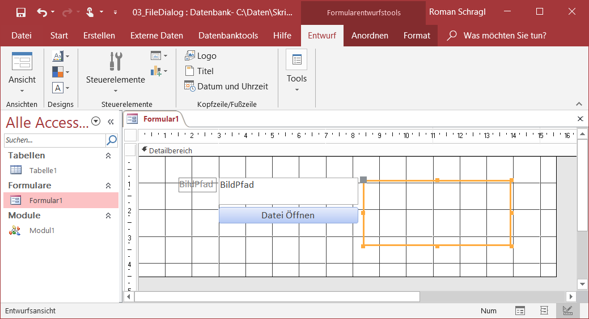

# 7.2 VBA in Access

Wie in allen MS-Office-Produkten kann auch in Access VBA (Visual-Basic for Applications) eingebettet werden. Werden in einem Formular/Bericht spezielle Dinge benötigt müssen die mittels VBA-Code eingebunden werden.

## VBA-Code mit Formularschaltfläche (02,03)

Hier wird gezeigt wie in ein Formular mittels Schaltfläche eine Datei in einem Datei-Öffnen-Dialog ausgewählt und zurückgegeben werden kann. Das Erstellen einer Schaltfläche ist bereits in Access verfügbar, der Datei-Öffnen-Dialog allerdings nicht, er wird daher mittels VBA geöffnet.

Zuerst wird ein Formular erzeugt. Im einfachsten Fall beinhaltet es ein Text-Feld, eine Schaltfläche und ein Bild:



- Das Textfeld wird als *BildPfad* benannt (es kann natürlich auch mit einem Tabellenfeld verbunden sein). Das Bild wird einfach als *Bild* benannt (die Namen sind wichtig, es wird via Code darauf zugegriffen). Die Schaltfläche wird als *SelBild* benannt (beim Erzeugen nichts Auswählen - nur Abbrechen).

- Die Schaltfläche wird im nächsten Schritt mit VBA-Code verbunden. Dazu *Schaltfläche auswählen ->Eigenschaften->Ereignis->Beim Klicken->Code-Generator*. Dadurch wird automatisch der VBA-Editor geöffnet und eine Routine *SelBild_Click()* erzeugt.

- Dort wird folgender Code zum Öffnen eines Datei-Dialogs eingefügt:

  ```vb
  Private Sub SelBild_Click()
      Dim objFiledialog As FileDialog
      
      Set objFiledialog = Application.FileDialog(msoFileDialogOpen)
      
      objFiledialog.Filters.Clear
      objFiledialog.Filters.Add "Bilder", "*.png; *.gif; *.jpg; *.jpeg; *.bmp"
      objFiledialog.Filters.Add "Alle", "*.*"
      objFiledialog.FilterIndex = 0
      objFiledialog.InitialFileName = Application.CurrentProject.Path
      objFiledialog.Title = "Bild Auswählen ..."
      objFiledialog.AllowMultiSelect = False
  
      if objFiledialog.Show = True Then
          Bild.Picture = objFiledialog.SelectedItems(1)
          BildPfad = objFiledialog.SelectedItems(1)
      End If
      Set objFiledialog = Nothing
  End Sub
  ```

  - Erzeugen des FileDialog-Objekts *objFiledialog*
  - Einstellen, dass nur eine Datei ausgewählt werden darf
  - Dialog Öffnen (mit *.Show*) und Prüfen ob er nicht abgebrochen wurde
  - Der Dateiname wird mit .SelectedItems(1) zurückgegeben
  - Mit *Bild.Picture = objFiledialog.SelectedItems(1)* wird direkt das Bild geladen
  - Mit *BildPfad = objFiledialog.SelectedItems(1)* wird der ausgewählte Pfad in das Textfeld kopiert
  - Am Ende wird das Objekt wieder freigegeben (gelöscht)

- Aktivieren von *Menü->Extras->Verweise…->Microsoft Office 16.0 Object Library*  
  FileDialog-Objekte können nur erzeugt werden wenn ein Verweis auf eine einzubindende Bibliothek gesetzt wird. In Visual-Studio-VBA erfolgt das im angeführten Menü.

- Mit diesem Code kann mittels Schaltfläche ein Bild geladen werden, oder/und der ausgewählte Dateipfad ermittelt werden.

## VBA-Code beim Formular-Öffnen

Wenn es erforderlich ist, ein Bild während dem Formularöffnen zu Laden:

- das Formular in der Entwurfsansicht Öffnen

- Zum Auswählen der Eigenschaften des gesamten Formulars wird es entweder im kleinen Quadrat in der linken oberen Formular-Ecke ausgewählt oder im Eigenschaftsbereich im Pull-Down-Menü

- Damit ist im Eigeschaftsblatt unter Ereignis die Option *Beim Anzeigen* verfügbar. Dort wiederum Code-Generator auswählen

- Der VBA-Editor wird geöffnet und die Routine *Form_Current()* erzeugt.

- Dort Eingeben, Speichern und Schließen:

  ```vb
  Private Sub Form_Current()
      Bild.Picture = BildPfad
  End Sub
  ```

Damit wird beim Öffnen dieses Formulars das Bild, welches im Textfeld *BildPfad* bezeichnet ist, geladen. Sehr sinnvoll ist das wenn der BildPfad aus einer Tabelle kommt.

## Relative Pfade

Soll ein Pfad zu einem Bild relativ sein - eventuell werden die Bilder dort gespeichert wo die Datenbank liegt - dann kann der Pfad in VBA mit

```
Application.CurrentProject.Path
```

ergänzt werden. Dieser Ausdruck liefert den Pfad unter welchem die Access-DB gespeichert ist.

## VBA-Code im Bericht (02)

Auf der Seitenansicht eines Berichts (für den Ausdruck) kann das Bild geladen werden.

- Das Bild im Bericht wieder Bild nennen (damit darauf zugegriffen werden kann).

- *Bild->Eigenschaften->Daten->Steuerelementinhalt* am Besten *BildPfad* eintragen. Dass ist nur notwendig um die Variable für das VBA verfügbar zu haben.

- Für den *Detailbereich* ein Ereignis *Beim Formatieren* Setzen: Code-Generator auswählen. Damit wird die VBA-IDE geöffnet und eine Funktion befüllt:

  ```vb
  Private Sub Detailbereich_Format(Cancel As Integer, FormatCount As Integer)
      Bild.Picture = BildPfad
  End Sub
  ```

Damit wird bei jedem Weiterblättern in der Seitenansicht (Druckansicht) das entsprechende Bild geladen.

Für einen Bericht der nur Angesehen wird (Berichtansicht) wird das Bild direkt mit dem Tabellen-Feld verbunden: in der Daten-Eigenschaft *Bild->Eigenschaften->Daten->Steuerelementinhalt* wird *BildPfad* eintragen.

## SQL-Befehle aus VBA

Um eine Access-Datenbank mittels SQL zu steuern:

```vb
Dim db As DAO.Database
Set db = CurrentDb      ' aktuelle Datenbank wählen
    
Dim str As String
str = _
      "DROP TABLE A;" & vbCrLf & _
      "DROP TABLE B;" & vbCrLf & _
      "CREATE TABLE A (a_id INT PRIMARY KEY);" & vbCrLf & _
      "CREATE TABLE B (b_id INT PRIMARY KEY);"

          
strarr = Split(str, vbCrLf)
    
For Each element In strarr
    db.Execute element, dbFailOnError
Next
```

## Referenzen

- Microsoft-Office-FileDialog:  
  [https://docs.microsoft.com/de-de/office/vba/api/office.filedialog](https://docs.microsoft.com/de-de/office/vba/api/office.filedialog)

