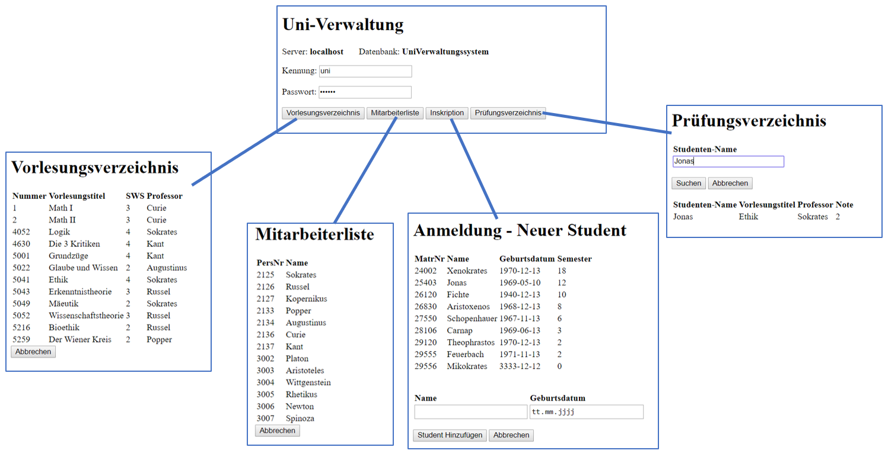
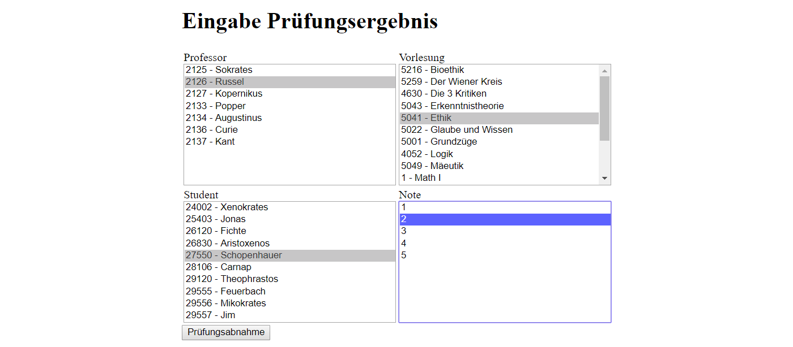

# 6.1 PHP - Übungen

## Einkauf (08)

Erstellen Sie für die Einkauf-DB (aus den SQL-Übungen) eine Anzeige der Kunden-Tabelle.

- In einem ersten Fenster werden die DB-Zugangsdaten eingegeben:
  
  

- Nachdem die Zugangsdaten eingegeben werden, wird auf folgendes Fenster gewechselt:  
  
  
  Es werden sämtliche Spalten angezeigt `$stmt->columnCount()` und die Namen ermittelt `$stmt->getColumnMeta($i)['name']`.

## Einkauf (09)

Erstellen Sie für die Einkauf-DB eine Anzeige der Kunden-Tabelle.

- In einem ersten Fenster werden die DB-Zugangsdaten eingegeben:
  
   

- Nachdem die Zugangsdaten eingegeben werden, wird auf folgendes Fenster gewechselt:  
   
  
   Es werden sämtliche Spalten angezeigt `$stmt->columnCount()` und die Namen ermittelt `$stmt->getColumnMeta($i)['name']`.
  
   In diesem Fenster kann ein Namen-Filter eingegeben werden, dadurch werden nur mehr die Datensätze mit den gewählten Namen angezeigt.

- Die Filter-Schaltfläche ruft die eigene Seite erneut auf, gibt allerdings diesmal den Filter-Parameter mit. Die Prüfung darauf erfolgt mit: `isset($_POST['filterName'])` -> liefert nur *true* wenn der Parameter existiert (leer oder auch nicht). Mit `empty($_POST['filterName'])` wird geprüft ob der Wert leer ist. 

- Die DB-Zugangsdaten werden bei der Filterung mittels globaler Variable übergeben. Dafür wird im Skript `start_session()` eingebaut womit mittels `$_SESSION['…']` Parameter übergeben werden können.

- Versuchen sie die Tabelle mittels SQL-Injection zu leeren. Je nach Implementierung kann das etwa so erfolgen:  
  `" OR "1"; DELETE FROM MY_EINKAUF.KUNDEN WHERE "1";COMMIT;"`

## Univerwaltungssystem

Erstellen Sie mittels PHP und der Uni-Datenbank die folgenden Seiten:

### 

## Prüfungsanmeldung

Erweitern Sie das vorherige Beispiel um eine Prüfungsabnahme. Die Eingabe einer Prüfung soll nur möglich sein, wenn über die Voraussetzungsvorlesungen schon eine Prüfung abgelegt wurde.

