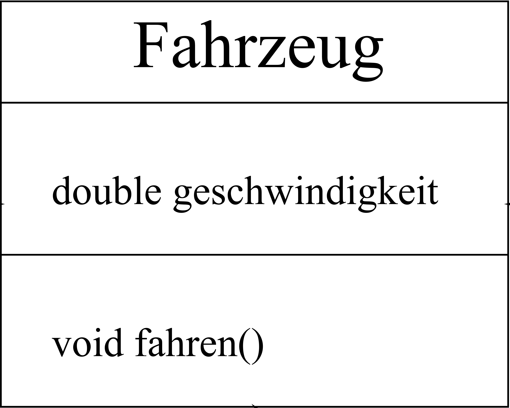

# Objekt Orientierte Programmierung - Vererbung

## Beispiel

Ein Programm beinhaltet die Klassen *Auto*, *LKW*, *Fahrrad* und *Kutsche*. Jede dieser Klassen hat das double-Attribut *geschwindigkeit* und die Methode *fahren()*. Zusätzlich haben einzelne Klassen noch weitere Attribute/Methoden die nicht alle anderen Klassen haben:


Nun könnte jede dieser Klassen unabhängig voneinander implementiert werden. Eventuell idente Attribute/Methoden können z.B. mittels Copy&Paste kopiert werden. Sollen die Klassen später mit weiteren gemeinsamen Attribute/Methoden erweitert werden, dann muss jede der Klassen angepasst werden.

Als Alternative können die gemeinsamen Elemente (Attribute/Methoden) in eine eigene Klasse zusammengefasst werden. Von dieser Klasse der Gemeinsamkeiten können in Folge die einzelnen Klassen *abgeleitet* werden.

Für das angeführte Beispiel kann eine gemeinsame Klasse *Fahrzeuge* erzeugt werden. Diese Klasse enthält das *geschwindigkeits*-Attribute und die *fahren()*-Methode.



Damit muss in den Klassen die sich von dieser Klasse ableiten nur mehr der Unterschied zu dieser Klasse implementiert werden. Wird die *Fahrzeug*-Klasse etwa mit der Methode *bremsen()* ertweitert, dann steht sie auch für die davon abgeleiteten Klassen zur Verfügung.

(Die oben dargestellten Diagramme sind sogenannte UML-Klassendiagramme)


Vererbung
------------

In der OOP gibt es die Möglichkeit Klassen in hierarchischen Beziehungen anzuordnen. Klassen können als eine **Ist-eine-Art-von-Beziehung** definiert werden. Diese Klassen werden **Subklassen** (Unterklassen, Kindklassen, Erweiterungsklassen) genannt.

Die Klasse die erweitert wird, wird als **Superklasse** (Oberklasse, Elternklasse) bezeichnet.

Die Subklasse übernimmt Attribute und Methoden, sie **erbt** diese Elemente. Die Superklasse **vererbt** diese Elemente an die Subklasse. Die Subklasse kann auch zusätzliche Eigenschaften/Methoden bekommen.

```java
public class Fahrzeug {
  public double geschwindigkeit;
  
  public void fahren() {
    ...
  }
}

public class Fahrrad extends Fahrzeug {  // Fahrrad leitet sich von Fahrzeug ab
  // das Fahrrad kann nichts ausser den Elementen aus der Klasse Fahrzeug
}

public class Lkw extends Fahrzeug {  // Lkw leitet sich von Fahrzeug ab
  // der Lkw kriegt alles vom Fahrzeut plus noch was dazu:
  public double tankFuellstand;
  
  public void tanken() {
    ...
  }
}
```

Sollten mehrere Klassen in einem Programm implementiert werden, wird immer versucht Gemeinsamkeiten zu finden und in Superklassen zu implementieren.

Allgemein gilt:

- Alle Klassen sind Kind-Klassen von java.lang.Object - ohne explizites Ableiten, erben sie daher automatisch public Eigenschaften/Methoden (toString() …).
- Mehrfachvererbungen (eine Subklasse hat mehrere Superklassen) sind in JAVA NICHT möglich.
- protected Eigenschaften/Methoden werden auch vererbt und sind im gleichen Paket sichtbar.
- Konstruktoren werden nicht vererbt, können mit **super()** explizit aufgerufen werden.

Beim Erstellen eines Objekts wird noch bevor der Konstruktor der Klasse ausgeführt wird, der Konstruktor der Super-Klasse ausgeführt. Wenn ausschließlich Super-Konstruktoren existieren mit Argumenten, dann muss der Superkonstruktor explizit aufgerufen werden:

```java
class Fahrzeug {
  private double geschw;
  public fahrzeug(double v) {
    geschw = v;
  }
  
}
class Fahrrad extends Fahrzeug {
  public Fahrrad(double v) {
    super(v);			// Aufruf des Basis-Konstruktors mit einem Parameter
    ...
  }
}
```

>Subklassen sind Erweiterungen von Superklassen. Es gilt immer der Satz: *Subklasse __ist ein__ Superklasse* (Fahrrad ist ein Fahrzeug). Eine Superklasse ist etwas **generelleres** als eine Subklasse. Eine Subklasse ist etwas **spezielleres** als eine Superklasse. Zum Finden von Gemeinsamkeiten wird generalisiert.

### Überladen Von Methoden

Geerbte Methoden können auch überladen werden. Damit wird die geerbte Methode unsichtbar. Eventuell soll das Fahrrad ein anderes Fahrverhalten haben als andere Fahrzeuge. Auf die geerbte und überladene Methode kann mit **super** zugegriffen werden.

```java
public class Fahrrad extends Fahrzeug {  // Fahrrad leitet sich von Fahrzeug ab
  public void fahren() {
    // fahrradfahren
    super.fahren();
  }
}
```

> **super** liefert eine Referenz auf die Superklasse.
