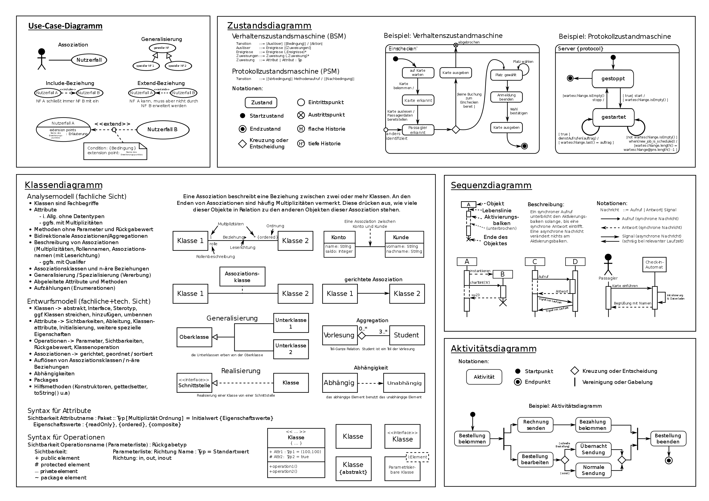
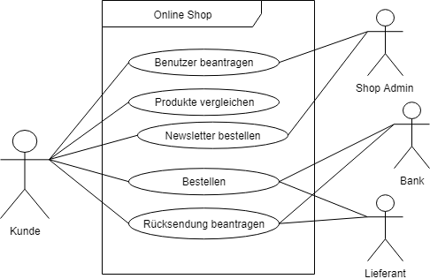
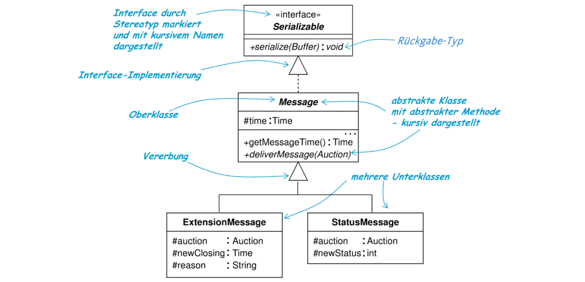

# 4 Unified Modeling Language - UML

Die UML ist eine ISO genormte Sprache um Software/-Systeme zu Spezifizieren und Dokumentieren. Sie definiert Bezeichnungen und für die Modellierung wichtige Begriffe. Ganz wesentlich ist das Zusammenwirken der unterschiedlichen Komponenten. Für das eindeutige Verständnis sind mehrere graphische Darstellungen definiert.

UML-Diagramme Übersicht:

- Use-Case-Diagramme: Beschreibung einzelner Anwendungsfälle (*Use-Cases*). Zur Übersicht, nicht vollständig (um Übersicht zu wahren). Dieses Diagramm ist gut für die Darstellung von Anforderungen an ein System geeignet.
- Informationsflüsse: Um den Fluss von Information in einem Fluss darzustellen wurde eine Beschreibung von Informationsflüssen in Strukturdiagrammen definiert (kein Beispiel).
- Zustandsdiagramm: für einen Teil der Klassen können Zustandsdiagramme eine sehr deutliche Beschreibung von Abläufen bieten.
- Sequenzdiagramm: Häufig ist die zeitliche Abfolge von Erzeugung und Ausführung von Klassen wichtig. Ein Sequenzdiagramm kann hier sehr übersichtlich helfen. Es zeigt auch sehr anschaulich die Interaktionen zwischen verschiedenen Elementen.
- Aktivitätsdiagramm: für parallele Abläufe kann eine Übersichtliche Darstellung mit sogenannten *Swimlanes* erfolgen. Das zeitliche Zusammentreffen zwischen unabhängigen Abläufen kann damit sehr übersichtlich gestaltet werden.

In UML sind noch weitere Diagramm definiert.

## Use-Case

Beschreiben der **Aktionen der Beteiligten**. Dabei:

- Beteiligte: Personen, **Aktoren** - Männchen - wer spielt in diesem System eine Rolle
- Handlungen: Aktionen, **Use-Cases** - Ellipsen - welche Aktionen können Aktoren setzen?
- Systemgrenzen: **Systemkontext** - Rechtecke - in welchem Kontext können Aktoren die Aktionen setzen?

Beispiel Online Shop:

Ein Use-Case-Diagramm ist eine stark reduzierte Darstellung, wichtig sind die Darstellung der Aktoren (Rollen), der Aktionen und wer mit wem in Verbindung zu sehen ist. Dabei werden auch die Beziehung von Use-Cases untereinander dargestellt.

## Klassendiagramm

Tool: ArgoUML - <http://argouml.tigris.org>

### Klasse

- Attribut: Eigenschaften einer Klasse

- Methode: Funktionen einer Klasse

Konstruktoren sind statisch, also ebenfalls unterstrichen.

(abgeleitetes Attribut: Funktion die einen Wert direkt aus einem Anderen berechnet)

### Vererbung, Interfaces

- Abstrakte Klasse: Klasse von welcher kein Objekt erzeugt werden kann, da sie virtuelle Elemente besitzt.
- Interface: Schnittstelle, eine Klasse kann beliebig viele Interfaces implementieren (Java). C++: Abstrakte Klasse, in welcher ausschließlich virtuelle/abstrakte Elemente sind.

Virtuelle Funktionen in C++ werden ebenfalls kursiv dargestellt.

### Beziehungen

- Assoziation: allgemeine Beziehung (keine nähere Information) - Linie, im allgemeinsten Fall ohne Pfeil

- Aggregation: eine Klasse ist in einer anderen Klasse enthalten (*Ist-Teil-Von-Beziehung*) - unausgefüllte Raute (Raute auf der Seite der einbindenden Klasse)
- Komposition: wie Aggregation aber zusätzlich: die Teilklasse kann nicht alleine existieren - ausgefüllte Raute (Raute auf der Seite der einbindenden Klasse)  
  Mannschaft <-> Person: Person kann auch ohne Mannschaft existieren -> Aggregation  
  Bestellposten <-> Bestellung: Bestellposten kann nicht ohne Bestellung existieren -> Komposition

- Realisierung: Implementierung eines Interfaces - gestrichelte Linie (siehe Oben)

- Vererbung / Generalisierung / Spezialisierung: Ableitung einer Klasse - durchgehende Linie, Dreieckpfeil (siehe Oben)
- Pfeile zeigen in welche Richtung ein Zugriff möglich ist (*Navigation*) - und damit auch ob eine Klasse eine Andere kennt (im Beispiel: Person hat eine Message-Liste und kennt die Message(s), umgekehrt weiß die Message nicht wem sie zugeordnet ist).

Multiplizität / Kardinalität: mit Zahlen kann die Anzahl von Objekten beschrieben werden die miteinander in Beziehung stehen

Rollen: Die Rolle wird nahe der Klasse angegeben und beschreibt die Rolle der Klasse in der Beziehung. Der Beziehungsname wird mittig über die Beziehung geschrieben und kann mit einem Pfeil für die Leserichtung eingetragen werden: *Person participates Auction*

## Referenzen

- Portal <https://www.uml.org/>  
  *Der* Standard: <https://www.omg.org/spec/UML/2.5.1/PDF> 
- Assoziationen:  
[informatikzentrale.de/assoziationen.html](informatikzentrale.de/assoziationen.html)
- UML-Programm und Klassendoku:  
  <https://www.softwareideas.net/uml-class-diagram#aggregation>  
  <https://www.softwareideas.net/en/download> (frei für Non-Commercial-Use)