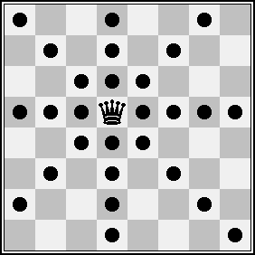
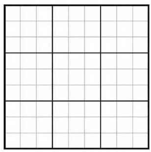
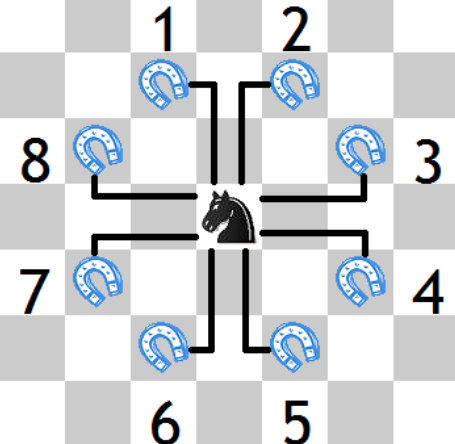

# Backtracking - Übungen

## Labyrinth Erzeugung + Grafische Darstellung in Windows ([C++](../Cpp/{MOC}%20Cpp.md)350, C2104)

Stellen Sie das Labyrinth grafisch dar (es werden Wege und nicht Wände gezeichnet):

```
─┐ ────────┬─┐ ──┬───┐ ──┬─┐ ┌─┬─  ┌───┐
 └─────────┘ └─┐ │ ──┴───┘ │ │ │ ┌─┘ ┌─┤
 ┌─  ┌─┐ ┌─────┘ ├───┐ ┌─┐ │ │ ┌─┘ ┌─┘ │
 │ ┌─┘ └─┘ ┌─────┘ │ │ │ └─┘ │ │ │ └───┐
 ├─┘ │ ┌─┐ │ ────┬─┘ │ └───┐ │ │ │ ┌─┐ │
 └─┐ │ │ └─┘ ┌───┤ ┌─┘ ┌─┐ └─┘ │ │ │ └─┘
 │ │ └─┴─┐ ┌─┘ │ │ └───┘ └─┬───┘ │ └───┐
 │ └─┐ ──┴─┘ ┌─┴─┘ ┌─┐ ┌─┐ └─────┴─┐ ┌─┘
 ├─┐ └─────┐ │ │ ┌─┘ └─┘ └─┐ │ ┌───┘ └─┐
 │ ├───┐ ┌─┘ └─┘ └───┬───┐ │ └─┘ ┌─────┤
 ┌─┘ ┌─┘ │ ┌───┐ ┌─┐ │ ┌─┘ └───┐ │ ────┘
 │ ┌─┴─  └─┘ │ └─┘ └───┘ ──┐ ┌─┘ ├─────┐
 │ │ ┌─┐ ┌───┤ ┌───┐ ┌───┬─┘ │ ┌─┘ ┌───┤
 ├───┘ │ └─┐ │ │ ┌─┘ ├─  └─┐ │ │ │ │ ──┤
 │ ┌───┴─  │ └─┘ └───┘ ┌───┤ │ └─┤ └─┐ │
 │ └───────┘ ──────┬─┐ └─┐ │ │ ──┴─  │ │
 │ ──┬─┐ ┌─┐ ┌─┐ ┌─┘ │ │ └───┘ ┌─┐ ┌─┘ │
 │ ┌─┘ └─┘ └─┘ │ │ ┌─┘ └───┬───┘ └─┘ │ │
 └─┘ ┌─┐ ┌─────┘ │ │ ──┬───┘ │ ┌───┐ ├─┘
 ────┘ └─┴───────┘ └───┘ ────┴─┴─  └─┴──
```

wobei (hier nicht darstellbar) die Lösung farbig eingezeichnet werden soll. In Windows wird üblicherweise in der Konsole, der Zeichensatz/die Codierung Codepage 850 verwendet (<https://de.wikipedia.org/wiki/Codepage_850).> Darin sind die dargestellten Zeichen für die Erstellung von Tabellen verfügbar. Als Übersetzung kann verwendet werden (4 Seiten mit je Weg oder nicht -> 2^4 Möglichkeiten):

```c++
const wstring walls[16] = {
  L" 0",       // 0
  L"\xC4\xC4", // 1   // L
  L" \xB3",    // 2   // U
  L"\xC4\xBF", // 3
  L" \xC4",    // 4   // R
  L"\xC4\xC4", // 5
  L" \xDA",    // 6
  L"\xC4\xC2", // 7
  L" \xB3",    // 8   // O
  L"\xC4\xD9", // 9
  L" \xB3",    // 10
  L"\xC4\xB4", // 11
  L" \xC0",    // 12
  L"\xC4\xC1", // 13
  L" \xC3",    // 14
  L"\xC4\xC5"  // 15
};
```

Wobei ein Feld des Labyrinths mit einem Bit-Feld belegt wird. Bit1=links, Bit2=unten, Bit3=rechts, Bit4=oben. Wenn die Abgänge eines Felds mit diesen Bitpositionen verwendet werden, dann kann die Übersetzung (hier *walls*) erfolgen. Die Erzeugung des Labyrinths erfolgt ebenfalls mittels Backtracking:

- Beginn Links-Oben
- Bewegen auf ein zufällig gewähltes, benachbartes, freies Feld
- Wiederholung: bewegen auf ein zufällig gewähltes Nachbarfeld
- Wiederholen solange bis kein Feld mehr frei (Sackgasse) -> Rückschritt, Prüfen ob anderes Feld frei -> Wiederholen oder Wiederum Rückschritt
- Die Prozedur wird solange wiederholt bis kein Feld im Array mehr frei.

Beim Finden eines Weges durchs Labyrinth kann wiederum in das Labyrinth-Array eingetragen werden: Bit-Position 5 für Feld begangen. In der Darstellung kann in Windows der Weg farbig gezeichnet werden:

```c++
HANDLE hConsole = GetStdHandle(STD_OUTPUT_HANDLE);

SetConsoleTextAttribute(hConsole, 4);           // Color 4 = red
if (m_area[r][c] & 0x10)
    SetConsoleTextAttribute(hConsole, 9);       // Color 9 = blue
wcout << walls[m_area[r][c] & 0xF];             // Mask only lower 4 Bit-Positions
```

## Visualisierung Labyrinth Mit Backtracking (Java 011)

Der Weg durch ein Labyrinth soll gefunden werden. Gestartet wird in der linken oberen Ecke, das Ziel ist die rechte untere Ecke. Das Vorgehen:

- …

- von der aktuellen Position wird versucht eine beliebige Nachbarposition zu begehen (nicht erlaubt wenn eine Wand, Rand des Labyrinths, schon Besucht).
- Wenn das möglich ist wird das Feld als gültig markiert (grün) und das Vorgehen wiederholt.
- Wenn es nicht möglich ist eine Nachbarfeld zu begehen, dann wird von der aktuellen Position auf die vorherige zurückgesetzt und das aktuelle Feld als ungültig markiert (rot).
- …

Bringen Sie das Java-Programm *GrfLabyrinth.java* zum Laufen.

## Visualisierung Labyrinth Mit Backtracking

Bringen Sie das Java-Programm *VisualLabyrinth.html* zum Laufen. Dazu muss die Suche des Wegs im Java-Skript-Code *worker_labyrinth.js* implementiert werden.

## 8 Damen (2102)

Acht Damen sollen so auf einem 8x8-Felder Schachbrett platziert werden, dass keine Dame eine andere bedroht. Damen bedrohen Figuren entlang der waagrechten, senkrechten und diagonalen Linien:



Wird die Dame im dargestellten Feld gesetzt, dann darf keine weitere Dame auf den mit Punkten markierten Feldern stehen.

Das Ergebnis soll so aussehen:

```
Loesung 8-Damen-Problem

Es werden 8 Damen so auf dem Feld plaziert,
dass sich keine der Damen gegenseitig bedroht.
Die Loesung wird mittels Backtracking berechnet.
    
       A   B   C   D   E   F   G   H
     ╔═══╪═══╪═══╪═══╪═══╪═══╪═══╪═══╗
   1 ║ ♛│   │   │   │   │   │   │   ║
     ╫───┼───┼───┼───┼───┼───┼───┼───╢
   2 ║   │   │   │   │   │   │ ♛│   ║
     ╫───┼───┼───┼───┼───┼───┼───┼───╢
   3 ║   │   │   │   │ ♛│   │   │   ║
     ╫───┼───┼───┼───┼───┼───┼───┼───╢
   4 ║   │   │   │   │   │   │   │ ♛║
     ╫───┼───┼───┼───┼───┼───┼───┼───╢
   5 ║   │ ♛│   │   │   │   │   │   ║
     ╫───┼───┼───┼───┼───┼───┼───┼───╢
   6 ║   │   │   │ ♛│   │   │   │   ║
     ╫───┼───┼───┼───┼───┼───┼───┼───╢
   7 ║   │   │   │   │   │ ♛│   │   ║
     ╫───┼───┼───┼───┼───┼───┼───┼───╢
   8 ║   │   │ ♛│   │   │   │   │   ║
     ╚═══╪═══╪═══╪═══╪═══╪═══╪═══╪═══╝
```

Vervollständigen Sie den Code:

```c
#include <stdio.h>
#include <stdlib.h>

#define DIM 8

void initBoard(int board[DIM][DIM]);
void printBoard(int board[DIM][DIM]);
int findConfig(int numDam, int board[DIM][DIM]);
int impossibleMove(int x, int y, int board[DIM][DIM]);

int main() {
    int board[DIM][DIM];
    initBoard(board);
    findConfig(0, board);
    printBoard(board);
    return 0;
}

int findConfig(int numDam, int board[DIM][DIM]) {
    if (numDam == DIM) return 0;
    /*
  	y = 0 bis DIM
    	Wenn board[numDam][y] nicht bedroht
    		Besetze board[numDam][y]
    		Wenn findConfig(numDam+1, Feld) erfolgreich, return 0
    		Sonst hebe Feld besetzen wieder auf
	*/  
    return -1;
}

int impossibleMove(int x, int y, int board[DIM][DIM]) {
    // ??????????????????????????????????????????
}


void initBoard(int board[DIM][DIM]) {
    int x, y;
    for (x = 0; x < DIM; x++) {
        for (y = 0; y < DIM; y++) {
            board[x][y] = -1;
        }
    }
}

void printBoard(int board[DIM][DIM]) {
    int x, y;

    // Header:
    printf("Loesung %i-Damen-Problem\n\n", DIM);
    printf("Es werden %i Damen so auf dem Feld plaziert,\n", DIM);
    printf("dass sich keine der Damen gegenseitig bedroht.\n");
    printf("Die Loesung wird mittels Backtracking berechnet.\n\n");
    printf("     ");
    for (x = 0; x < DIM; x++) {
        printf(" %c",'A' + x);
    }
    printf("\n    ");
    for (x = 0; x < DIM+1; x++) {
        printf("__");
    }
    printf("\n");
    // Board
    for (y = 0; y < DIM; y++) {
        printf(" %3i|", y+1);
        for (x = 0; x < DIM; x++) {
            if ((board[x][y] >= 0) && (board[x][y] < DIM)) printf("%2i", board[x][y]+1);
            else printf(" .");
        }
        printf("|\n");
    }
    // Footer:
    printf("    |");
    for (x = 0; x < DIM; x++) {
        printf("__");
    }
    printf("|\n");
}
```

## Visuelle Darstellung Des 8-Damen-Problems

Erweitern Sie den js-Code des 8-Damen-Problems so, dass die HTML-Datei Backtracking8Damen.html funktioniert (worker_ndamen.js).

## Sudoku (2100)

Gegeben ist ein Sudoku Feld mit neun 3x3 großen Teilfeldern. Die Teilfelder sind 3x3 angeordnet.




Wenn das Rätsel gelöst ist, muss in jedem Teilfeld jede Ziffer von 1 bis 9 genau einmal vorkommen. Zusätzlich muss jede Ziffer in jeder Spalte und in jeder Zeile genau einmal vorkommen.

Zu Beginn sind in manchen Feldern bereits Ziffern eingetragen. Die fehlenden Felder müssen durch den Algorithmus mit passenden Nummern befüllt werden.

1. Im ersten freien Feld wird eine Ziffer eingetragen, es wird die erste Ziffer gewählt die weder im Teilfeld, noch in der Zeile und auch nicht in der Spalte vorkommt.
2. Dieses Vorgehen wird für das nächste freie Feld wiederholt.
3. Sollte sich in einem Feld keine Ziffer finden die noch nicht in der Spalte und Zeile vorkommt und im Teilfeld vorkommt, dann sind die bisherigen Annahmen nicht zulässig. Die zuletzt getroffene Annahme wird rückgängig gemacht und eine andere gültige Ziffer gewählt.  
4….

## Visuelle Darstellung Sudoku

 Der Worker worker_sudoku.js muss so angepasst werden um den Sudoku-Löser lauffähig zu machen.

## Springer-Problem (2101)

Mittels Springer (Schachfigur-Pferd) soll auf einem leeren Schachbrett (8x8 Felder) ein Weg gefunden werden um sämtliche Felder genau einmal zu besuchen. Als Bewegung für den Springers ist dabei nur erlaubt: 2 Felder in eine beliebige Richtung und 1 Feld in eine rechtwinklig davon abgehende Richtung:



Es ergeben sich daraus die dargestellten, möglichen acht Bewegungen. Das Ergebnis kann so aussehen (hier Start auf 0/0):

```
Springer-Problem:
Versuch saemtliche Felder eines Schachbretts mittels Springer zu erreichen.

 01  38  55  34  03  36  19  22
 54  47  02  37  20  23  04  17
 39  56  33  46  35  18  21  10
 48  53  40  57  24  11  16  05
 59  32  45  52  41  26  09  12
 44  49  58  25  62  15  06  27
 31  60  51  42  29  08  13  64
 50  43  30  61  14  63  28  07
-----6484068----------------------------------------
```

Hier wird anhand Nummern die Reihenfolge der besuchten Felder angezeigt.

Lösung:

1. Ausgehend von aktueller Brettposition Versuch "A": Weg 1 (siehe Bild oben)
   - wenn möglich (noch nie besucht und auf dem Brett): versuche von dort wiederum Weg 1
   - wenn nicht möglich: versuche Weg 2
   - …
   - wenn keiner der 8 Wege möglich, dann ist der aktuelle Versuch "A" nicht zulässig und wird rückgängig gemacht

2. Ausgehend von aktueller Brettposition Versuch "B": Weg 2

3….

## Visualisierung Springer Mit Backtracking (JS008)

Bringen Sie das Java-Programm *Springerproblem.html* zum Laufen. Dazu muss die Suche des Wegs im Java-Skript-Code *worker_springer.js* implementiert werden.