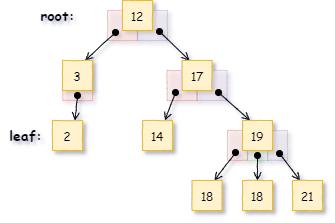
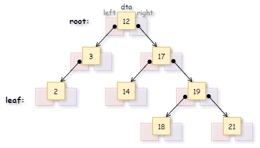
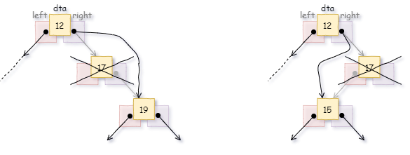

# Trees

Roots (Wurzel): Hat keine 

## Binary Tree

Jeder Knoten hat maximal 2 Sub-knoten 

### Binary Search Tree

Jeder Knoten im Linken Teilbaum ist kleiner als seine Wurzel.  
Jeder Knoten im rechten Teilbaum ist größer als seine Wurzel.

> [!EXAMPLE] 
>
> 
>
> ``` c
> struct node {
> 	int data;
> 	struct node *next;
> 	struct node *last;
> }
> typedef struct node node_t;
> ```

### Durchqueren/Traversieren

#### Depth-First-Search DFS

Durch das Traversieren eines Binären Such Baumes mit depth first search, bekommt man eine Sortierte Liste zurück.

#### Breadth First Search BFS

---

# Tags

## Bäume

Für Bäumen gilt:

- Bäume bestehen aus Knoten.
- Jeder Knoten hat keine oder mehrere Nachfolgerknoten.
- Jeder Knoten, bis auf den **Wurzelknoten (root)**, hat einen Vorgängerknoten.
- Ein Knoten ohne Nachfolger ist ein **Blatt (leaf)**.



Haben Knoten in Bäumen maximal zwei Nachfolgeknoten werden diese als **binäre Bäume** bezeichnet. Sie haben große Bedeutung für die Sortierung/Suche von Daten - **binäre Suchbäume**.



Für einen binären Suchbaum gilt zusätzlich, dass die Werte jedes linken Teilbaums kleiner als die Wurzel ist.

**Baum-Knoten in C**

Für einen Binären Baum kann ein Knoten die folgende Struktur haben:

```c
typedef struct SNODE {
    int num;                // Datum des Knotens
    struct SNODE *left;     // Zeiger auf linken Teilbaum
    struct SNODE *right;    // Zeiger auf rechten Teilbaum
} TNODE;
```

### Traversieren in Binären Bäumen

Häufig ist es gewünscht durch einen Baum hindurch sämtliche Elemente genau einmal aufzusuchen, etwa bei der Ausgabe oder der Suche. Man nennt das das **Traversieren** in einem Baum. Es gibt grundsätzlich die Bewegungsmöglichkeiten:

- Links->Wurzel->Rechts: **inorder**

  ```c
  void inorder(TNODE *ptr, FILE *stream){
      if (ptr){
          inorder (ptr->left, stream);
          fprintf (stream, "%d", ptr->num);
          inorder (ptr->right, stream);
      }
  }
  // 2 3 12 14 17 18 19 21
  ```

  Hier wird "von Links nach Rechts" jeder Knoten-Wert des Baums mit root = ptr in den FILE-stream ausgegeben. 

- Links->Rechts->Wurzel: **postorder**

  ```c
  void postorder(TNODE *ptr, FILE *stream) {
      if (ptr){
          postorder (ptr->left, stream);
          postorder (ptr->right, stream);
          fprintf (stream, "%d", ptr->num);
      }
  }
  // 2 3 14 18 21 19 17 12
  ```

- Wurzel->Links->Rechts: **preorder**

  ```c
  void preorder(TNODE *ptr, FILE *stream) {
      if (ptr){
          fprintf (stream, "%d", ptr->num);
          preorder (ptr->left, stream);
          preorder (ptr->right, stream);
      }
  }
  // 12 3 2 17 14 19 18 21
  ```

### Suche in Binären Suchbäumen

In diesen Bäumen sind Elemente kleiner dem Knotenelement immer Links, die Suche ist daher mit wenig Aufwand möglich:

```c
TNODE *search(int num, TNODE *root) {
    if (root == NULL)                // Baumende
        return NULL;
    else if (num == root->num)       // Knoten gefunden
        return root;
    else if (num < root->num)        // Suchelement vor aktuellem Knoten --> Links
        return search(num, root->left);
    else                             // Suchelement nach aktuellen Knoten --> Rechts
        return search(num, root->right);
}
```

### Einfügen in Binären Suchbäumen

Das Einfügen erfolgt auf folgende Weise: im Baum wird solange verzweigt biss der Abzweig gefunden wird an der das Element zu finden sein müsste. Dort wird das Element eingefügt:

```c
TNODE *insert (int num, TNODE **root) {
    TNODE *curr= *root;
    TNODE *prev= *root;
	
    // 1. Wenn Baum leer ist: Knoten als Wurzel erzeugen und Fertig
    if (*root == NULL) {
        *root = make_node(num);
        return *root;
    }

    //2. Suche Platz zum Einfügen
    while (curr != NULL) {
        prev = curr;
        if (num > curr->num)
            curr= curr->right;
        else if ( num < curr->num)
            curr= curr->left;
        else //Element bereits vorhanden
            return NULL;
    }

    //3. Bei prev neuen Knoten Erzeugen und Einfügen
    if (num > prev->num) {
        prev->right= make_node(num);
        return prev->right;
    } else {
        prev->left= make_node(num);
        return prev->left;
    }
}
```

Das macht das Arbeiten mit binären Bäumen so effizient, beim Einfügen muss nie ein Ersetzen/Verschieben erfolgen, jedes neue Element kann als Blatt sortiert eingefügt werden.

### Löschen in Binären Suchbäumen

Für das Löschen eines Knotens in binären Suchbäumen müssen zwei Fälle unterschieden werden:

- Löschen von Knoten mit nur einem Zweig (Folgeknoten) oder gar keinem Zweig (also ein Blatt)
- Löschen von Knoten mit zwei Folgeknoten

Soll ein Knoten gelöschte werden dem nur ein Knoten folgt:



Im linken Bild soll Knoten 17 gelöscht werden. Dazu muss der right-Zeiger des Vorgängerknoten 12 der auf 17 zeigt auf Knoten 19 geändert werden (also auf denjenigen Knoten auf den der zu löschende Knoten zeigt). Wenn Knoten 17 keine Folgeknoten hat, dann wird der right-Zeiger von Knoten 12 (der auf Knoten 17 zeigt) auf NULL verändert.

Im rechten Bild soll Knoten 17 gelöscht werden. Dazu muss der right-Zeiger von Knoten 12 auf Knoten 15 verändert werden.

Völlig anders für das Löschen von Knoten mit zwei Folge-Zweigen. Im dargestellten Beispiel soll etwa der Knoten 12 gelöscht werden. Dazu wird der Knoten 12 durch den Knoten mit dem nächsthöheren Wert ersetzt (hier Knoten 14). Der nächsthöhere Knoten ist der Knoten im rechten Teilbaum von 12 der ganz links ist.


Für das Ersetzten von Knoten 12 durch Knoten 14 wird am einfachsten nur der Wert kopiert und dann Knoten 14 gelöscht. Hätte Knoten 14 noch einen rechten Zweig, dann müsste der Löschvorgang rekursiv auf diesen Knoten angewendet werden.

Die beschriebene Art kann völlig analog auch auf der anderen Seite erfolgen: 12 kann auch durch den Knoten ersetzt werden, der ganz rechts im linken Zweig liegt (hier 3).

### Ungünstige Konfigurationen

Der Grund für die Entwicklung der Bäume ist ja eine effiziente Suchstruktur. Je nachdem in welcher Reihenfolge ein Baum aufgebaut wird kann es zu ungünstigen Konstellationen kommen:


Um solche Anordnungen zu vermeiden, gibt es balancierte/ausgeglichene Bäume. Um einen Baum auszubalancieren wird der Medianwert ermittelt und als Wurzel gesetzt. Für jede Seite des Baums wird dieser Vorgang wiederholt.

(Medianwert ist jener Wert einer Zahlenzeihe zu dem es in der Zahlenreihe gleich viel größere als kleinere Werte gibt. Zum Beispiel: für die Zahlenreihe 1,2,1000 ist der Medianwert 2 - es gibt einen größeren und einen kleineren Wert)