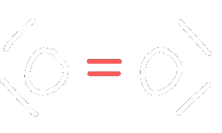
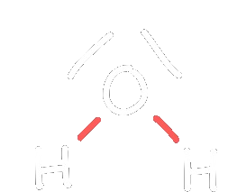
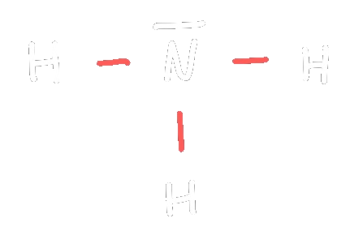
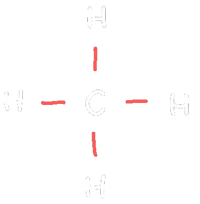
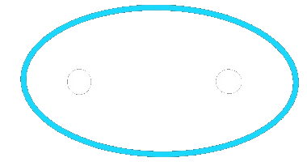
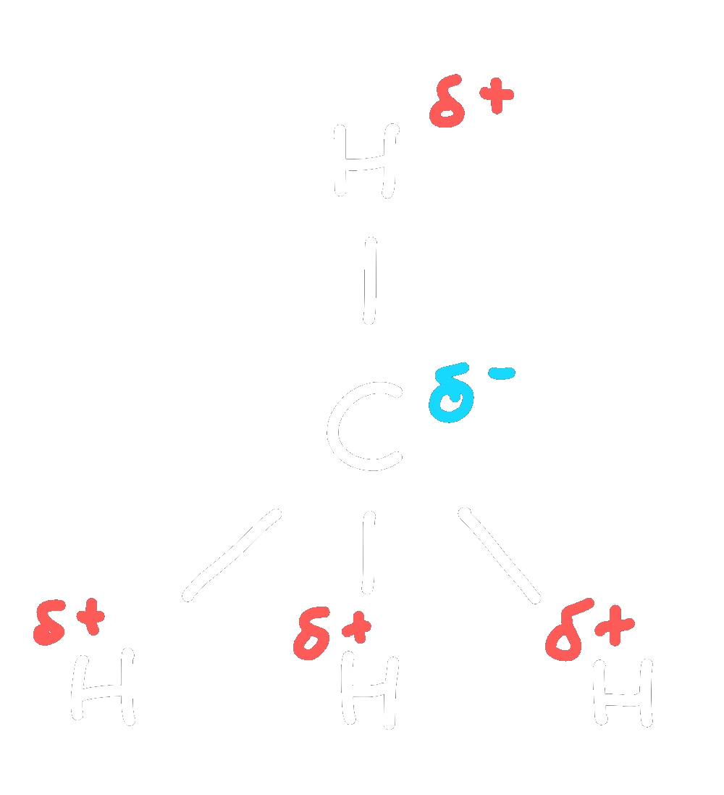
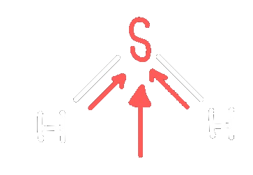

# Atombindung

- Wichtigste Art der Bindung zwischen 2 Nichtmetallatomen
- $\Delta EN < 1.7$
- Elektronen-Wolken durchdringen einander $\rightarrow$ <mark style="background: #ADCCFFA6;">negative</mark> Ladungswolke hält <mark style="background: #FF5582A6;">positive</mark> Kerne zusammen $\rightarrow$ Neues Teilchen: **Molekül**
- $H_{2}$ Molekül ist energieärmer als 2x $H$  

**Allgemeine Eigenschaften von Stoffen mit Atombindung**
- Moleküle sind Elektrisch neutral $\rightarrow$ elektrische Isolatoren
- Niedriger Schmelz und Siedepunkt (Ausnahme: Gitter)
- Kommen fest, flüssig und gasförmig vor

**Stoffe mit Atombindungen**
- Nichtmetalle ($H_{2}$)
- Viele anorganische Verbindungen ($H_{2}O$)
- Alle organischen Verbindungen ($CH_{4}$, Polymere)

## Bindende Elektronenpaare

Durch Überlappung einfach besetzter Orbitale benachbarter Atome, entstehen Elektronenpaare mit entgegengesetztem Spin.

## Nicht bindende Elektronenpaare

Bestimmen räumliche Anordnung der Atome und Wechselwirkung zwischen Moleküle.

## Valenzstrichformel

| Molekül  | VSF                    | Atome                                                                               |
| -------- | ---------------------- | ----------------------------------------------------------------------------------- |
| $Cl_{2}$ | > |                                            |
| $O_{2}$  | >  |                                            |
| $N_{2}$  | >  |                                            |
| $HCl$    | > |   |
| $H_{2}O$ | > |                                                                                       |
| $NH_{3}$ | > |                                                                                      |
| $CH_{4}$ | > |                                                                                     |

Durch gemeinsame Elektronenpaare erreichen all Atome Edelgaskonfiguration (8 [Valenzelektronen](Valenzelektronen.md)).  
Die **Molekülform** wird durch Abstoßung der freien und der bindenden Elektronenpaare bestimmt:
> Tetraeder ($CH_{4}$)  
> Verzerrter Tetraeder ($NH_{3}$)  
> gewinkeltes Molekül ($H_{2}O$)

# Doppel und Dreifachbindungen

## Unpolare Atombindungen

1. Eine reine Atombindung besteht **nur** zwischen Atomen gleicher Elektronegativität $\rightarrow$ **symmetrische Elektronen & Ladungsverteilung**

| Molekül                   | VSF                             | Ladungsverteilung       |
| ------------------------- | ------------------------------- | ----------------------- |
| $Cl_2$   $\Delta EN=0$ | > | > | 

1. Bei Atomen unterschiedlicher $\Delta EN$, die sich zu einem **symmetrischen Molekül** verbinden $\rightarrow$ **unpolare Verbindung**
>

Unpolare Stoffe zeigen nach außen keine Ladung und sind deshalb im Wasser schwer löslich $\rightarrow$ **Hydrophob** (z.B.: Benzin).

## Polare Atombindungen

Bei Atomen mit unterschiedlicher Elektronegativität ($\Delta EN < 1.7$) liegt eine polare Atombindung vor.

<mark style="background: #FF5582A6;">Atome mit unterschiedlicher Elektronennegativität und unsymmetrischem Aufbau bilden Polare Moleküle. 	 </mark>  
<mark style="background: #ADCCFFA6;">$\rightarrow$ hydrophil (wasserliebend) </mark> 

Dipole heben sich auf $\rightarrow$ unpolar. 

### Dipol

| Molekül                    | VSF                    | Ladungsverteilung  |
| -------------------------- | ---------------------- | ------------------ |
| $HCl$   $\Delta EN=0.9$ | > | > |

Dipolpfeil zeigt zur negativen Ladung  
Wichtigstes Dipolmolekül: $H_{2}O$
>

#### Dipolmoment

Teilpole addieren sich zum Dipolmoment:  
**Einheit:** D - Debey  
$H_{2}O$: $1.9D$  
$HCl$: $1.1D$  
$H_{2}S$: $1.1D$

>

Weil Dipole sich elektrisch anziehen, kondensieren diese leicht  
$H_{2}O$ flüssig  
$H_{2}S$ gasförmig (geringeres Dipolmoment)

 

---

# Tags

[Studyflix - Dipol](https://studyflix.de/chemie/dipol-2390) 