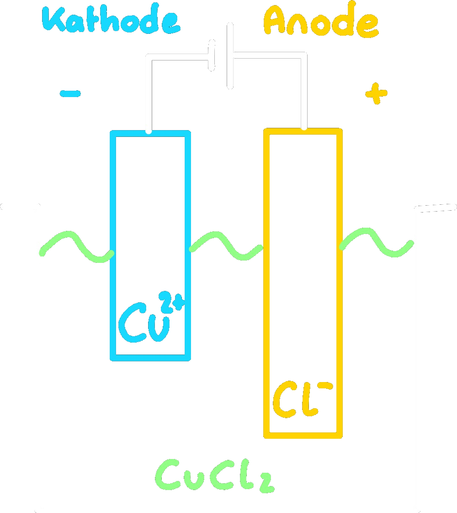
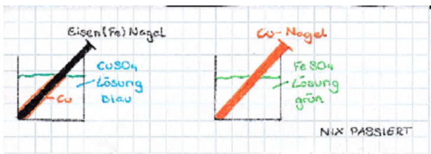
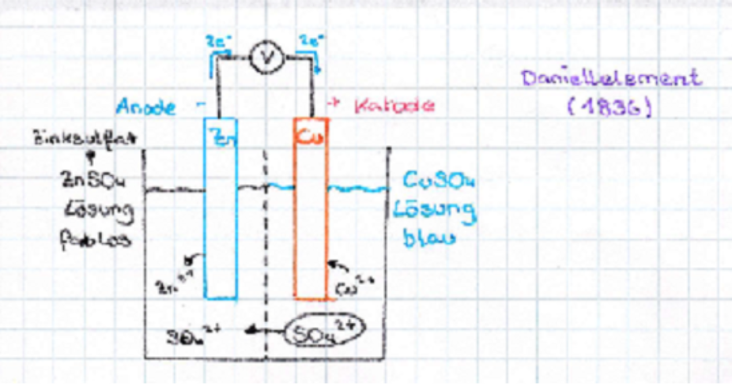

# Elektrochemie

> [!INFO] **LUIGI GALVANI (1750)**, **ALESSANDRO VOLTA (1800)**  
>Bei Kontakt unterschiedlicher Metalle mit einer Elektrolytlösung entsteht elektrische Spannung.  
>Elektrolyte (oder elektrische Leiter 2. Klasse) Lösungen / Schmelzen welche Ionen enthalten  
>$\rightarrow$ sind Leitfähig

## Elektrolyse

Abscheidung von Stoffen durch Strom beziehungsweise Zerlegung mit Strom.

>[!EXAMPLE] Elektrolyse von $CuCl_{2}$ (Kupfer(II)-chlorid Lösung)  
>

| [Reduktion](Oxidation%20und%20Reduktion.md) (Aufnahme von $e^{-}$) | [Oxidation](Oxidation%20und%20Reduktion.md) (Abgabe von $e^{-}$) |
| ---------------------------------------------------------------------------- | -------------------------------------------------------------------------- |
| $Cu^{2+}+2e^{-}\longrightarrow Cu$                                           | $2Cl^{-}\longrightarrow Cl_{2}+2e^{-}$                                                                           |

**Gesamtreaktion:** $CuCl_{2}\longrightarrow Cu\downarrow+Cl_{2}\uparrow$

**Elektrolyse ist mit Gleichstromerzwungene [Redoxreaktion](Oxidation%20und%20Reduktion.md)**
- **Zersetzungsspannung:** Mindestspannung für der Elektrolyse
- **Schmelzflusselektrolyse:** Elektrolyse von Schmelzen

### Berechnung elektrolytischer Vorgänge

Die durch die Elektrolyte geflossene Ladung $Q$ (Elektrizitätsmenge) ist das Produkt aus der Stromstärke $I$ und der Dauer des Stromflusses $t$:  
$Q=I\cdot t$  
Faraday Konstante: $F = 96485 \frac{As}{mol}$

> [!EXAMPLE] Berechnung der für eine Elektrolyse notwendige Ladung  
Wie viel Ladung benötigt man um aus Kupfersalzlösung 1kg Cu abzuscheiden?  
$Cu^{2+} + 2e^{-}\longrightarrow Cu\downarrow$
---
$1mol\dots63.5g$
$n\ mol\dots1000g$
$n = 15.78mol$
---
$Q = 15.78mol\cdot F \cdot 2$  
**$Q = 3.03\cdot 10^{3}As$**

> [!EXAMPLE] Berechnung der bei einer Elektrolyse abgeschiedenen Masse  
Wie viel Silber (Ag) kann ein Strom von $10A$ in $20s$ aus einer Silbersalzlösung abscheiden?  
$Ag^{+} + e^{-} \longrightarrow Ag$  
$Q=I\cdot t = 200As$
---
$1mol\dots 96485As$
$n\ mol\dots 200As$
$n=2.072\cdot10^{-3}mol$
---
$107g\dots 1mol$  
$m\ g\dots 2.072\cdot10^{-3}$  
**$m = 0.2235g$**

> [!EXAMPLE] Berechnung der für eine Elektrolyse erforderlichen Stromstärke  
Welche Stromstärke benötigt man wenn man aus einer Silbersalzlösung in 30min 54g Ag abscheiden will?  
$Ag^{+}+e^{-}\longrightarrow Ag$  
$30min = 1800s$
---
$107g\dots 1mol$
$54g\dots n mol$
$n = 0.5$
---
$Q=I\cdot t = 0.5\cdot F$  
$I = \dfrac{0.5\cdot F}{1800}$  
**$I = 26.801A$**

## Spannungsreihe

**Eisennagel in Kupferlösung:** Kupfer scheidet sich ab und Eisen löst sich.  
**Kupfernagel in Eisenlösung:** Eisen bleibt gelöst und Kupfer bleibt Metallisch.  
unedles Fe geht gerne in Lösung! → Lösung wird grün  
edleres Cu bleibt gerne metallisch oder scheidet sich ab!

[Oxidation](Oxidation%20und%20Reduktion.md):$Fe \longrightarrow Fe^{2+} + 2e^{-}$  
[Reduktion](Oxidation%20und%20Reduktion.md): $Cu^{2+} + 2e^{-} \longrightarrow Cu\downarrow$  
$Fe + Cu^{2+} \longrightarrow Fe^{2+} + Cu\downarrow$

Je leichter ein [Metall](Metallbindung.md) in Lösung geht, desto unedler ist es.

### [Reaktivitätsreihe](Elektrochemische%20Spannungsreihe.md) der Metalle

- unedle Metalle in $HCl$ löslich
- edle Metalle in $HCl$ unlöslich

### Galvanisches Element

elektrochemische Spannungsquelle bestehend aus 2 Halbelementen die durch eine Membran getrennt sind.  
  

#### Beim Schließen des Stromkreises passiert folgendes

1. Unedleres $Zn$ löst sich auf ([Oxidation](Oxidation%20und%20Reduktion.md))  
   $Zn\longrightarrow Zn^{2+}+2e^{-}$
   
2. $e^{-}$ wandern zum edleren $Cu$ und reagieren mit $Cu^{2+}$ und $Cu$ schiedet sich ab ([Reduktion](Oxidation%20und%20Reduktion.md))  
   $Cu^{2+}+2e^{-}\longrightarrow Cu\downarrow$
   
3. $SO_{4}^{2-}$ wandert durch Membran $\rightarrow$ es bildet sich Zinksulfat  
   $Zn^{2+} + SO_{4}^{2-}$
   
4. Stromkreis ist geschlossen

#### Welche Spannung entsteht

Spannung bei Kupfersulfat ($Cu-Zn$) Element: $1.11V$  
Spannung $U$ ergibt sich aus der Differenz der Metallpotentiale $E°$:  $U = E_{edel} - E_{unedel}$

### Standard-Wasserstoffelektrode

Spannung eines einzelnen Metalls kann nicht angegeben werden.  
Vermessung gegen eine Bezugselektrode ist notwendig.  
$\rightarrow$ *Standard-Wasserstoffelektrode* willkürliches Potential von $H = 0$  
  
**Standard:** 
- Wasserstoffgesättigte Pt-Elemente mit $HCl$: $c = 1.00 mol/l$
- $p = 1 bar$ 
- $T = 25°C$

Unedle Metalle: $e^{-}$ fließen zur Wasserstoffhalbzelle; [Metall](Metallbindung.md) löst sich auf $E° < 0$  
Edle Metalle: efließen von Wasserstoffhalbzelle zum edlen [Metall](Metallbindung.md); [Metall](Metallbindung.md) scheidet sich ab. $E° > 0$  
[(° = Standard)](Elektrochemische%20Spannungsreihe.md)

**Standard-Wasserstoffelektrode:**

| 1. Halbelement $Zn\|ZnSO_{4}$ (Zinksulfat Lösung) | 2. Halbelement $Cu\|CuSO_{4}$ (Kupfersulfat Lösung) | **Galvanisches Element** |  
| --------------------------------------------------------------------------------------------- | ----------------------------------------------------------------------------------------------- | ------------------------ |  
| $Zn \longrightarrow Zn^{2+} + 2e^{-}$                                                         | $Cu^{2+} + 2e^{-} \longrightarrow Cu$                                                           | $Cu\|Zn$                 |  
| $U = -0.76V$                                                                                  | $U = +0.35V$                                                                                    | $U = +1.11V$             | 

Mit diesem Verfahren lässt sich die [Elektrochemische Spannungsreihe](Elektrochemische%20Spannungsreihe.md) aufstellen.

## Technische nutzbare galvanische Elemente

### [Primärelement](Primärelement.md)

Galvanisches Element mit irreversiblen elektrochemischen Vorgang $\rightarrow$ *nicht Aufladbar* $\rightarrow$ [Batterie](Primärelement.md)  

### [Sekundärelement](Sekundärelement.md)

Galvanisches Element, dass sich nach Erschöpfung *wieder Aufladen* lässt $\rightarrow$ [Akkumulator](Sekundärelement.md) 

# Tags

[Korrosion](Korrosion.md)  
[Galvanotechnik](https://de.wikipedia.org/wiki/Galvanotechnik)

