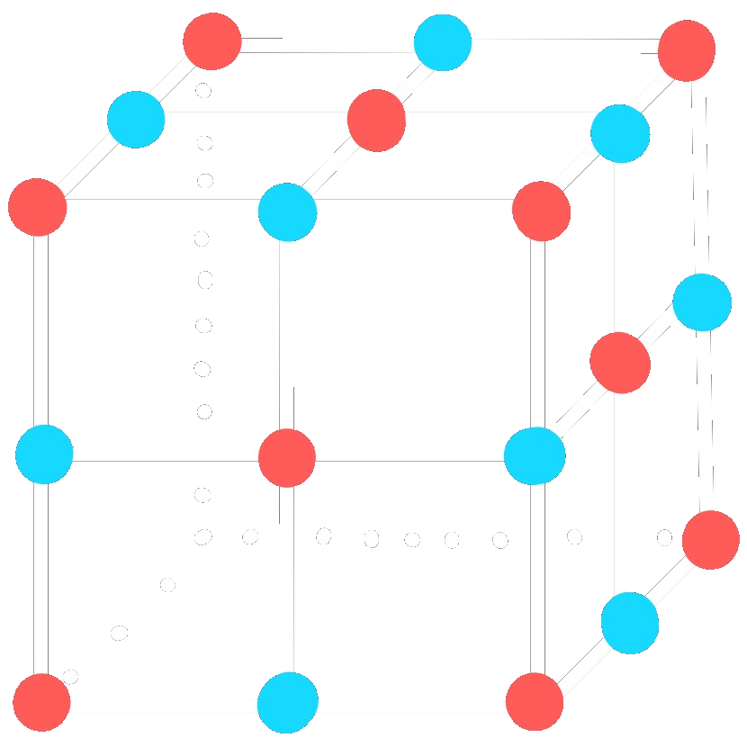

# Ionenbindung
>
- wichtigste Art der Bindung zwischen Metallen und Nichtmetallen
- $\Delta EN > 1.7$
- Stoffe mit Ionenbindung nennt man **Salze**
- Nichtmetall mit größerer EN entreißt [Metall](Metallbindung.md) [Valenzelektron](Valenzelektronen.md)
- Metallatom: <mark style="background: #ADCCFFA6;">Kation</mark> ($Na\longrightarrow Na^{+}+e^{-}$)
- Nichtmetallatom: <mark style="background: #FF5582A6;">Anion</mark> ($Cl+e^{-}\longrightarrow Cl^{-}$)

## Struktur
Ionenpaare bilden Ionengitter  oder Kristallgitter:
>
> - $e^{-} \rightarrow$  Übertragungsreaktion
> - z.B.: $Na^{+}Cl^{-}$ sind ein Ionenpaar

## Notation
|  4 [Valenzelektronen](Valenzelektronen.md) | Nebengruppen |  4 [Valenzelektronen](Valenzelektronen.md) |
| -------------------- | ------------ | --------------------- |
| $Na^{+}$             | $Fe^{3+}$    | $F^{-}$               |
| $Mg^{2+}$            | $Fe^{2+}$    | $Cl^{-}$              |
| $Al^{3+}$            |              | $O^{2-}$              |
- Wechselnde Ladung bei Nebengruppen
- Die Summenformel beschreibt das Atomzahlverhältnis im Kristall.
- **Die Ladungszahl ($^{+/-}$)** (= Ionenwertigkeit) gibt an, w.v. positive oder Negative Ladungen ein Ion Trägt
- In einem Salz entsprechen eine bestimmte Anzahl positiver Ladungen **gleich viele** negative Ladungen $\rightarrow$ Die Verbindung ist *elektrisch neutral*

## Binäre Ionenbindung (-id)
Salze aus zwei Verbindungen heißen **binäre** Verbindungen:
<mark style="background: #ADCCFFA6;">[Metall](Metallbindung.md) steht an 1. Stelle</mark>
<mark style="background: #FFF3A3A6;">Nichtmetalle an 2. Stelle mit Endung</mark> <mark style="background: #FF5582A6;">-id</mark> 

| Ionenpaar        | Summenformel  | Name            | Bindung                                  |
| ---------------- | ------------- | --------------- | ---------------------------------------- |
| $Na^{+}/F^{-}$   | $NaF$         | Natriumflourid  | $2Na+F_{2}\longrightarrow 2NaF$          |
| $Mg^{2+}/O^{2-}$ | $MgO$         | Magnesiumoxid   | $2Mg+O_{2}\longrightarrow 2MgO$          |
| $Al^{3+}/O^{2-}$ | $Al_{2}O_{3}$ | Aluminiumoxid   | $4Al+3O_{2}\longrightarrow 2Al_{2}O_{3}$ |
| $Ca^{2+}/F^{-}$  | $CaF_2$       | Calciumflourid  | $Ca+F_{2}\longrightarrow CaF_{2}$        |
| $Al^{3+}/Br^{-}$ | $AlBr_{3}$    | Aluminiumbromid | $2Al + 3Br_2\longrightarrow 2AlBr_{3}$                                        |

## Komplexe Ionenbindung (-at, -onium-)
Salze aus mehr als 2 Elementen heißen **komplexe** Verbindungen:
<mark style="background: #ADCCFFA6;">[Metall](Metallbindung.md) steht an 1. Stelle</mark>
<mark style="background: #FFF3A3A6;">komplexes Anion an 2. Stelle mit Endung</mark> <mark style="background: #FF5582A6;">-at</mark> (kommt bei mehrfachem Vorkommen in Klammern)

| Ionenpaar             | Summenformel         | Name            | Beispiele            |
| --------------------- | -------------------- | --------------- | -------------------- |
| $Na^{+}/NO^{-3}$      | $NaNO_{3}$           | Natriumnitrat   |                      |
| $Ca^{2+}/CO^{2-}_{3}$ | $CaCO_{3}$           | Calciumcarbonat | Kalk, Marmor, Kreide |
| $Al^{3+}/SO^{2-}_{4}$ | $Al_{2}(SO_{4})_{3}$ | Aluminiumsulfat |                      |
| $Ka^{+}/PO_{4}$       | $K_{3}PO_{4}$        | Kaliumphosphat  |                      |

<mark style="background: #ADCCFFA6;">Komplexes Kation:</mark> $NH_{4}^{+}$ Amm<mark style="background: #FF5582A6;">onium</mark>ion <mark style="background: #FF5582A6;">"+ Geladen"</mark> 
$\rightarrow$ z.B.: $(NH_{4})_{2}SO_{4}$: Ammoniumsulfat

### Mehrfachvorkommende Atome oder Komplexionen
**mono, di, tri, tetra, penta, hexa, octa, nona, deca ...**

| Summenformel            | Name                     |
| ----------------------- | ------------------------ |
| $KH_{2}PO_{4}$          | Kaliumdihydrogenphosphat |
| $CuSO_{4}\cdot 5H_{2}O$ | Kupfersulfat-pentahydra  |

## Eigenschaften von Salzen
Aus der starken Anziehungskraft zwischen Anionen und Kationen resultiert eine Gitterstruktur
- sind bei Raumtemperatur **fest**
- **hoher** Schmelzpunkt (~800°C)
- Ionen sind im Gitter festgehalten $\rightarrow$ elektrische Isolatoren
- im flüssigen oder gelösten Zustand sind sie elektr. Leiter (2. Klasse)
- Spröde (Gitterebenen verschieben sich bei Krafteinwirkungen und stoßen sich ab)

````ad-example
title: Bsp.: Welche Summenformel haben folgende Ionenpaare:
- $Ra^{2+}/Cl^{-}$
- $Na^{+}/O^{2-}$
- $Al^{3+}/F^{-}$

```ad-success
title: Lösung
- $RaCl_{2}$
- $Na_{2}O$
- $AlF_{3}$

```


````

---
# Tags
