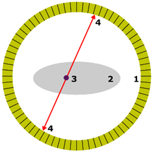

# Radioaktivität
## Arten der Strahlung / Zerfallsarten
|                                | $\alpha$                                                              | $\beta^{-}$                                                                                                        | $\beta^{+}$                                                                                                     | $\gamma$                                                                                                        |
| ------------------------------ | --------------------------------------------------------------------- | ------------------------------------------------------------------------------------------------------------------ | --------------------------------------------------------------------------------------------------------------- | --------------------------------------------------------------------------------------------------------------- |
| Was wird emittiert             | Helium-Kerne                                                          | Elektronen                                                                                                         | Positronen                                                                                                      | Elektromagnetische Strahlung                                                                                    |
| Ladung                         | +2e                                                                   | -e                                                                                                                 | +e                                                                                                              | 0                                                                                                               |
| Allgemeine <br> Zerfallsformel | ${}^{A}_{Z}X\rightarrow {}^{A-4}_{Z-2}Y + {}^{4}_{2}He$               | ${}^{A}_{Z}X\rightarrow {}^{A}_{Z+1}Y + {}^{0}_{-1}e^{-} + {}^{0}_{0}\overline{v_{e}}$                             | ${}^{A}_{Z}X\rightarrow {}^{A}_{Z-1}Y + {}^{0}_{1}e^{+} + {}^{0}_{0}v_{e}$                                      | ${}^{A}_{Z}X* \rightarrow {}^{A}_{Z}X+\gamma$                                                                   |
| Zerfallsvorgang                | Es werden zwei Protonen und zwei <br> Neutronen als $\alpha$-Teilchen | in Neutron wandelt sich im Kern in ein Proton um. <br> Dabei wird ein Elektron und Elektron-Antineutrino emittiert | Ein Proton wandelt sich im Kern in ein Neutron um. <br> Dabei wird ein Positron und Elektron-Neutrino emittiert | Kern geht von energetisch angeregtem Zustand <br> in energetisch günstigeren über und emittiert Gammastrahlung. |
| Ionisationsvermögen            | sehr hoch                                                             | mittel                                                                                                             | mittel                                                                                                          | gering                                                                                                          |
| Reichweit in [Luft](Lufth%C3%BClle%20der%20Erde%5C)              | Einige Zentimeter                                                     | Einige Meter                                                                                                       | einige Meter                                                                                                    | Sehr weit                                                                                                       |
| Abschirmung durch              | Papier                                                                | Aluminium                                                                                                          | Aluminium                                                                                                       | Blei                                                                                                            | 

### Positronen Emissions Tomographie (PET)


Bei der **Positronen Emissions Tomographie** (PET) werden radioaktiv markierte Substanzen (Tracer), die Positronen **abstrahlen**, in den **Stoffwechsel eingeschleust** und ihre Verteilung im menschlichen Körper mit einer PET-Kamera aufgezeichnet.

Bei Positronen Strahler macht man sich zunutze, dass das emittierte Positron im Gewebe schon bald nach seiner Emission auf ein ruhendes Elektron trifft und bei der Paarvernichtung zwei γ-Quanten mit jeweils der Ruheenergie eines Elektrons genau in entgegengesetzte Richtung abstrahlen.

1. Scanner-Ring der PET-Kamera  
2. Querschnitt durch den Körper des Patienten  
3. Ort eines Positronen Zerfalls und Paarvernichtung  
4. γ-Quanten fliegen gleichzeitig und im Winkel von 180 Grad zueinander vom Ort des Zerfalls weg.


## Halbwertszeit
Zerfallskonstante und Zerfallsgesetz

Jedes Radionuklid hat eine Zerfallskonstante $\lambda$, die die Wahrscheinlichkeit pro Zeit Intervall für den Zerfall eines einzelnen Atomkerns angibt.
Deshalb lässt sich die Aktivität einer Probe von $N$ Atomen zum Zeitpunkt $t$ ausdrücken als:
$A(t) = - \dfrac{\mathrm dN}{\mathrm dt}(t) = \lambda \cdot N(t)$

Hieraus folgt das **Zerfallsgesetz**:
$N(t)= N_0 \cdot e^{-\lambda t}\,$

Zwischen $\lambda$ und der Halbwertszeit $T_{1/2}$ besteht die Beziehung:
$\lambda = \dfrac {\ln 2}{T_{1/2}} \approx \dfrac {0{,}693}{T_{1/2}}$


### C-14 Methode der Altersbestimmung
In der obersten Atmosphärenschicht trifft **kosmische Strahlung** auf die Erde, wodurch aus einem Stickstoffkern und einem Neutron das radioaktive **Kohlenstoffisotop** $^{14}C$ entsteht.
Dieses hat eine Halbwertszeit von **5730** Jahren.

Dieses Isotop mischt sich mit den anderen nicht radioaktiven Isotopen und wird von allem lebenden Organismen aufgenommen.
Stirbt der Organismus wird kein neues $^{14}C$ mehr aufgenommen und der Anteil beginnt zu sinken.
Jetzt kann über das Verhältnis des heutigen Anteils von $^{14}C$ im organischen Material, zu dem in einen heute lebenden Organismus und über das Zerfallsgesetz das Alter bestimmt werden.

$$
\begin{align*}
N(t)=N(0)\cdot e^{-\dfrac{ln(2)}{T_\frac{1}{2}}\cdot t}
\\
\\
t=\frac{\ln{(\frac{N(t)}{N(0)})}\cdot T_\frac{1}{2}}{-ln(2)}
\end{align*}
$$

```ad-example
title: Ötzi altersbestimmung
Bei Ötzi zählt man N(t) = 2,3 * 105 dieser 14C-Atome,  
bei einer Vergleichsprobe zählte man N(0) = 4 * 105 dieser 14C -Atome.  
Vor wie vielen Jahren ist Ötzi verstorben?

$t=\dfrac{\ln{(\dfrac{N(t)}{N(0)})}\cdot T_\frac{1}{2}}{-ln(2)} = \dfrac{\ln{(\dfrac{2,3\ \cdot\ {10}^5}{4\cdot{10}^5})}\cdot5370\ Jahre}{-ln(2)}=4500\ Jahre$

```

## Strahlenschäden

## [Kernspaltung](../physik/Kernspaltung.md)

---
# Tags
[Kernfusion](../physik/Kernfusion.md)
#incomplete 