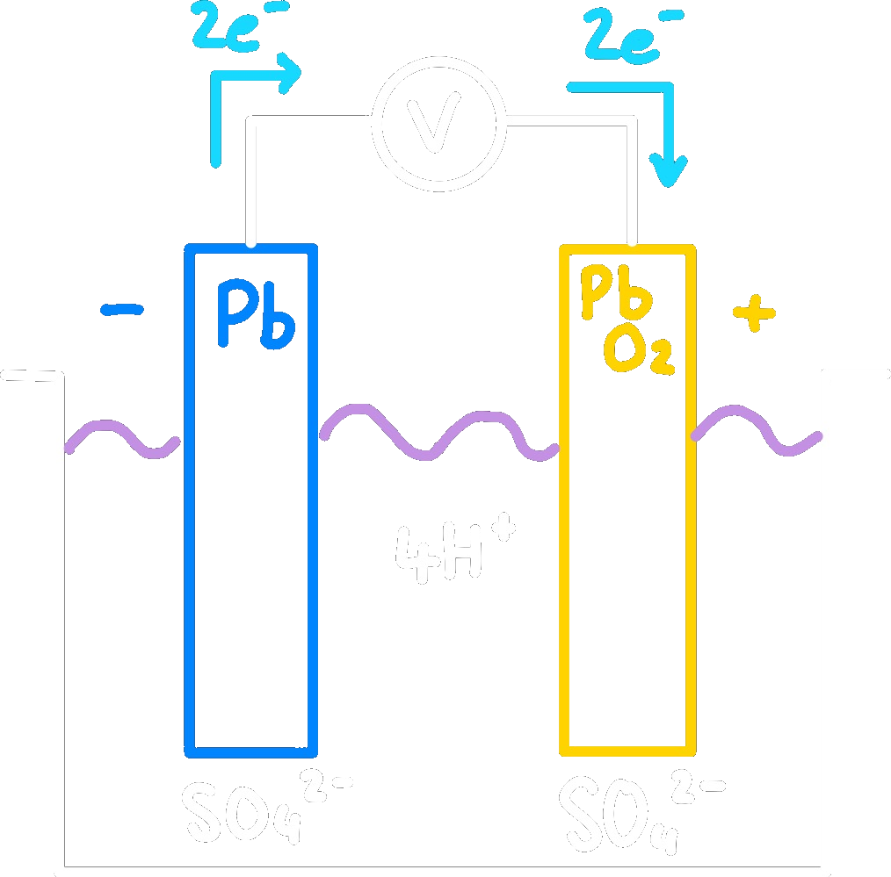

# Sekundärelemente (Akkumulatoren)

Galvanisches Element, dass sich nach Erschöpfung *wieder Aufladen* lässt $\rightarrow$ Akkumulator 

## Blei-Akku

- Der Ladezustand kann mittels der **Dichte** der **Akkusäure** festgestellt werden.  
	$\rightarrow$ Aräometer
- $U=2V$

>  
>$H_{2}SO_4$ als **[Elektrolyt](Elektrochemie.md)** 

<mark style="background: #ADCCFFA6;">Anode (-):</mark> $Pb\longrightarrow Pb^{2+}+2e^{-}(Pb^{2+}+SO_{4}^{2-}\rightarrow PbSO_{4}\downarrow)$  
<mark style="background: #FF5582A6;">Kathode (+):</mark> $Pb^{4+}+2e^{-}\longrightarrow Pb^{2+}(Pb^{2+}+SO_{4}^{2-}\rightarrow PbSO_{4}\downarrow)$  
$2O^{2-}+4H^{+}\longrightarrow 2H_{2}O$  
**Gesamtgleichung:** $Pb+PbO_{2}+2H_{2}SO_{4}\longleftrightarrows 2PbSO_{4}+2H_{2}O$ 

## Nickel-Cadmium-Akku

- Für unregelmäßigen Gebrauch besser geeignet.
- leichter und wartungsfrei.
- $Cd$ 💀!

$\overbracket{\underbracket{Cd}_{0}+2\underbracket{Ni(OH)_{3}}_{+3}}^{+6}\longleftrightarrows\overbracket{\underbracket{Cd(OH)_{2}}_{+2} + 2\underbracket{Ni(OH)_{2}}_{+2}}^{+6}$

## Lithium-Ionen-Akku

- Müssen völlig Wasserfrei sein. ($Li$ +💧=🔥)
- **[Elektrolyt](Elektrochemie.md):** organische Lösungsmittel mit $Li^{+}$-Salzen
- Hohe energetische Dichte $100\frac{Wh}{kg}$ für Laptops und Smartphones.
- Früher: Bei Überhitzung Kurzschluss zwischen Elektroden
- Heute: Temperaturstabile 

<mark style="background: #ADCCFFA6;">Anode (-):</mark> $Li\longrightarrow Li^{+}+e^{-}$ *(Lithiumgrafit)*  
<mark style="background: #FF5582A6;">Kathode: (+):</mark> $\overset{+4}{MnO_{2}}+Li^{+}+e^{-}\longrightarrow \overset{+3}{LiMn} O_{2}$

## Lithium-Polymer-Akku (LiPo)

- $U=3,7V$
- Weiterentwicklung des LiPos
- Kein flüssiger [Elektrolyt](Elektrochemie.md), sondern polymere Gelelektrolyte

| Pro                                      | Kontra                                   |
| ---------------------------------------- | ---------------------------------------- |
| hohe Energiedichte ($140 \frac{Wh}{kg}$) | Geringe Ströme                           |
|                                          | Empfindlich gegenüber Ladung             |
|                                          | Empfindlich gegenüber Temperatur Extrema |
|                                          | Empfindlich gegenüber höhe Ströme        | 

## Brennstoffzelle

---

# Tags