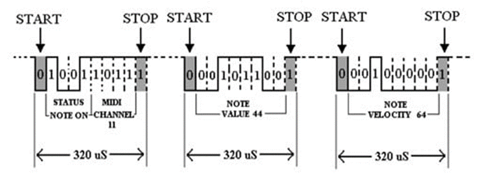
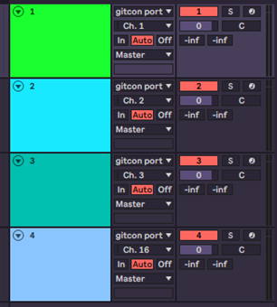
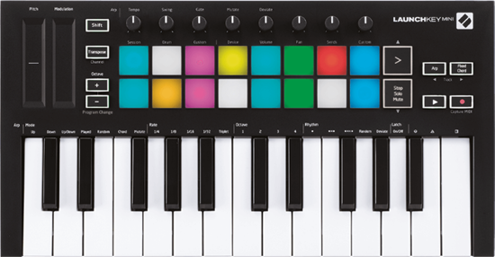

# MIDI
Das MIDI-Protokoll wurde in den frühen 80ern entwickelt und standardisiert die Kommunikation zwischen Computern und Musik-Hardware, sogenannten MIDI-Controllern. Jedes Mal, wenn eine Taste auf einem Controller gedrückt wird, erstellt dieser eine MIDI-Nachricht und sendet sie an den Computer. Diese Tasten sind nicht nur auf die Klaviatur eines MIDI-Controllers beschränkt, es können ebenfalls MIDI-Wörter gesendet werden, welche andere Parameter in einer digitalen Musikproduktionsumgebung steuern, wie zum Beispiel die Intensität eines Audioeffekts.

> [!example] Beispiel
> 
> Die [Grenzfrequenz](../hwe/Grenzfrequenz.md) eines digitalen Filters kann mittels eines MIDI enkodierten Potentiometers am MIDI-Controller gesteuert werden.
> 
> 

Es ist wichtig zu wissen, dass MIDI-Signale nichts mit niederfrequenten Audiosignalen zu tun haben. Weder analoges- noch digital aufgefasstes Audio kommt in einer MIDI-Kommunikation vor. [1]

Das MIDI-Protokoll beschreibt unter anderem die zu übertragenden Noten mit digitalen Wörtern, welche in einer genormten Tabelle festgehalten sind. Jede Note hat daher eine Adresse, durch welche dann ein anderes digitales Instrument weiß, mit welcher Tonhöhe es diese Note spielen muss.

Das MIDI-Protokoll beschreibt unter anderem die zu übertragenden Noten mit digitalen Wörtern, welche in einer genormten Tabelle festgehalten sind. Jede Note hat daher eine Adresse, durch welche dann ein anderes digitales Instrument weiß, mit welcher Tonhöhe es diese Note spielen muss.

## Status Bytes

Eine MIDI-Nachricht ist aus drei (manchmal zwei) Bytes aufgebaut:
- Status und Kanal
- Erstes Datenbyte
- Zweites Datenbyte

### MIDI-Status

Um das MIDI-Wort so kurz wie möglich zu halten, teilen sich des Status- und Kanalnibble ein Byte. Mit dem Statusnibble wird dem Empfänger mitgeteilt, welche Funktion die darauffolgenden Datenbytes haben. Mit 16 verschiedenen Möglichkeiten, kann der Status mit vier Bit eindeutig codiert werden. Mögliche Statusnibble sind:

| Status            | Hex-Wert | Funktion                                                                                                  |
| ----------------- | -------- | --------------------------------------------------------------------------------------------------------- |
| Note Off          | 0x8      | Beendet das Spielen einer Note                                                                            |
| Note On           | 0x9      | Startet das Spielen einer Note                                                                            |
| Polyphon Pressure | 0xA      | Löst beim Nachdrücken einer Keyboard Taste aus (gilt für die jeweils gedrückte Note)                      |
| Control Change    | 0xB      | Spricht Steuerelemente, wie z.B. Regler in der DAW an.                                                    |
| Program Change    | 0xC      | Wechselt zwischen verschiedene Klänge und Instrumente                                                     |
| Channel Pressure  | 0xD      | Löst beim Nachdrücken einer Keyboard Taste aus (gilt für alle Noten auf dem Kanal)                        |
| Pitch Bend        | 0xE      | Ändert die Tonhöhe des gesamten Kanals in feinen Schritten.                                               |
| System Messages   | 0xF      | MIDI [Clock](../hwe/Oszillatoren/Clock%20Generierung.md), Start, Stop, System [Reset](../hwe/Reset%20Generierung.md), Active Sensing |

### MIDI Kanal

Mit den Vier übrigen Bit wird der Kanal eingestellt, an den die Nachricht geschickt werden soll. Ein einzelner Controller kann also bis zu 16 verschieden MIDI-Kanäle in einer DAW ansprechen. Auf einem MIDI-Keyboard würden zum Beispiel die Klaviertasten auf einen anderen Kanal geschickt werden als die Drumpads.

>[!info] Vier verschiede MIDI-Spuren mit dem gleichen Controller als Input
>
>

> [!info] MIDI Kanäle auf die Hardware bezogen:
> 
> 
> 
> Channel 10: Drumpads (16 Quadratische Drucktasten oben)
> Channel 1: Klaviertasten

### Datenbytes

Für das Projekt sind nur die Funktionen _Note On_ und _Note Off_ relevant, weshalb die Dokumentation der Datenbytes auf diese beiden Status-Worte beschränkt ist.

Im Datenbyte eins ist bei beiden Status die Adresse der Note gespeichert, während in Byte zwei die Anschlagstärke übertragen wird. Ungewöhnlicherweise wird auch beim Ausschalten einer Note die Anschlagstärke (Loslass-Geschwindigkeit) übertragen, welche je nach Empfänger beispielsweise als Nachklang interpretiert werden könnte. [1]

Die Adresse der Note lässt sich wie folgt herausfinden: Die Note A0 entspricht der Adresse 21 (dezimal). Von dort aus zählt man linear aufwärts bis 127, welches der Note G9 entspricht. Noten unter A0 können auch übertragen werden, jedoch sind die Frequenzen, welcher sie entsprechen, nicht mehr im hörbaren Bereich. Die Anschlagstärke einer Note bestimmt die Initiale Lautstärke. Hat seine Note die Anschlagstärke 0, so wird sie automatisch als _Note Off_ interpretiert. [1] [2] [3] 

Soll beispielsweise die Note E2 mit einer Anschlagstärke von 64 auf Kanal 1 angeschaltet werden, sieht das übertragene Wort folgendermaßen aus:

|             | Status    | Kanal     | Byte 1 (Adresse) | Byte 2 (Anschlagstärke) |
| ----------- | --------- | --------- | ------------------- | -------------------------- |
| Dezimal     | 144       | 40        | 64                  |                            |
| Hexadezimal | 0x90      | 0x28      | 0x40                |                            |
| Binär       | 1001 0000 | 0010 1000 | 0100 0000           |                            |

Nach dieser Übertragung bleibt die Note so lange angeschaltet, bis ein _Note Off_ Signal auf dieselbe Adresse und denselben Kanal gesendet wird.

# Quellen

[1] - [ZeM College MIDI Kompendium](https://www.zem-college.de/indexf.html)

[2] - [Expanded MIDI 1.0 Messages List (Status Bytes)](https://www.midi.org/specifications-old/item/table-2-expanded-messages-list-status-bytes)

[3] - [MIDI note numbers and center frequencies](https://www.inspiredacoustics.com/en/MIDI_note_numbers_and_center_frequencies)