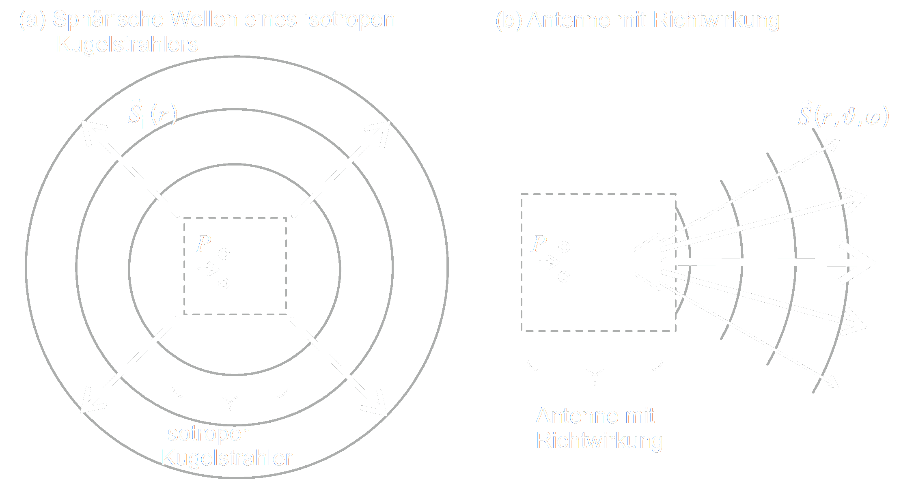

# Isotroper Kugelstrahler

Der Isotrope Kugelstrahler ist eine theoretische [Antenne](Antenne.md), die die ihr zugeführte [Leistung](../../physik/Elektrische%20Leistung.md) gleichmäßiges in alle Richtungen abstrahlt.

Die *Strahlungsdichte* $\vec{S_{i}}$ des isotropen Kugelstrahlers im *Abstand* $r$ kann aus der zugeführten *[Leistung](../../physik/Elektrische%20Leistung.md)* $P$ und der *Kugeloberfläche* $O = 4\pi r^{2}$, auf die sich die [Leistung](../../physik/Elektrische%20Leistung.md) verteilt, berechnet werden.

Die Strahlungsleistungsdichte ist unabhängig von den Winkeln $\varphi$ und $\vartheta$.

$$
\vec{S_{i}}= \frac{P}{4\pi r^{2}}\cdot\vec{e_{r}} = \frac{\vec{E_{i}^{2}}}{Z_{F0}}\cdot \vec{e_{r}}= H_{i}^{2}\cdot Z_{F0}\cdot \vec{e_{i}}
$$

> [!NOTE]  
> Bei einer allgemeinen [[Antenne](Antenne.md)](Antenne.md) stellt sich immer eine gewisse Richtwirkung ein, sodass hier die Strahlungsleistungsdichte im Fernfeld auch von den Winkeln $\varphi$ und $\vartheta$ abhängt.

Es gilt: $\vec{S} = S(r,\vartheta,\varphi)\vec{e_{r}}$

> [!INFO] Der isotrope Kugelstrahler ist technisch nicht realisierbar (Zuführung der Antennenleitung), dient aber bei den Antennenkenngrößen als wichtigste Bezugsgröße.

# Quellen

