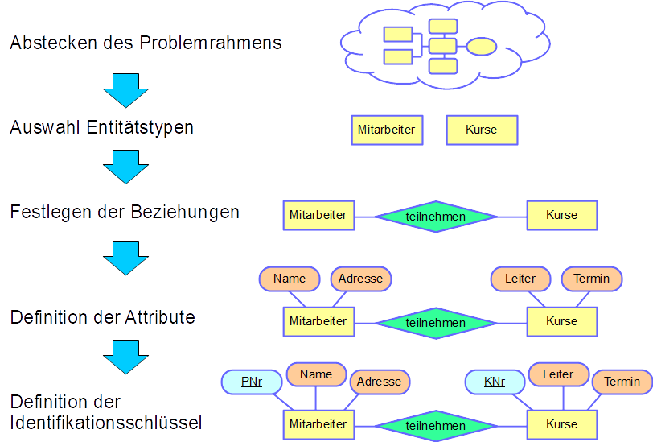
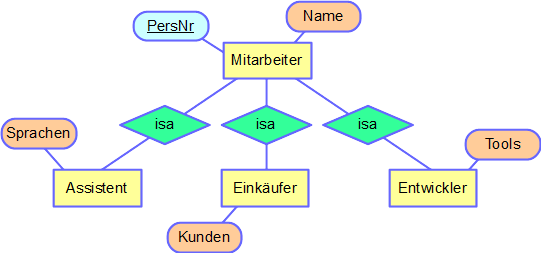

# 3 Entity-Relationship-Modell (ERM)

(nach Peter Chen)

Beschreibung der realen Welt durch:

- Entitäten: Menge gleichartiger Objekte (dargestellt durch Rechtecke)
- Relationship: Beziehungsmöglichkeit (dargestellt durch Rauten) zwischen den Entitäten
- Eigenschaften: Eigenschaft (dargestellt durch Ovale) der Entität

## Modellierung im ER-Diagramm

Beispiel: ein Mitarbeiter kann an einem Kurs teilnehmen.

Ein **Mitarbeiter** (Objekt) mit diversen Eigenschaften (PNr, Name, Adresse) und eine Beziehung **teilnehmen** zu einem weiterem Objekt **Kurs** (KNr, Leiter, Termin).:

Vorgangsweise:

- Abstecken Problemrahmen
- Entitäten auswählen / abgrenzen
- Beziehungen definieren
- Eigenschaften definieren
- Identifikationsschlüssel definieren (werden unterstrichen dargestellt)

## Kardinalität der Beziehung (1:1, 1:n, n:m)

Einzelne Objekte können zu einer Anzahl von gleichartigen Objekten eine Beziehung haben:

**Beispiel Kurs:**

- Ein Mitarbeiter kann an mehr als einem Kurs teilnehmen (m)
- Ein Kurs kann von mehr als einem Mitarbeiter besucht werden (n)

**Beispiel Bibliothek-Buch:**

- Ein Buch kann nur von einem Leser ausgeliehen werden (1)
- Ein Leser kann mehrere Bücher gleichzeitig ausleihen (n) (wenn das so erlaubt ist!)

häufig werden Kardinalitäten noch detailierter beschrieben, z.B.:

- 0 .. n auch keine Beziehung möglich

- 1 .. n es muss mindestens 1 Beziehung geben

- 0 .. 10 keine bis maximal 10 Beziehungen

u.s.f.

## Is-A-Beziehung

Es kommt vor, dass unterschiedliche Objekte sehr starke Ähnlichkeiten aufweisen. Beispielsweise gibt es in einer Firma einen Chef, einen Abteilungsleiter, einen Projektleiter, einen Assistenten, einen Einkäufer und viele weitere. Sie alle haben eine Personalnummer, einen Vor-/Nachnamen, eine Adresse ...
Sie alle sind eine Ausprägung von *Mitarbeiter*, daher: **Projektleiter Is A Mitarbeiter**.

In den meisten Fällen sind diese isa-Beziehungen 1:n-Beziehungen - für dieses Beispiel handelt es sich um eine 1:1 Beziehung: ein Mitarbeiter kann nur ein Einkäufer oder ein Assistent sein. Ebenso kann ein Assistent nur ein einzelner Mitarbeiter sein. Es kann jedoch auf vorkommen dass hier mehrfache Zuordnungen möglich sind (n:m), etwa wenn es mehrere Assistenten geben kann.

Der Vorteil der Verwendung von isa-Strukturen ist, dass damit zum Beispiel einfach sichergestellt werden kann, dass die Personalnummer eindeutig ist.

## Übertragung auf Relationen

Mit den so gefundenen Modellen können Relationen erzeugt werden:

- jedes Objekt/Entität ist eine Tabelle.
  - Die Eigenschaften sind Attribute dieser Tabelle
  - Verbindungen zu Beziehungen sind Attribute
- jede N:M Beziehung ist eine Tabelle
  - Der Primärschlüssel der ersten Seite ist ein Attribut
  - Der Primärschlüssel der zweiten Seite ist ein zweites Attribut
- jede N:1 Beziehung wird ein Attribut
  - auf der N-Seite der Beziehung wird in die Tabelle ein Attribut mit Verbindung auf den Primärschlüssel der 1-Seite vorgesehen
  - auf der 1-Seite wird nichts verändert

Wenn das Diagramm gut aufgebaut wurde, ergibt sich automatisch eine hohe Normalformnummer.

## Praktische Umsetzung von Fremdschlüsseln

- In Werkzeugen zur Erstellung wird für Fremdschlüssel die Optionen **NO ACTION**, **CASCADE**, **RESTRICT**, **SET NULL** und **SET DEFAULT** angeboten. Damit wird festgelegt wie in der abhängigen Tabelle verfahren wird, wenn ein verknüpfter Schlüssel verändert wird. Eben nichts oder Änderung übernehmen usf.

## Notation nach Barker

Die Darstellung nach Peter Chen ist für das Zeichnen mit der Hand noch relativ gut möglich, die Darstellung nach Barker ist für größere Strukturen wesentlich komfortabler und übersichtlicher. Von dieser Notation kann einfach mittels UML-Darstellungen in Werkzeugen gearbeitet werden:

## Fragen

- Was ist das Entity-Relationship-Modell?
- Welche Arten von Kardinalitäten gibt es?
- Was ist eine Is-A-Beziehung?
- Wie werden ERM in eine Tabellen-Struktur übersetzt