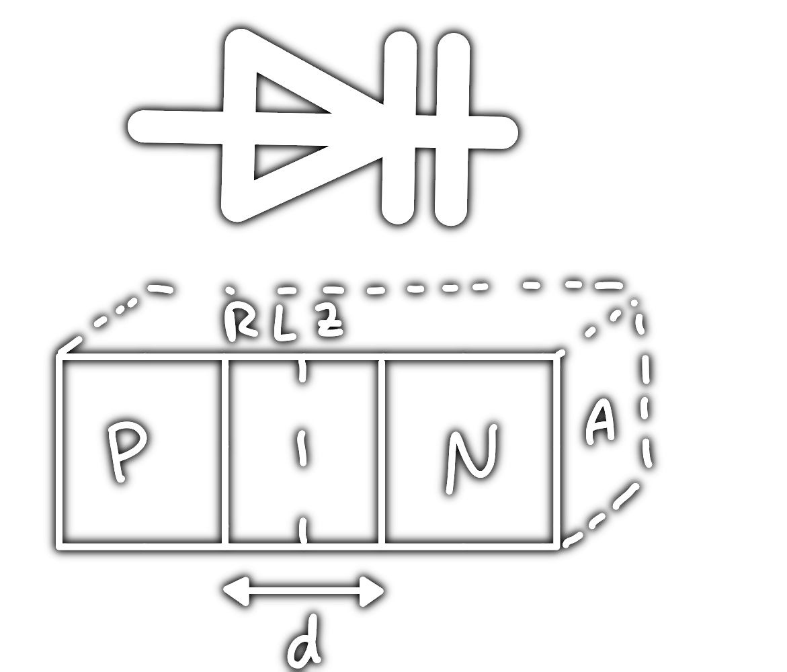

# Kapazitäts-[Diode](Diode.md)
Die Kapazitätsdiode oder Varicap, auch Varaktor oder Abstimmdiode genannt, ist ein elektronisches [Halbleiter](Halbleiter.md)-Bauteil.
Durch Änderung der angelegten Spannung lässt sich eine Variation der [Kapazität](Kapazität.md) von 10:1 erreichen.
Somit steht eine elektrisch steuerbare [Kapazität](Kapazität.md) zur Verfügung, die die früher üblichen, erheblich größeren Drehkondensatoren weitgehend ersetzt hat.

$d = f(U)$
Die Breite der RLZ ist eine Funktion der Spannung.

>[!summary] $C=\dfrac{\varepsilon\cdot A}{d(U)}$

## Funktionsweise
- Der p-n-Übergang einer [Diode](Diode.md) hat eine [Kapazität](Kapazität.md), die von der Breite der Raumladungszone abhängig ist.
- Wird eine [Diode](Diode.md) in Sperrrichtung betrieben, so entsteht am p-n-Übergang eine Ladungsträgerverarmungszone, an der sich auch ein [Elektrisches Feld](Elektrisches%20Feld.md), bedingt durch die fehlenden Ladungsträger, aufbaut.
- Mit steigender Spannung vergrößert sich die Breite der ladungsfreien Zone, damit nimmt die [Kapazität](Kapazität.md) ab.
- Durch geeignete Dotierung können Kapazitäten im Bereich von 3 pF bis 300 pF erreicht werden.

# Tags
[VCO](Voltage%20Controlled%20Oscillator.md)
[PLL](Oszillatoren/Phase%20Locked%20Loop.md)