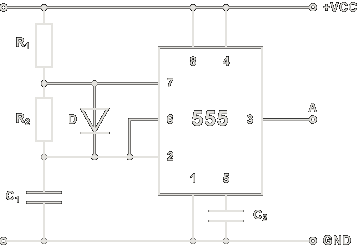
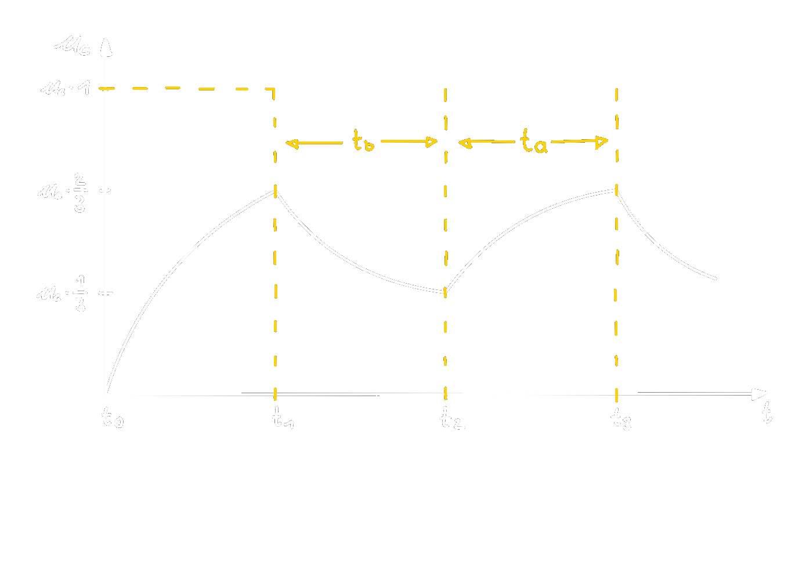

# NE555 Timer-Baustein
>[!summary] Innenschaltung
>

## NE555 als astabile Kippstufe / astabiler Multivibrator
>[!summary]
>

### Funktion

| $t=$                             | $t_{0}$                  | $t_1$                  | $t_3$                  |
| -------------------------------- | ------------------------ | ---------------------- | ---------------------- |
| $u_{C}$                          | 0 (ist Entladen)         | $\geq \frac{2}{3} u_B$ | $\leq \frac{1}{3} u_B$ |
| $U_{D}$                          |                          | Komparator 1: positiv  | Komparator 2: negativ  |
| $S$                              |                          |                        | 1                      |
| $R$                              |                          | 1                      |                        |
| $\neg Q$                         |                          | 1                      | 0                      |
| $A$                              | 1                        | 0                      | 1                      |
| [Transistor](%7BMOC%7D%20Transistor%5C) | sperrt                   | leitet                 | sperrt                 |
| $C_{1}$                          | wird über $R_{1}(R_{2})$ | entlädt                | lädt                   |
| $u_{C}(t)$                       | steigt                   | sinkt                  | steigt                 |

### Laden
$$
\begin{align*}
u_{C}(t) = U_{0}\cdot (1-e^{-\dfrac{t_{3}}{\uptau}})\qquad \uptau = R_{1}\cdot C_{1}
\end{align*}
$$
### Entladen
$$
\begin{align*}
u_{C}(t)=U_{0}\cdot e^{-\dfrac{t}{\uptau}} \qquad \uptau = R_{2}\cdot C_{1}\\
\end{align*}
$$
### Herleitungen ($t_{aus}$, $t_{ein}$)

#### Ladevorgang: $t_{a} = t_{3}-t_{2}$
$$
\begin{align*}
u_{C}(t)&=U_{0}\left(1-e^{-\dfrac{t_{3}}{\uptau}}\right)&u_{C}(t_{2})&= U_{0}(1-e^{- \dfrac{t_{2}}{\uptau}})\\
\frac{2}{3}U_{0}&=U_{0}\left(1-e^{-\dfrac{t_{3}}{\uptau}}\right)&\frac{1}{3}U_{0}&= U_{0}\left(1-e^{- \dfrac{t_{2}}{\uptau}}\right)\\
\frac{2}{3}-1&=- e^{-\dfrac{t_{3}}{\uptau}}&\frac{2}{3}&= e^{- \dfrac{t_{2}}{\uptau}}\\
\ln\left(\frac{1}{3}\right)&= - \frac{t_{3}}{\uptau}&\ln\left(\frac{2}{3}\right)&= - \frac{t_{2}}{\uptau}\\
\ln(3)&=\frac{t_{3}}{\uptau}\\
t_{3}&= \uptau \cdot \ln(3)&t_{2}&= \uptau \cdot(\ln(3)-\ln(2))\\
\end{align*}
$$
>[!summary] $t_{a}=t_{3}-t_{2}=\uptau \ln(2)$

#### Entladevorgang: $t_{b} = t_{2}-t_{1}$
$$
\begin{align*}
u_{C}(t_{2})&= \frac{1}{3}U_{a}=U_{0}\cdot e^{- \dfrac{t_{2}}{\uptau}}& u_{C}(t_{1})&= \frac{2}{3}U_{a}=U_{0}\cdot e^{- \dfrac{t_{1}}{\uptau}}\\
\frac{1}{3}&= e^{- \dfrac{t_{2}}{\uptau}}& \frac{2}{3}&= e^{- \dfrac{t_{1}}{\uptau}}\\
\ln(3)&=+ \frac{t_{2}}{\uptau}&\ln(2)-\ln(3)&= - \frac{t_{1}}{\uptau}\\
t_{2} &= \uptau\cdot \ln(3) & t_{1}&= \uptau\cdot(\ln(3)-\ln(2))
\end{align*}
$$
>[!summary] $t_{b}= t_{2}-t_{1}=\uptau \ln (2)$

## NE555 als monostabile Kippstufe

>[!summary] Schaltung
>

# Quellen