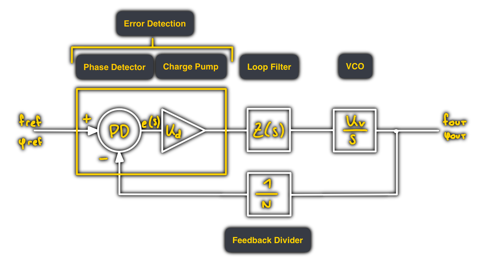
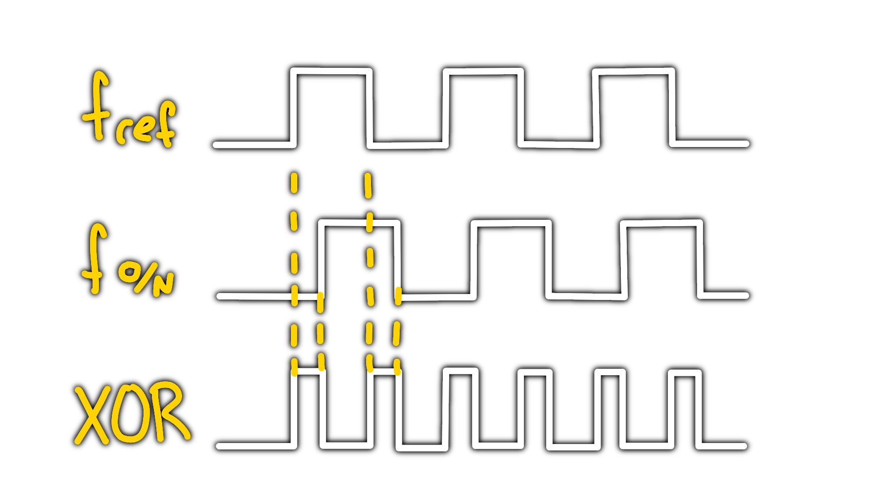
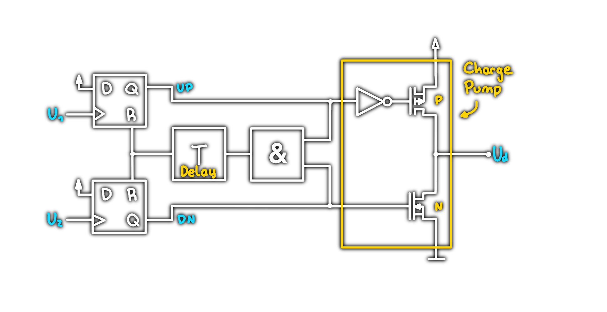

# Phase Locked Loop (PLL)

Ein PLL ist ein System, welches die Phasenlage und damit die Frequenz eines veränderbaren Oszillators so beeinflusst, dass die Phasenabweichung zu einem zu einem äußeren System möglichst konstant ist. 

> [!summary] Bestandteile
> - Phase Detector + Charge Pump
> - Loop Filter
> - [VCO](../Voltage%20Controlled%20Oscillator.md)
> - Feedback Divider ([Clock Divider](../../digital-technik/Clock%20Divider.md))

## Kennwerte
| Kennwert                        |                                                                                                |
| ------------------------------- | ---------------------------------------------------------------------------------------------- |
| **Lock Range**                  | PLL folgt der Frequenzänderung innerhalb eines Taktes                                          |
| **Pull out Range**              | spezifizierte Zeit für größere Frequenzänderungen um wieder den „locked“ Zustand zu erreichen. |
| **Lock time**                   |                                                                                                |
| **Operationsbereich**           | der von der PLL überdeckte Frequenzbereich                                                     |
| **Frequenzmultiplikator**       | ganzzahlig / fraktional                                                                        |
| **Ordnung der PLL**             | Ordnung des Loop Filters                                                                       |
| **Frequenzstabilität / Jitter** |                                                                                                |

# Phasedetector (PD)
Der Phasedetector vergleicht die ... sind beide Frequenzen gleich, ist die PLL im *Locked*-Zustand, ansonsten (wenn ungleich) wird ein, der Abweichung proportionales Signal, ausgegeben.

## XOR Phase Detector
Ein einfaches Modell für einen Phasendetektor ist ein XOR-Gatter.
Je größer die Phasenabweichung, desto höher das "PWM" am Ausgang des XOR Gatters.

## Phase Frequency Detector (PFD)
Eine sehr populäre Implementierung für den Phasen Detektor ist der Phase-Frequency-Detector.

siehe: [MT-086](../assets/pdf/MT-086.pdf)
# Loop Filter
Das rechteck-förmige Ausgangssignal des PD besteht aus einer Vielzahl von Frequenzen.
Für den Regelkreis interessant ist jedoch nur sein DC-Anteil. Die übrigen Frequenzanteile werden durch den Loop-Filter eliminiert.

> [!warning] Der Filter hat daher eine Tiefpass-Charakteristik.
> Tiefpass 1. Ordnung

# [VCO](../Voltage%20Controlled%20Oscillator.md)
- Der [VCO](../Voltage%20Controlled%20Oscillator.md) setzt das Signal in eine Rechteckschwingung um.
- Interessant ist die sogenannte *center-frequency*, also jede Frequenz, mit der der [Oszillator](Clock%20Generierung.md) im Locked-Zustand schwingt.
- Um sie herum findet der Regelvorgang statt.
- In PLL-Schaltungen kommen für die [Oszillatoren](Clock%20Generierung.md) hauptsächlich [LC-Oszillatoren](LC%20Oszillatoren.md) (weniger häufig RC-[Oszillatoren](Clock%20Generierung.md)) sowie Ringoszillatoren zum Einsatz.

--- 

# Tags

