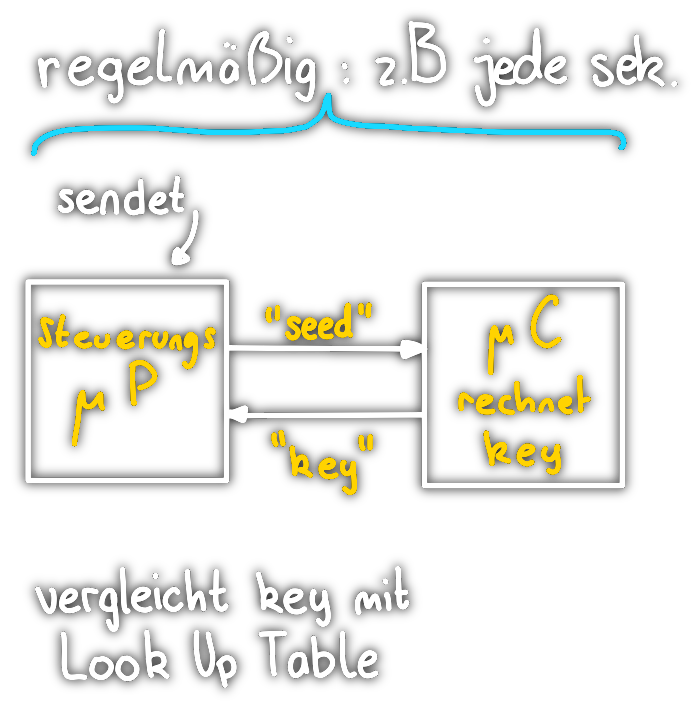

# Reset Generierung

> [!todo] Aufgaben
> Beim Systemstart:
> - Deaktivieren aller Systemkomponenten bis die Versorgungspannung stabil ist.
> - Zurücksetzen aller Systemkomponenten in einen definierten Anfangszustand.
> 
> Im laufenden Betrieb:
> - Aufheben von Systemblockaden
> - zurücksetzen aller Systemkomponenten in einen definierten Anfangszustand
> - bei Spannungseinbruch

## Möglichkeiten zur Resetgenerierung

> [!info] Bestimmende Faktoren der Resetdauer
> - Hochfahren der Systemkomponenten, [Schaltregler](Schaltnetzteil.md), [PLL](Phase%20Locked%20Loop.md)
> - Pipeline Strukturen im µC

### Power on Reset (POR)
Reset bei Systemstart
> [!note] Einfachster Aufbau
> 

#### Berechnung der Resetdauer
$V_{IL,max}=0.8V$
$V_{IH,max}=2.4V$

$u_{c}(t)=U_{0}(1-e^{\tfrac{-t}{\uptau}})$

## Reset Generator Systembetrachtung

### Spike Filter

### Reset Synchronizer
Dient zur Vermeidung von Setup/Hold-Time violations beim loslassen des Reset Signal.

Synchronisiert das loslassen des Reset Signals auf die Falling edge

> [!note] Setuptime
> Wenn sich ein Signal um die Taktflanke ändert, sollte das Reset Signal nicht die änderung im Latch verhindern.
## Reset bei Spannungseinbruch

# Watchdog
Ein Watchdog weckt eine Schaltung wieder auf, wenn sie z.B. keine Rückmeldung erhält.

$\rightarrow$ "seed-key" Prinzip

> [!error] Wenn der Key nicht mit dem im LUT übereinstimmt, führt der Watchdog einen Reset durch.

# Tags
[Open Collector](Open%20Collector.md)