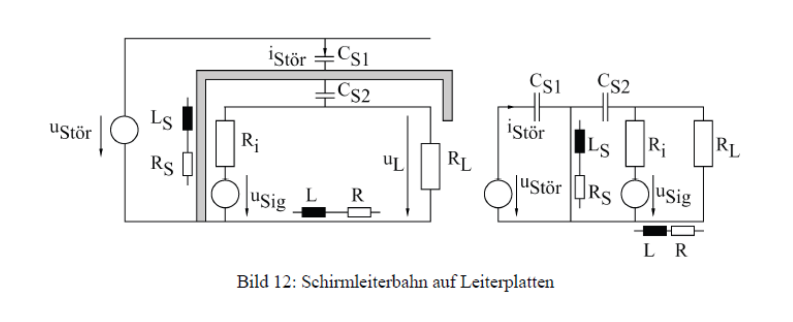
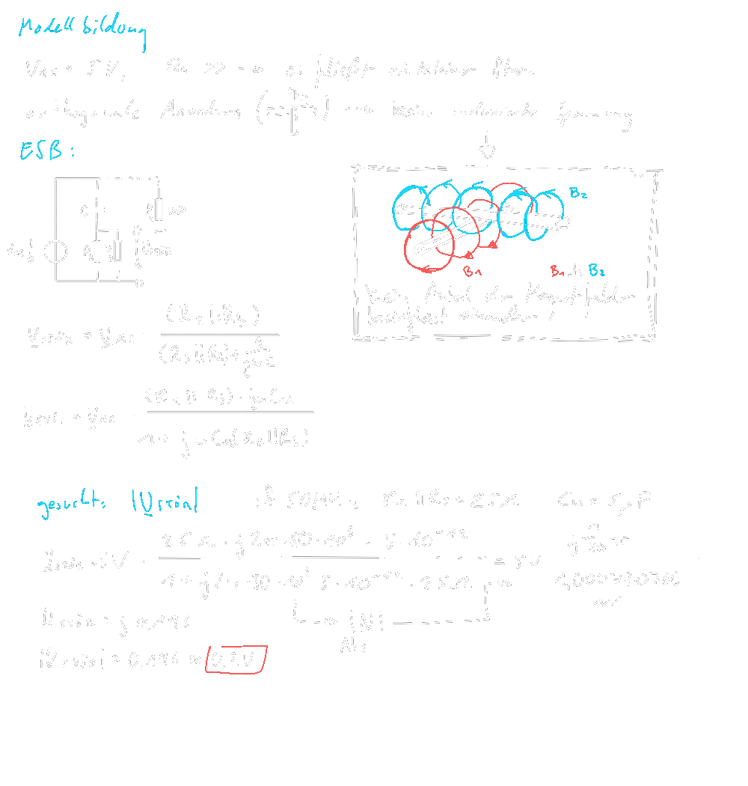

# Schirmung
>[!info] Die Koppelkapazität teilt sich auf:
>Die Wirksame Koppelkapazität $C_{K}$ wird reduziert auf die [Kapazität](Kapazität.md) $C_{S2}$ zwischen Schrim und Nutzkreis.
>Bei gleicher Amplitude und $\frac{d}{dt}$ der [Störquelle](Störquelle.md) verringert sich damit die eingekoppelte Störspannung.
>

> [!important] ESB
> 

Der Schirm muss jeweils aus gut leitendem Material bestehen, damit der über ihn abfließende Strom keinen nennenswerten Spannungsabfall über der Schirmimpedanz $Z_{s} = R_{s}+j\omega L_{s}$ erzeugt.

> [!example] [PCB](PCB-Layout.md) mit übereinander Kreuzende Leiterbahnen
> 
> 