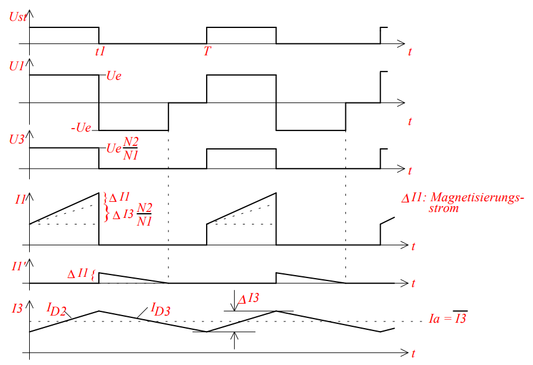

# Eintakt-[Durchflusswandler](Durchflusswandler.md)

- Eine galvanisch getrennte, regelbare Ausgangsspannung
- [Leistung](../../physik/Elektrische%20Leistung.md) bis einige $100W$
- Transistorsperrspannung $U_{DS} \geq 2U_{e}$
- Tastverhältnis $\frac{t_{ein}}{T} \leq 0.5$
- Sehr gute magnetische Kopplung notwendig
- Kleiner Kern ohne Luftspalt

## Schaltbild

$$
U_{a}=U_{e}\cdot \frac{t_{1}}{T_{S}}\cdot \frac{N_{2}}{N_{1}}
$$

## Lauf-Zeit Diagramm

## Schaltstufe  $S$

### $0<t<t_{1}$: $S_{geschlossen}$

### $t_{1}<t<T_{s}$: $S_{geöffnet}$

In dieser Phase wird dieser Fluss im Trafokern abgebaut ($I_{1}=0$, $I_{2} = 0$) und der Strom $I_{3}$ wird von der Speicherdrossel getrieben.
$N_{1} = N_{1}'\rightarrow$ Dadurch dauert die Ent-Magnetisierung wie die Auf-Magnetisierung.
Der Maximale $DC$ beträgt $0.5$
Während der Sperrphase liegt an $N_{1}$ Spannung $U_{e}$, welche an $N_{1}$ zu $U_{1}=-U_{e}$ wird.
Daher Liegt über $U_{DS}=2 \cdot U_{e}$

#### Anmerkung

- Normaler Trafo, kein Luftspalt
- $U_{DS}>2\cdot U_{e}$
- Enge Kopplung von $N_{1}$, $N_{1}'$
	- Entnetzwerk ist trotzdem Notwendig
- $DC=0.5$ maximal
- 
### Herleitung der Dimensionierung

$\rightarrow$ siehe [Abwärtswandler](Buck%20Converter.md)
$$
U_{a}=U_{e}\cdot \frac{t_{1}}{T_{S}}\cdot \frac{N_{2}}{N_{1}}
$$
mit $DC=0.5$ ergibt sich:
$$
\frac{N_{2}}{N_{1}}=2\cdot \frac{U_{a}}{U_{e}}
$$

## [Induktivität](../Induktivitäten.md)

$\Delta I_{L}=\Delta I_{3} \approx 0.2\cdot I_{a}$
mit $DC=0.5$ wird:
$$
L_{min}=\frac{U_{a}\cdot T_{S}}{2\cdot \Delta I_{3}}
$$

---

# Tags

