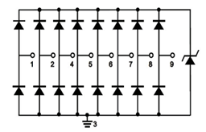

# TVS-Diode

## Kennwerte von TVS-Dioden

### Uni- oder Bidirektional

Je nachdem ob die zu schützende Leitung über oder unter dem Massepotential liegt, muss man bei unidirektionalen TVS-Dioden die Polung beachten.
Bidirektionale arbeiten in beide Richtungen.

### Anzahl von Kanälen

Oft haben Konnektoren eine Vielzahl an Pole (z.B. HDMI) die geschützt werden müssen.
Deshalb gibt es mehrere TVS-Dioden in einem einzigen Package.

### Arbeitsspannung

Die Arbeitsspannung ist die maximale Spannung, welche im Normalbetrieb auf der Leitung vorkommt. z.B. 3.3V

### Klemmspannung

Im Falle eines ESD-Spikes, wirkt die TVS-Diode niederohmig gegen Masse.
Die Spannung, die dabei an der Diode abfällt, ist die Klemmspannung.
Obwohl sie immer noch signifikant höher ist als die Betriebsspannung, ist sie aufgrund der kurzen Dauer nicht weiter gefährlich, trotzdem sollte sie in jedem Anwendungsfall möglichst gering gewählt werden.
Einen genauen Wert dafür findet man nur sehr schwer.
Man sollte im Datenblatt der TVS-Diode auf Verweise für typische Applikationen achten.

### Intrinsische Kapazität

Wie bei jedem Bauteil, gibt es gewisse parasitäre Kenngrößen, die im In-neren präsent sind. Bei der TVS Diode ist die Kapazität eine störende, dennoch unvermeidbare, Größe.
Bei TVS-Dioden mit hoher Kapazität besteht die Gefahr, dass sehr kurze ESD-Stöße nicht gefiltert werden können.
Abgesehen von der intrinsischen Kapazität, ist zu berücksichtigen, dass auch die Leiterbahn von der Buchse zur Diode keine eigene signifi-kante Kapazität aufweisen darf. Dies wird durch eine möglichst kurze Lei-terbahnführung sowie eine dünne Leiterbahnbreite realisiert.

### IEC61000−4−2 Rating

Die TVS-Diode verfügt über eine Rating-Stufe der IEC61000-4-2 Norm, welche Aussagen über die absoluten Höchstwerte des ESD-Spikes liefert.
