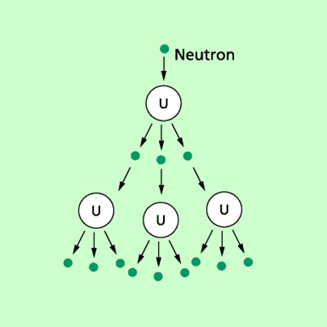

# Kernspaltung

Atomkern wird unter Energiefreisetzung in **zwei** oder **mehr** kleinere Kerne **zerlegt**.

Spaltung wird nur bei **genügend schweren Nukliden** beobachtet (Thorium-232 aufwärts).
Nur bei ihnen ist die Zerlegung in leichtere Kerne und mit Freisetzung von [Bindungsenergie](Bindungsenergie.md) möglich.

Die lange Reichweite der gegenseitigen elektrischen **Abstoßung** der **Protonen** **überwiegt** dann die **anziehende Kernkraft** ([Coulomb Barriere](https://de.wikipedia.org/wiki/Coulombwall)) mit ihrer kurzen Reichweite und **treibt** die beiden Enden **auseinander**, sodass der Kern in zwei oder drei Bruchstücke – hoch angeregte **mittelschwere Kerne** – zerfällt.

Durch Beschuss mit **langsamen Neutronen** können **schwere Atomkerne** (z. B. Uran, Plutonium) in **mittelschwere Atomkerne** aufgespalten werden.
Außer den Bruchstück-Kernen werden meist einige einzelne Neutronen freigesetzt, typischerweise zwei oder drei.

## Energie Freisetzung

Ebenfalls wird **Energie abgegeben**, da die Masse des Ausgangskerns **plus** des aufgenommenen Neutrons **größer** ist als die **Masse der entstehenden Kerne** einschließlich der **frei werdenden Neutronen**.
Durch die Änderung der [Bindungsenergie](Bindungsenergie.md) nimmt die Gesamtmasse entsprechend ab (Massendefekt).

> [!example] Langsames Neutron trifft auf Uran-235 $\rightarrow$ Kernumwandlung in Uran-236 $\rightarrow$ zerfällt in Bruchteil von Sekunden in zwei mittelschwere Kerne, z.B. Krypton und Brom (über 200 Zerfallsprodukte bekannt)
>
> ${}^{1,00866u}_{0}n+^{235,04392}_{92}U\longrightarrow {}^{236.04556u}_{92}U\longrightarrow {}^{88.91783u}_{36}Kr + {}^{143,92295u}_{56}Ba + 3\cdot {}^{1.00866}_{0}n$
>
> 

Man muss beachten, dass sich diese Energie auf einen Kernzerfall bezieht. Betrachtet man die Anzahl der Atomkerne, die in einem Kilogramm Uran enthalten sind und nimmt an, dass alle zerfallen, so beträgt die dann frei werdende Energie ~8,6⋅1012 J. Das ist etwa 290 000-mal so viel, wie bei der Verbrennung von 1 kg Steinkohle freigesetzt wird. $\rightarrow$ [Bindungsenergie](Bindungsenergie.md)

## Kettenreaktion

Treffen die bei einer Kernspaltung **frei werdenden Neutronen** auf weiteres **spaltbares Material** und haben sie darüber hinaus die "**richtige**" Geschwindigkeit, so können sie **weitere Kernspaltungen** hervorrufen.
Es kommt zu einer Reaktion, die sich **von selbst fortsetzt**, zu einer Kettenreaktion.

- Wird diese Kettenreaktion nicht beeinflusst, so spricht man von einer _ungesteuerten Kettenreaktion_.
Ungesteuerte Kettenreaktionen erfolgen bei Atombomben.

- Durch bestimmte Materialien kann man aber auch die **Anzahl der Neutronen beschränken** und damit die Kettenreaktion beeinflussen.
Eine solche beeinflusste Kettenreaktion wird als _gesteuerte Kettenreaktion_ bezeichnet.
Gesteuerte Kettenreaktionen erfolgen in Kernreaktoren von Kernkraftwerken.

# Kernreaktor / Kernkraftwerke

Carnot Prozesse

# Atombomben

---

# Tags

[Radioaktivität](../chemie/Radioaktivität.md)