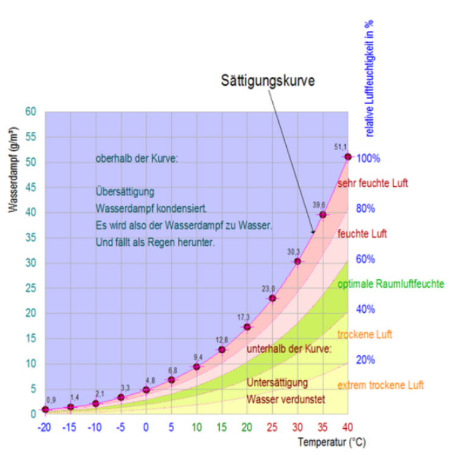

# Thermodynamik
## Ausdehnung bei Erwärmung
### Volumenveränderung von Stoffen
- Die meisten Körper vergrößern bei Erwärmung ihr Volumen
- Volumenveränderug: [Gas](Allgemeines%20Gasgesetz.md) > Flüssigkeiten > Festkörper
## [Temperatur und Teilchenmodell](Temperatur%20und%20Teilchenmodell.md)
Alle Körper sind aus kleinen, sich ständig bewegenden Teilchen aufgebaut.
## [Gasgesetze](Allgemeines%20Gasgesetz.md) - 
**Avogadro'sches Gesetz:**
$p\cdot V = n\cdot R\cdot T$

### Molare Gaskonstante, [Molvolumen](../chemie/Molvolumen.md), Molare Masse
| Bezeichnung                                         | Formelzeichen | Einheit                                       |
| --------------------------------------------------- | ------------- | --------------------------------------------- |
| allgemeine Gaskonstante                             | $R$           | $\dfrac{J}{mol\cdot K}$                       |
| [Molares Volumen](Molvolumen.md)                                     | $V$           | $\dfrac{dm^{3}}{mol}$ / $\dfrac{m^{3}}{kmol}$ |
| Molare Masse ([PSE](Periodensystem%20der%20Elemente.md)) | $M$           | $\dfrac{g}{mol}$ / $\dfrac{kg}{kmol}$         |
| [Temperatur](Temperatur%20und%20Teilchenmodell.md)       | $T$           | $K$                                           |
| Stoffmenge (Molzahl)                                | $n$           | $mol$                                         |
| Teilchenzahl                                        | $N$           | Anzahl                                        |
| Avogadro Konstante                                  | $N_{A}$       | $\dfrac{1}{mol}$                              |
	
## Wetter und Klima
### Starkregenereignisse
durch größere Luftfeuchtigkeit bei höheren Temperaturen.

Wasserdampfmoleküle, die in der [Luft](Lufthülle%20der%20Erde.md) liegen, werden von einem sogenannten **Dampfdruck** zusammengehalten.
In **kalter** [Luft](Lufthülle%20der%20Erde.md) ist der maximal mögliche Dampfdruck **geringer** als in warmer [Luft](Lufthülle%20der%20Erde.md), deshalb können in **warmer** [Luft](Lufthülle%20der%20Erde.md) **mehr** Wassermoleküle aufgenommen werden.

Die **absolute Luftfeuchtigkeit** ist der Gehalt an **Wasserdampf pro Kubikmeter** ($\dfrac{g}{m^{3}}$), wird mit einem Absolutfeuchte-Fühler bestimmt und kann zwischen 0 und einem Maximalwert liegen. Dieser Maximalwert ist von der Lufttemperatur abhängig. 

Grafik: maximale absolute Luftfeuchtigkeit in Abhängigkeit der [Temperatur](Temperatur%20und%20Teilchenmodell.md)

### [Lufthülle der Erde](Lufthülle%20der%20Erde.md)

### Treibhauseffekt

Sichtbares [Licht](../chemie/Spektralanalyse.md), UV-Strahlen und Infrarotstrahlen dringen leicht durch die Atmosphäre. Die Erdoberfläche erwärmt sich und gibt Wärmestrahlung in Form von langwelligen Infrarotewellen ab.

Spurengase in der Atmosphäre reflektieren teilweise die ausgesendeten Infrarotstrahlen zurück.
Das ist der Natürliche Treibhauseffekt.

Ohne Treibhauseffekt würde die global gemittelte [Temperatur](Temperatur%20und%20Teilchenmodell.md) -18°C betragen.

Durch Ausstoß von Treibhausgasen (anthropogener Treibhauseffekt) verstärkt sich der Effekt, was zur Erderwärmung führt, welche zahlreiche negative Konsequenzen mit sich führt.

*Radius der Erde:* 6370km
*Troposphäre:* 10km (Atembereich)
*Stratosphäre:* ca. 40km

[Schwarzkörperstrahlung](Schwarzkörperstrahlung.md)
### Verdunsten von Wasser, warum steigt H2O so leicht auf? (geringere Dichte als N2 oder O2)
$m(H_{2}O) = 18 \frac{g}{mol}$
$m(N_{2}) = 28 \frac{g}{mol}$ 
$m(O_{2}) = 32 \frac{g}{mol}$
$\longrightarrow$ **1 mol eines Gases** nimmt unter Normbedingungen ein **Volumen von 22,4l** ein.
	Da Wasser die kleinste dichte im vergleich zu den Restlichen Bestandteilen der [Luft](Lufthülle%20der%20Erde.md) hat, steigt dieses sofort auf.
### Transport der Wolken durch Druckunterschiede
#### Wolkenentstehung
Es gibt Tiefdruckgebiete - Gebiete mit tiefem Luftdruck – und Hochdruckgebiete.
Diese verschiedenen Luftdrücke kommen durch unterschiedliche Erwärmung u. damit verbundenen Luftströmungen von Festland und Meer zustande.

[Luft](Lufthülle%20der%20Erde.md) strömt am Boden immer von Hochdruckgebieten in Tiefdruckgebiete.
Im TG steigt die vom HG abgeflossene [Luft](Lufthülle%20der%20Erde.md) nach oben, weil diese im HG sich erwärmt hat und Feuchtigkeit an der Erdoberfläche aufgenommen hat.
Es kommt dabei zur Abkühlung von [Luft](Lufthülle%20der%20Erde.md), zu Wolkenbildung und häufig zu Niederschlag.

#### Wind
Durch Sonneneinstrahlung erwärmt sich die Erdoberfläche deutlich – oft um 10°C und mehr am Tag.
Die unteren Luftschichten erwärmen sich durch die Berührung mit dem Boden deutlich, und dehnen sich dabei aus.

Die **erwärmte**, **dünnere** [Luft](Lufthülle%20der%20Erde.md) steigt nun nach **oben**, indem sie **kühlere**, **schwerere** [Luft](Lufthülle%20der%20Erde.md) **verdrängt**.
In die von der aufsteigenden [Luft](Lufthülle%20der%20Erde.md) entstandene "Blase" fließt kühlere, schwerere [Luft](Lufthülle%20der%20Erde.md) (meist von seitwärts oder von umliegenden Anhöhen, die kühler sind) nach.

---
# Tags
[LEIFIphysik](https://www.leifiphysik.de/waermelehre)
