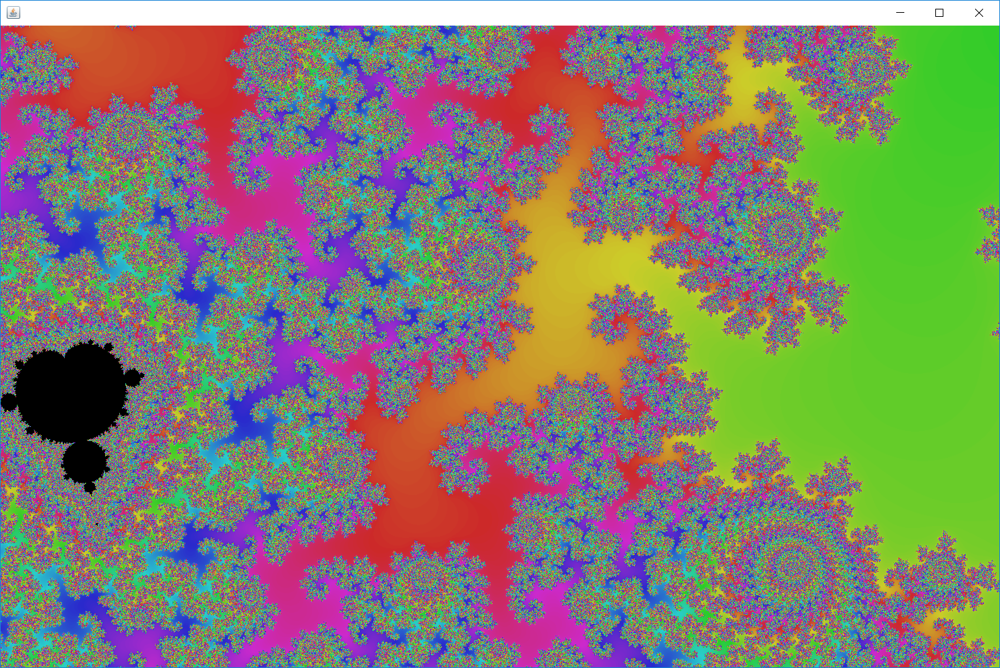
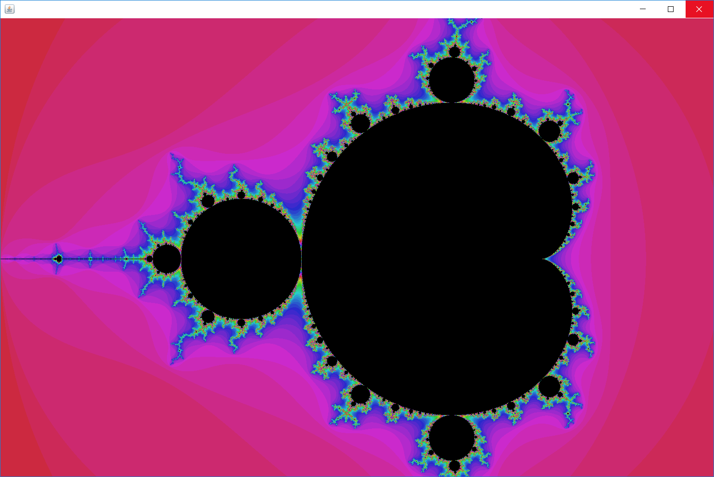

# Mandelbrot-Mengen

Die Mandelbrot-Menge ist definiert als die Menge der komplexen Zahlen c, für welche die Folge $z_{n+1}=z_n^2+c$ 	mit 	 $z_0=0$ für $n \rightarrow \infty$ beschränkt bleibt.

Das bedeutet es gibt [komplexe Zahlen](../../mathe/mathe%20(3)/Komplexe%20Zahlen.md) c für die wird $z$ unendlich (nicht Mandelbrot-Menge) und andere für die bleibt der Wert beschränkt (Mandelbrot-Menge). Die Formel ist eine rekursive Beschreibung und lässt sich einfach Programmieren:

```java
int calc(int n, double xn, double yn, double a, double b)
{
	if ( ((xn*xn + yn*yn) > MAX) /*4: frei gewählte Schranke*/ || (n > MAXITER))
		return n;
		
	double xm =  xn*xn - yn*yn + a;
	double ym = 2*xn*yn + b;
	n++;
	return calc(n, xm, ym, a, b);
}
```

Hier wurde die [komplexe Zahl](../../mathe/mathe%20(3)/Komplexe%20Zahlen.md) in einen Real- (x = Re(z) bzw. a) und einen Imaginärteil (y = Iim(z) bzw. b) aufgespaltet. Das Beispiel wurde in JAVA programmiert um eine grafische Darstellung zu vereinfachen. Die Farbe der Punkte gibt die Anzahl der Iterationsschritte wieder ab denen der [Grenzwert](../../mathe/mathe%20(3)/Grenzwert.md) (MAX) überschritten wird:

|  |  |
| ------------------------------------------------ | ------------------------------------------------ |

