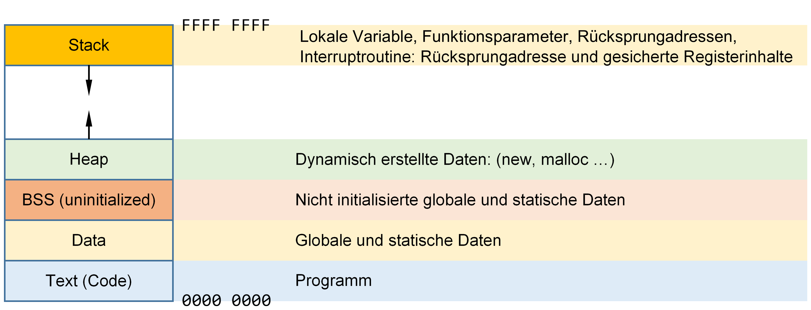
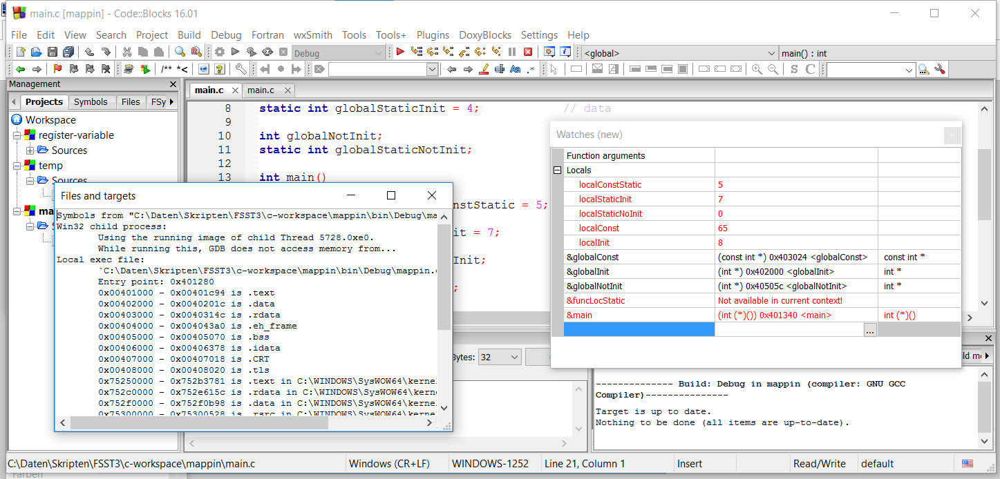

# 10 Speicherorganisation

Es wird nur eine stark vereinfachte Übersicht geboten. Diese Organisation ist Betriebssystemabhängig.

## Allgemein

Einem C-Programm wird bei der Ausführung ein Speicherbereich zugewiesen der sich in verschiedene Teile gliedert.
Unter Windows wird dem Programm ein maximaler Speicherbereich von 2GB zugewiesen (in Linux ebenfalls).
Mehr kann vom Programm nicht verwaltet werden, das Betriebssystem rückt nicht mehr raus (4GB können adressiert werden, 2GB, rund 50% des Speichers werden vom OS für Org. zurückgehalten).
Aus Sicht des Programms ist es ein zusammenhängender Speicher. Aus Betriebssystemsicht kann dieser Speicher auf verschiedene Stellen verteilt sein oder sogar komplett oder zum Teil auf auf eine Festplatte ausgelagert sein. 

Für unser Programm ist dieser Speicher virtuell, als linear adressierbar, zusammenhängender Speicher wahrnehmbar.

Dieser Speicherbereich wird folgendermaßen aufgeteilt:



Mit einer 32 Bit Adresse kann von 0x0 bis `0xFFFF FFFF` adressiert werden.

## Bereiche

### .text

Das eigentliche Program, der Code liegt im untersten Bereich des Speichers. Dieser Speicherbereich kann von mehreren Threads gemeinsam genutzt werden. Aus diesem Grund ist er üblicherweise nur lesbar. Der Inhalt wird beim Programmstart mittels dem Systemaufruf *exec* aufgerufen.

### .data / .rdata

dieser Bereich enthält konstante und/oder statische Daten:

```c
const int globalConst = 2;                  // rdata
const static int globalConstStatic = 2;     // rdata

int globalInit = 3;                         // data
static int globalStaticInit = 4;            // data

int main()
{
  const static int localConstStatic = 5;    // rdata
  static int localStaticInit = 7;           // data
  //...
}
```

Daten die nicht nur global sondern auch noch konstant (const) sind, sind im Bereich .rdata abgelegt (read-only-data). Es gibt jedoch Ausnahmen: wenn die Daten nicht initialisiert werden, dann werden sie im .bss Bereich abgelegt.

### .bss

(block started by symbol/block storage segment). Daten die nicht initialisiert werden, werden im .bss Bereich abgelegt:

```c
int globalNotInit;                          // bss
static int globalStaticNotInit;             // bss

int main()
{
  static int localStaticNoInit;             // bss
  //...
}
```

### stack

Auf dem Stack (Stapel) werden sämtliche andere lokale Variable abgelegt. Weiters Parameter von Funktionen, Rücksprungadressen von Funktionen und Rücksprungadressen und ein Abbild der Register beim Aufruf von Interruptserviceroutinen. Ein Stack funktioniert wie ein LIFO-Speicher (Last-In-First-Out).

```c
int main()
{
  const int localConst = 5;               // stack
  int localInit = 6;                      // stack

  funct(3);

  printf("Hello main!\n");
  return 0;
}

int funct(int param) {                    // funct: text, param: stack
  int funcLoc;							// stack

  printf("Hello funct!\n");
  return 0;
}
```

Beim Aufruf der Funktion **funct()** wird der aktuelle Instruction Pointer ([IP](../../netzwerk-technik/protokolle/Internet%20Protocol.md)) auf dem Stack gespeichert und die Funktion aufgerufen. Der Instruction Pointer ist die Adresse an der sich die Code-Ausführung gerade befindet und wird in einem eigenem Register gespeichert.

Der Stack hat eine begrenzte Größe, wächst und schrumpft während dem Programmverlauf, der Zugriff ist sehr effizient (Zugriff ohne eigenen Zeiger) und muss nicht explizit freigegeben werden.

### heap

Auf dem Heap (Haufen) wird dynamisch angeforderter Speicher abgelegt:

```c
ptr = malloc(10);
```

Mit dieser Anweisung werden 10 Bytes Speicher reserviert und die Adresse des 1ten Bytes an die Variable ptr übergeben (falls der Speicher nicht zur Verfügung gestellt werden kann, wird NULL zurückgegeben).

Der Heap ist vorstellbar als großer Speicherbereich ohne explizite Organisation. Variablen oder Funktionen können hier irgendwo liegen, der Zugriff erfolgt über Pointer die positioniert werden müssen. Um Speicher auf dem Heap verfügbar zu machen, muss er explizit wieder freigemacht werden.

Der Heap kann in gewissen Grenzen beliebig groß werden, dafür ist der Zugriff nicht so effizient wie auf den Heap.

## Debugging (122)

Um eine Speichermap für folgenden Code:

```c
#include <stdio.h>
#include <stdlib.h>

int funct(int param);

const int globalConst = 2;                  // rdata
const static int globalConstStatic = 2;     // rdata

int globalInit = 3;                         // data
static int globalStaticInit = 4;            // data

int globalNotInit;                          // bss
static int globalStaticNotInit;             // bss

int main() {
  const static int localConstStatic = 5;    // rdata
  static int localStaticInit = 7;           // data
  static int localStaticNoInit;             // bss

  const int localConst = 5;                 // stack
  int localInit = 6;                        // stack

  funct(3);

  printf("Hello main!\n");
  return 0;
}

int funct(int param) {                    // funct: text, param: stack
  int funcLoc;							  // stack

  printf("Hello funct!\n");
  return 0;
}
```

 zu erstellen gibt es die Möglichkeit in der Kommandozeile:

```sh
gcc  main.c -o main.exe -Wl,-Map -Wl,main.map
```

In **main.map** wird folgendes abgelegt:

```c
...

Memory Configuration

Name             Origin             Length             Attributes
*default*        0x00000000         0xffffffff

Linker script and memory map
... 
.text           0x00401000     0x2c00
...
                0x00401460                main
                0x0040149d                funct
... 
.data           0x00404000      0x200
...
                0x00404004                globalInit
... 
.rdata          0x00405000      0x400
...
                0x00405064                globalConst
...
.bss            0x00407000       0x7c
...
                0x00407000                _argv
                0x00407004                _argc
...
                0x00407078                globalNotInit
...
```

Anschließend können die Bereiche übersichtlicher dargestellt (<https://sourceware.org/binutils/docs/binutils/size.html>):

``` c
>size -A -x main.exe
main.exe  :
section            size       addr
.text            0x2ba4   0x401000
.data              0x28   0x404000
.rdata            0x30c   0x405000
.eh_frame         0x9bc   0x406000
.bss               0x7c   0x407000
.idata            0x5bc   0x408000
.CRT               0x18   0x409000
.tls               0x20   0x40a000
.debug_aranges     0x38   0x40b000
.debug_info      0x1cff   0x40c000
.debug_abbrev     0x12f   0x40e000
.debug_line       0x1c8   0x40f000
.debug_frame       0x38   0x410000
Total            0x5f6a

```

Um die Adressen von Variablen zu ermitteln (<https://sourceware.org/binutils/docs/binutils/nm.html>):

``` c
>nm main.exe
...
00407004 B __argc
00407000 B __argv
0040707c B __bss_end__
00407000 B __bss_start__
...
00404028 D __data_end__
00404000 D __data_start__
...
00405064 R _globalConst
00405068 r _globalConstStatic
00404004 D _globalInit
00407078 B _globalNotInit
00404008 d _globalStaticInit
00407020 b _globalStaticNotInit
...
00405088 r _localConstStatic.2281
0040400c d _localStaticInit.2282
00407024 b _localStaticNoInit.2283
00401460 T _main
...
```

(um den Assemblercode der Anwendung anzuzeigen kann objdump verwendet werden: `objdump -D -M intel main.exe`)

In **Code::Blocks** gibts die Möglichkeiten (Debug -> Information -> Target&Files):



Im Watches-Fenster kann die Adresse einer Variable mit dem Adressoperator ermittelt werden.

## Speicherlecks - *Memory-Leakage*

Speicherlecks sind DIE Fehler in C/C++ schlechthin. Diese Fehler sind der Grund warum viele andere Sprachen, trotz des enormen Potentials von Pointern auf dieses Konzept verzichten.

Speicherleck: es wird Speicher reserviert und nie wieder frei gegeben. Dadurch ist Speicher reserviert (kann nicht verwendet werden) wird aber nicht mehr verwendet. Der Speicherbedarf der Anwendung ist größer als notwendig. Passiert das in Schleifen kann der Bedarf kontinuierlich wachsen. Für Programme wie sie in der Ausbildung entwickelt werden ist das nicht weiter problematisch. Auch das ist mit ein Problem, die Sache wird nicht wahrgenommen. Dadurch übt sich eine gewisse *Schlampigkeit* ein. In einer Anwendung die dann tatsächlich dauerhaft zur Anwendung kommt tritt der Fehler dann in Form von seltsamen Abstürzen auf. Ein typischer Fall ist eine Serveranwendung die ständig läuft. Der Ursache für den Absturz ist im nachhinein sehr schwer zu erkennen.

```c
for (int i = 0; i < 10; i++)
	int *a = (int*)malloc(8); // Reserve Mem for 2 Integer-Values
free(a);							   // Free Mem of last 2 Integer-Values
```

Hier wird Platz für 10x2 Integer-Werte reserviert aber nur der Speicher für 2 Integer-Werte freigegeben. Dieses Beispiel ist sehr offensichtlich, deutlich schwerer wird die Sache wenn die Anwendung regelmäßig zwischen reservieren und freigeben des Speichers eine Exception auslöst und daher der Speicher nicht freigegeben wird.

> [!success] Lösung 1: Speicher nicht dynamisch reservieren.

> [!success] Lösung 2: Sauber arbeiten + Debuggen

### Valgrind in CLion

Es gibt zahlreiche Tools die unterstützen Speicherlecks zu finden. Ein sehr gutes und bei weitem das bekannteste ist *Valgrind*. Problem: das gibt's nicht für Windows.

> [!success] Lösung:
> WSL ein Windows-Linux-Subsystem. Sehr ähnlich wie eine virtuelle Maschine ist das Linux-Subsystem. Allerdings ist es keine vollständig virtuell laufendes OS (samt Kernel) sondern lediglich ein auf Betriebssystem-Schnittstellen aufgesetzte Kompatibilitätsschicht. Dadurch ist es sehr schnell und für Entwickler im MS-Bereich kann sehr einfach und effizient auf Linux-Tools zugegriffen werden und für Linux getestet werden.

(Howtos: install of WSL)

## Referenzen

- Top Einführung
  https://www.youtube.com/watch?v=KjAh0tIisYc