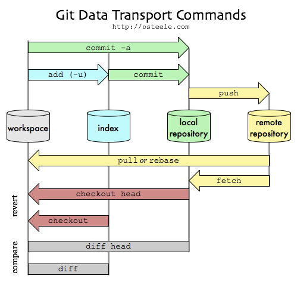
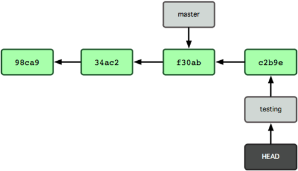
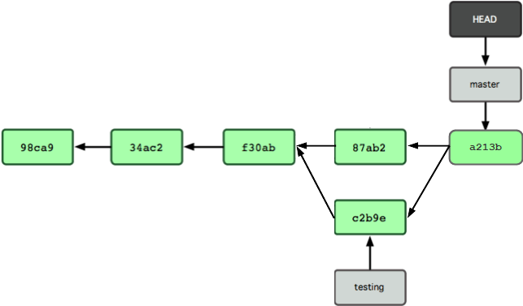

# 1 Git - Allgemeines

## Einführung

Git ist eine Versionsverwaltung.

Wikipedia: <Eine Versionsverwaltung ist ein System das zur Erfassung von Aenderungen an Dokumenten oder Dateien verwendet wird>

In der Softwareentwicklung kann damit die chronologische Entwicklung einer Software verwaltet werden. Gerade in der Softwareentwicklung ist das wichtig, weil:

- oftmals vorhergehende Softwarestände wiederhergestellt werden sollen, etwa um eine erfolglose Veränderung/Erweiterung rückgängig zu machen.
  Häufig sollen Softwarestände wiederhergestellt werden die an Kunden ausgeliefert wurden, vielleicht um für die entsprechende Version Veränderungen oder Korrekturen einbauen zu können.
- für parallele Entwicklungen (mit mehreren/vielen Softwareentwickler) werden definierte Softwarestände benötigt um aufgeteilt an verschiedenen Teilen arbeiten zu können und sie anschließend wieder zusammenführen zu können.

Es gibt viele verschiedene Versionsverwaltungssysteme (SCM-Systeme). Zwei sehr grundlegende Unterschiede verschiedener SCM-Systeme:

- Versionsgeschichte wird auf einem zentralen Server gespeichert. In einer lokalen Version wird lediglich eine Kopie eines einzigen Standes abgelegt. 
  Git: Demgegenüber gibt es Systeme in denen auf jedem Client lokal eine komplette Versionsgeschichte abgelegt ist. Dabei gibt es den Server dann eigentlich nur für die Synchronisierung zwischen den verteilten Clients.
- Speichern von Unterschieden zwischen zwei Versionen (spart Speicher). In Git: es sind für jede Version die kompletten Daten vorhanden.

Sehr anschauliche Erklärung:  [https://git-scm.com/book/de/v1/Los-geht%E2%80%99s-Git-Grundlagen](https://git-scm.com/book/de/v1/Los-geht's-Git-Grundlagen) 

## Tools

- Notwendig ist ein Server um das SCM zu hosten. Dieser kann selber aufgesetzt werden. Alternativ stehen viele unterschiedliche Hosting-Anbieter zur Verfügung:
  https://git.wiki.kernel.org/index.php/GitHosting

- Ein Client. Um mit Git arbeiten zu können wird lokal ein Client benötigt, es gibt eine enorme Fülle von Tools, die einfachsten sind Konsolenbasiert, etwa Git-For-Windows:

  https://git-scm.com/download/win

  In sehr vielen Linux-Distributionen ist Git schon inkludiert, also keine Installation notwendig.
  
  Auch mit graphischer Unterstützung sind viele Tools verfügbar:
  https://git-scm.com/downloads/guis/

Da das Arbeiten mit Git aktuell sehr populär ist, gibt es eine Vielzahl an Dokumentation für die Arbeit im Internet (siehe Referenzen).

## Gitlab

### Vorbereitung

Für *GitLab* wird ein SSH-Schlüssel benötigt. Dafür muss, wenn ein für einen neu angelegten Benutzer ein neues Projekt erstellt wird, ein Schlüssel generiert und eingegeben werden. Dazu:

- SSH-Schlüssel erzeugen mittels `ssh-keygen` in der Kommandozeile. Dabei wird ein passender Schlüssel in `c:\users\xxxxxx\.ssh\id_rsa.pub` generiert (in aktuellen Versionen von Windows 10 ist OpenSSH als APP direkt aktivierbar).
- Alternativ dazu kann zum Beispiel im Windows-Explorer im Kontext-Menü des .Git-Verzeichnisses Git-Gui gestartet werden und darin in Help->Show SSH ein Key generiert werden.
- Dieser Key wird komplett kopiert und in Gitlab unter User Settings->SSH-Keys eingefügt.

### Projekt Teilen

Beim Erstellen eines Projekts wird das Projekt auf *private* gesetzt. Dadurch wird das Projekt nicht automatisch für jedermann zugreifbar.

Wird ein Projekt mit jemanden geteilt wird in den Projekteinstellungen unter Members der entsprechende Anwender für das aktuelle Projekt dazugefügt. Dabei kann der Anwender mittels Gitlab-User oder einer Mail-Adresse angeführt werden. Dabei wird auch die Rolle eingestellt: https://docs.gitlab.com/ee/user/permissions.html

Für Benutzer die Code auch verändern können sollen ist zumindest die Rolle *Reporter* notwendig (via Branch und Merge - Details siehe Link). Um direkt im *main*-Branch Änderungen tätigen zu können muss zumindest die Rolle *Maintainer* zugeteilt sein.

## Übersicht

Ein **Repository** (kurz Repo) ist ein Container, in welchem die zu verwaltende Software abgelegt ist.

Lokal ist ein Repo das auf dem eigenen Rechner abgelegt wird. Dieses **lokale Repo** ist kein unter unterschiedlichen Nutzern geteiltes Repo.

Ein **Remote Repo** ist eines, von welchem lokale Repos kopiert werden können, oder in welche lokale Repos abliefern können.

1. Ein Lokales Repo besteht grundsätzlich aus 3 Teilen:

   - die **Arbeitskopie** (workspace): echte Dateien, diese können in der Kommandozeile oder einem Explorer angezeigt werden. Hier wird editiert/gearbeitet.
   - der **Index**: nur eine *virtuelle Zwischenstufe*. Mit `git add <name>` können Arbeitskopien hier registriert werden.
   - und der **Head** (im Bild "local repository"): zeigt auf den letzten Commit (freigegebene Version). Mit `git commit -m "Infotxt"` werden die Index-Dateien im Head registriert (sind noch immer nur lokal).

   Vom lokalen Repo aus wird das Remote Repo als **origin** (Ursprung) bezeichnet.

   

2. Im einfachsten (üblichen) Fall hat ein lokales Repo genau ein Remote-Repo. Das Remote-Repo ist über seine Adresse erreichbar. Um einfacher darauf zugegriffen werden kann, wird dem Remote-Repo ein kurzer Name gegeben. Für den erwähnten, einfachen, üblichen Fall wird dieses Repo **Origin** (Ursprung) genannt.
   Jeder Pfad der Versionierung hat eine Bezeichnung. Der Hauptpfad heißt **main**. Die Idee: die Entwicklung verläuft linear auf dem *main*-Pfad. Dieser Hauptpfad wird bei der Erstellung eines Repos automatisch erstellt. Wenn immer eine parallele Entwicklung (gleichzeitig unterschiedliche Features) gewünscht ist, wird ein **branch** (Zweig) mit einem gewählten Namen erzeugt. Um zwischen branches umzuschalten: `checkout myBranch` oder zurück `checkout main`

## Projekt Erstellen

Ein Projekt kann auf *GitLab* einfach (menügeführt) erstellt werden. Beim Einstellen wird der Name des Projekts (Beispiel *myRepo*) angegeben und dass das Projekt privat (Zugreifen dürfen nur explizit Eingeladene) ist (Alternative: öffentlich - beliebige *GitLab*-Besucher dürfen Zugreifen). Mit der Erstellung eine Projekts in *GitLab* wird automatisch ein Remote-Repo mit dem Projekt-Namen erzeugt.

- Für das lokale *Commiten* von Versionen müssen lokal diese Einstellungen getroffen werden:

  ```
  git config --global user.name "myName"
  git config --global user.email "pre.post@yahoo.com"
  ```

  Mit der Angabe *--global* werden die Einstellungen für sämtliche Projekte auf dem verwendeten Rechner getroffen. Soll ein lokales Repo gesonderte Einstellungen haben, dann wird diese mit *--local* getroffen. 

- Noch ohne Bezug zu einem Remote-Repo kann ein vorhandenes Verzeichnis als lokales Git-Repo definiert werden. Gerade wenn lokal schon ein Projekt gestartet wurde und dieses gleich Remote abgeliefert werden sollen, direkt im lokalen Arbeitsverzeichnis:

  ```
  git init
  ```

  Dadurch wird das Verzeichnis *.git* angelegt (durch den führenden Punkt ist das Verzeichnis unsichtbar).

  Um dieses Verzeichnis mit einem schon vorhandenen Remote-Repo zu verbinden:

  ```
  cd c:\myRepo
  git init
  git remote add origin https://gitlab.com/myGitUser/myRepo.git
  git add .
  git commit -m "Initial commit"
  git push -u origin main
  ```

  mit `git remote add` wird das Remote-Repo (hier *myRepo*) angegeben (anschließend verfügbar als *origin*). *myGitUser* stellt hier den GitLab-Benutzer dar, der das Projekt erstellt hat (hat nichts mit den Daten oben zu tun). Ein Remote-Repo kann auf drei Arten angegeben werden:

  - *https://gitlab.com/myGitUser/myRepo.git*	https-Protokoll, es wird nach den Verbindungsparametern gefragt
  - *http://gitlab.com/myGitUser/myRepo.git*	http-Protokoll, es wird nach den Verbindungsparametern gefragt
  - *git@gitlab.com:myGitUser/myRepo.git*	*GitLab*-Protokoll, mittels ssh kann eine RSA-geschützte Verbindung aufgebaut werden

  Mit `git add .` werden sämtliche im Verzeichnis befindliche Dateien in den *Index* *gestagt*, mit `git commit -m "..."` ins lokale Repo *commitet*. Diese Schritte sind natürlich nur dann notwendig, wenn vorhandene Dateien mitgenommen werden sollen.

- Alternativ kann ein schon vorhandenes Remote-Repo als Start für ein lokales Repo verwendet werden (gerade wenn Remote schon Dateien gehostet sind). Dazu wird lokal ein Verzeichnis erstellt und darin ausgeführt:
   ```
   git clone https://gitlab.com/usr/myProj ./
   ```


Mit `git add .` wird der aktuelle Inhalt des lokalen Arbeitsverzeichnisses ins Repo mitgenommen. Die oben (in der Abbildung) angeführte Option `-u` (update) kopiert geänderte Dateien und entfernt gelöschte Elemente. Allerdings fügt es dann nicht neue Elemente dazu. Um nicht sämtliche Dateien eines Verzeichnisses in ein Repo mitzunehmen können diese exkludiert werden (eine IDE generiert oft temporäre Arbeitsdateien):

- nur *sinnvolle* Dateien ins Repo nehmen etwa mit`git add *.c`.  Temporäre Ablagen oder Dateien die während dem Compilieren erzeugt werden sollen nicht versioniert werden (log-Dateien ...).

- *sinnlose* Dateien ausnehmen. Dazu muss im Pfad die Datei *.gitignore* erzeugt werden und mit den Ausnahmen eingetragen werden:

  ```
  $ cat .gitignore
  
  # Werden beim Build erstellt:
  */Release/*
  */Release/*/*
  */Release/*/*/*
  */Release/*/*/*/*
  */Release/*/*/*/*/*
  */Release/*/*/*/*/*/*
  
  # wird beim Build erstellt
  *.mk
  
  # logs werden ignoriert ausser der .gitkeep-Datei
  /logs/*
  !logs/.gitkeep
  ```

- Für einen zyklisches Upload (manuell) kann ein Skript *upload_to_gitlab.bat* erstellt werden:

  ```
  git add *.c
  git add *.h
  git commit -m "... cyclic update ..."
  git push origin main
  pause
  ```

  Wichtig ist dabei natürlich, dass das Repo mittels *GitLab*-Protopkoll und ssh konfiguriert ist, ansonsten muss jedes mal eine Legitimierung angegeben werden (Benutzer/Kennwort).

- Update vom Remote-Repo an lokales Repo: wenn Remote-Repo-Änderungen direkt in die lokale Arbeitskopie gemergt werden sollen, kann das mit `git pull` erfolgen. Wenn die Änderung manuell in die lokale Arbeitskopie erfolgen soll, dann kann die Remote-Version mittels `git fetch` geholt werden. Die Änderungen können mit `git diff origin/main` geprüft werden.

- Erstellen einer speziellen Commit-Version. Jeder Commit wird durch einen Hash-Wert unterschieden. Um einen speziellen Commit wiederherzustellen wird der gesamte Baum geklont und anschließend die gewünschte Version ausgecheckt:

   ```
  git clone https://gitlab.com/usr/gitintro_counter ./
  ```
  
   Mit ./ wird direkt ins aktuelle Verzeichnis geklont. Anschließend ein Checkout:
  
      git checkout 983e5ca
  
   Damit wird auf den speziellen Commit gestellt.

## Version erstellen

Eine Datei in der lokalen Arbeitskopie wird verändert. Um diese Datei in den Index zu übernehmen (*stagen*):

```
 git add adc_conf.c
```

Im Nächsten Schritt wird die Datei in den Head übernommen (*commiten*)

```
 git commit -m "LED input moved" adc_conf.c
```

Mit jedem Commit wird eine neue Version erstellt und **main** um Eins weiter geschoben. Zur Unterscheidung von Versionen wird jedem Element ein Hash zugeordnet:


Gleichzeitig zeigt ein zweiter Zeiger ebenfalls auf dieses letzte Element, der **Head**-Zeiger. Die in der Übersicht angeführte Parameter `-a`  inkludiert den Add-Schritt, fügt aber keine neu eingefügten Dateien ein.

Wenn eine Nicht-Commitete (geadded) Version gelöscht werden soll:

```
 git stash
 git stash drop
```

Mit *stash* können Nicht-Commitete Elemente auf einem Stack gespeichert werden und aus dem lokalen Arbeitsbereich gelöscht werden um evtl. andere Versionen pullen zu können. Mit `git stash list` können diese *Stashes* angezeigt und mit `git stash apply ` wieder *gemerget* werden. Explizites Löschen eines *Stashes*: `git stash drop stash@{0}`.

Damit ein Versions-Verlauf ein wenig besser dargestellt wird gibt es eine graphische Darstellung des lokalen Baumes:

```
 git log --graph --decorate --pretty=oneline --abbrev-commit
```

Darstellung des Remote-Verlaufs:

```
 git log --graph --decorate --pretty=oneline --abbrev-commit origin
```

(Um die Version auch in das Remote-Repo zu übernehmen muss sie noch gepusht werden)

## Verzweigung

Nehmen zwei Entwickler gleichzeitig von der gleichen Version ausgehend Änderungen vor, dann wird vom Hauptzweig abgezweigt (**branch**). Grundsätzlich empfiehlt sich das auch, wenn nur ein Entwickler alleine eine Änderung vornimmt. Am Ende der Entwicklung bringt der Entwickler seine Änderung (der kann aus mehreren Commits bestehen) wieder in den Hauptpfad ein (**merge**).

Erstellen eines Zweigs (branch) mit Namen *testing*:

   ```
git branch testing
   ```


Der Branch-Zeiger *testing* zeigt auf die gleiche Version wie *main*. Bemerkenswert ist, dass *Head* trotzdem noch auf *main* zeigt (im Hauptpfad). Erst mit *checkout* wechselt *Head* auf den *testing*-Pfad:

```
git checkout testing 
```


Dadurch wird erkennbar: *main* ist immer im Hauptpfad, *Head* ist der letzte Commit, der kann auch in einem Abzweig sein.

Mit einem weiteren *Commit* verändert sich der Baum wie folgt:

   ```
git commit -m "Änderung auf c2b9e"
   ```




Head bewegt sich im aktiven Pfad (durch *Checkout* auf *testing*) weiter. *main* bleibt im Hauptpfad. Für das *Pushen* eines *Commits* (damit die Teilversionen auch auf dem Remote-Repo landen):

```
git push -u origin testing
```

(wird in der Abbildung nicht gezeigt)

Erst mit einem erneutem *Checkout* kann in den Hauptpfad gewechselt werden:

   ```
git checkout main
   ```


Ein weiterer *Commit* in diesem Hauptpfad verursacht:

   ```
git commit -m "Änderung auf 87ab2"
   ```

   

   

   Mit einem **merge** von *testing* ist die Folgeversion des *testing*-Pfades wieder im Hauptpfad.

   ```
git merge testing
   ```

   

## Geteiltes Arbeiten

Für die Entwicklung in einem Team ist es hilfreich, wenn ein Teammitglied für die Integration in den *main*-Branch verantwortlich ist. Andere Mitglieder haben höchstens *Developer*-Rechte und können damit zwar Branches anlegen aber nicht *mergen*. Wenn ein Branch in den *main*-Branch *gemergt* werden soll dann muss der Entwickler an einen Maintainer einen **Merge-Request** senden. Dazu wird in *GitLab* unter *New* ein entsprechender Request abgesetzt. Wichtig dabei:

- Senden an den korrekten Empfänger
- In der Nachricht notwendige Information übermitteln - gerade wenn für die Integration ein gewisser Aufwand notwendig ist, muss berücksichtigt werden, dass der Maintainer eventuell mit den Änderungen nicht sehr vertraut ist.

Aus der Kommandozeile (nicht ganz üblich) kann ebenfalls ein Merge-Request abgesetzt werden. Dazu muss als zu Mergende Version eine Version wie folgt gepushed werden:

```
git push -o merge_request.create
```

## Tagging

Sollen *Commit*-Versionen besonders gekennzeichnet werden, erfolgt das mit sogenannten **Tag**s. Etwa werden im Verlauf einer SW-Entwicklung manche Versionen an Kunden abgeliefert und bekommen Versionsnummern. Um eine beliebige Version in einem lokalen Repo zu taggen:

```
git tag -a "V2.4" -m "Meine Version vom 2.3.2017" b75dc1c
```

Damit wird der *Commit* b75dc1c getaggt (kann weggelassen werden wenn die aktuelle Version *getaggt* werden soll).

Mit *-a* wird der Name des Tags angegeben.
Mit *-m* wird eine zusätzliche (optionale) Beschreibung mit angeführt

Tags werden mit einem normalen *Push* nicht automatisch mit Übertragen. Sie müssen manuell mit übertragen werden (wird als *Tag-Sharing* bezeichnet). 

```
git push origin "v2.4"
```

Damit wird das Tag *v2.4*  vom Lokalen-Repo auf das Remote-Repo kopiert.

Zum Klonen einer expliziten Version eines Remote-Repos mit Hilfe des obigen *Tags* v2.4 in das aktuelle Verzeichnis (User: usr):

```
git clone --branch v2.4 https://gitlab.com/usr/gitintro_rechner.git ./
```

Das Löschen eines Tags auf dem Remote-Repo erfolgt via Benutzeroberfläche. Lokal:

```
>git tag --delete V1.0
```

## Git-Server

Das Erstellen eines eigenen Git-Servers ist relativ einfach, eine direkte Anleitung für Windows:

[https://medium.com/@piteryo7/how-to-set-up-git-server-on-local-network-windows-tutorial-7ec5cd2df3b1](https://medium.com/@piteryo7/how-to-set-up-git-server-on-local-network-windows-tutorial-7ec5cd2df3b1)

Für Linux (inklusive Setup für SSH-Verbindung):

https://www.linux.com/tutorials/how-run-your-own-git-server/

## Git im Unterricht

- Erstellen Sie ein lokales Verzeichnis für den Unterricht

  ```
  mkdir c:\lieblingsOrdner
  ```

- Klonen des Unterrichtsordners in das lokale Verzeichnis (eigenes Namenskürzel *xyza*):

  ```
  c:\lieblingsOrdner> git clone https://gitlab.com/fosy/ ....     ./
  git config --global user.name xyza
  git config --global user.email xyza@htuu-salzburg.ac.at
  ```

- Der main-Branch wird zur Verfügung gestellt. Darin sind Skripten, Aufgaben und Anleitungen enthalten. Mit dem Klonen wurde dieser main-Branch kopiert.

- Legen Sie einen Branch mit Ihrem Namenskürzel *xyza* an. In diesen Branch werden Ihre Entwicklungen abgeliefert.

  ```
  git branch xyza
  git checkout xyza
  ```

- Um die Vorgaben aktuell zu halten, muss der main-Branch up-to-date gehalten werden (z.B. nach Aufforderung oder vor dem Unterricht):

  ```
  git checkout main
  git pull origin main
  ```

- Um Teile aus dem main-Branch in den eigenen Branch zu übernehmen (in diesem Fall etwa den Ordner Aufg04):

  ```
  git checkout xyza
  git checkout main Aufg04
  ```

- Lösen einer Aufgabe hat folgenden Vorgang:

  ```
  git checkout xyza
  
  
  ... Einbau der Änderungen ...
  
  
  git add .
  git commit -m "Loesung Aufgabe 04"
  git push origin xyza
  ```

- Stöbern auf dem main-Branch:

  ```
  git checkout origin/main
  ```

  Damit ist lokal der main-Branch verfügbar, vor jedem Arbeiten wieder auf eigenen Branch wechseln:

  ```
  git checkout xyza
  ```

- Zurücksetzten des eigenen lokalen Ordners auf die letzte Ablieferung - damit gehen sämtliche lokale Änderungen verloren:

  ```
  git checkout xyza
  git reset --hard origin/xyza
  ```

## Kurz

1. Erstellen eines Remote-Repos und eines dazu passenden lokalen Repos:
   - auf *GitLab*-Projekt erstellen (*myProject*)
   - lokal einen Ordner auswählen in welchem das lokale Repo liegen soll
   - Für User myUser: `git clone https://gitlab.com/myUser/myProject.git ./` 
    (mit SSH: `git@gitlab.com:myUser/myProject.git ./`)
   
2. Lokale Veränderungen nach Remote übernehmen
   - als Beispiel wurde die Datei *myFile.txt* lokal bearbeitet
   - Datei vom Arbeitsverzeichnis in den Index *stagen*: `git add myFile.txt`
   - Datei vom Index in den Head *commiten* (vor dem aller ersten Mal:`git config ...`) : `git commit -m "myFile verändert" myFile.txt`
   - Datei vom Head in das Remote-Repo übernehmen: `git push -u origin main`
   
3. Remote Veränderung übernehmen, sofern lokal noch keine Veränderung seit dem letzten Push erfolgte:

  `git pull -u origin main`

4. Branching: um einen Zweig zu erstellen mit dem Namen *newFeature*

   - `git checkout -b newFeature` (-b: nacheinander `git branch` und `git checkout`)
   - zum Rückwechseln auf den main-Pfad:`git checkout main`
   - Zum Branch löschen `git branch -d newFeature`
   - Zum Hochladen des lokal erstellten Branch: `git push origin newFeature`

5. Merge

   - `git merge <branch>` zum Zusammenführen des aktuellen Branches (zuletzt mit *Checkout* gewählt) mit \<branch\>. 

6. Ältere Commit Version vom remote Repo auf lokalen Repo wiederherstellen (alles lokale wird Gelöscht/Überschrieben):

   - `git reset --hard c05c20be` die angeführte Nummer ist der SH des Commits. Am Remote-Repo bleibt alles gleich.

7. Änderung einer lokalen Datei auf dem *Workspace* (ohne *stage* und *commit*) rückgängig machen (aus dem lokalen Repo):

   ```
   git restore main.cpp
   ```

8. Anzeigen von allen Branches:

   ```
   git branch
   * main
   ```

9. Ändern der *Commit*-Beschreibung nach dem *Commit*

   ```
   git commit --amend -m "New Message"
   ```

10. Prüfen des Unterschieds lokales- und Remote-Repo:

   ```
   > git fetch origin main
   From gitlab.com:username/myproject
    * branch            main     -> FETCH_HEAD
   
   > git diff FETCH_HEAD
   ```

   *fetch* holt *main* von *origin* als *FETCH_HEAD*.

11. Umschalten auf den *FETCH_HEAD* Status:

    ``` 
    > git fetch origin main
    From gitlab.com:username/myproject
     * branch            main     -> FETCH_HEAD
    
    > git checkout FETCH_HEAD
    ```

    und zurück:

    ```
    git checkout main
    ```

12. Ein Lokales Repo zurücksetzen (alle lokalen Änderungen gehen verloren):

    ```
    git fetch --all
    git reset --hard origin/main
    ```

13. Wechsel zwischen unterschiedlicher Remote-Versionen:

    ```
    git checkout origin/main
    git checkout origin/testbranch
    ```

    Unabhängig davon wo die lokale Konfiguration steht wird auf die entsprechende Remote-Version gewechselt.

## Referenzen

- Einführung Versionsverwaltung - Git:

  [mittwald](https://www.mittwald.de/blog/webentwicklung-design/webentwicklung/versionsverwaltung-einfuhrung-in-git-teil-1)

- Sehr anschauliche Einführung git:
  [https://se.ewi.tudelft.nl/ti3115tu-2018/resources/01-git-and-gitlab.pdf](https://se.ewi.tudelft.nl/ti3115tu-2018/resources/01-git-and-gitlab.pdf)
  http://www-cs-students.stanford.edu/~blynn/gitmagic/intl/de/ch01.html

- Ein erster Überblick / Cheatsheet:

  [rogerdudler](https://rogerdudler.github.io/git-guide/index.de.html)

- Interaktive, sehr anschauliche Übersicht:
  [git-cheatsheet](http://ndpsoftware.com/git-cheatsheet.html)

- Online Git-Doku:
  [git-scm](https://git-scm.com/book/de/v1/Git-Grundlagen)
  
- Eigener Git-Server (deutsche Anleitung):
  
  [git-scm:Git-auf-dem-Server](https://git-scm.com/book/de/v1/Git-auf-dem-Server)
  [nullpointer](http://www.nullpointer.at/2011/10/15/howto-der-eigene-git-server-mit-gitosis/)
