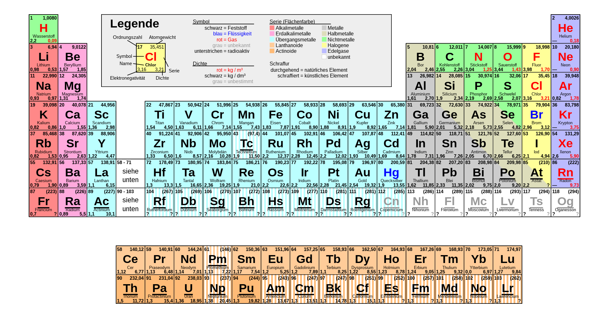
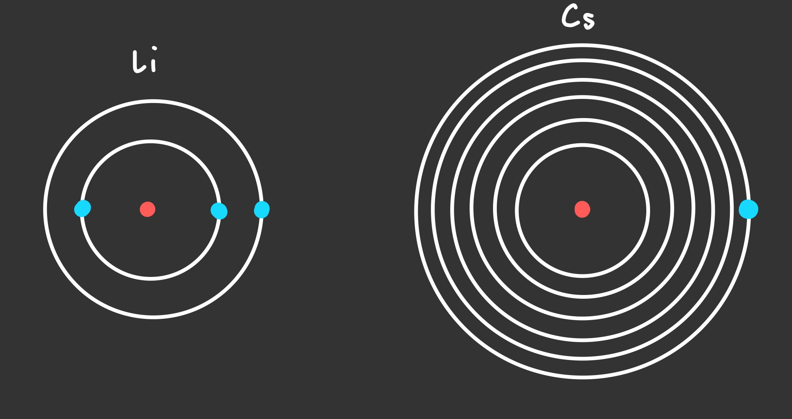

# Periodensystem der Elemente (PSE)

Das PSE ist eine Tabelle, in der die Symbole aller bekannten Elemente nach der Anzahl der Protonen geordnet sind.  

## Ordnungsprinzipien des PSE

### 1. Ordnungszahl (OZ):

Protonenzahl (Kernladungszahl)

### 2. Perioden: **Zeilen** im PSE

- Elemente einer Periode weisen die gleiche Zahl von $e^{-}$ [Schalen](Orbitalmodell.md) auf.
- Entsprechend den 7 [Schalen](Orbitalmodell.md) (K-Q), gibt es 7 Perioden.
- $e^{-}$ sind nach dem Aufbauprinzip ([Orbitalmodell](Orbitalmodell.md)) auf die energieärmsten Orbitale verteilt.

### 3. Gruppen

- Elemente die **untereinander stehen** (senkrechte Spalten)
- Elemente einer Gruppe haben **gleiche [Valenzelektronen](Valenzelektronen.md)**
- haben daher **ähnlichen chem. Eigenschaften**

| Gruppe | [Valenzelektronen](Valenzelektronen.md) |
| ------ | -------------------- |
| 1      | 1                    |
| 2      | 2                    |
| 13     | 3                    |
| 14     | 4                    |
| 18     | 8                    |

Die Gruppen 1, 2, 13-18 nennt man Hauptgruppen.

Bei den Elementen der Hauptgruppen (HG) (I-VIII) befinden sich die [Valenzelektronen](Valenzelektronen.md) in sund p-Orbitalen, die zusammen $8 e^{-}$ aufnehmen können.

Diese Elemente der Nebengruppen (Übergansmetalle) werden d-Orbitale der 2. äußersten [Schale](Orbitalmodell.md) aufgefüllt.  
Diese $d-e^{-}$ können ebenso wie die $s-e^{-}$ [Valenzelektronen](Valenzelektronen.md) sein.

Bei den Elementen der Lanthanoide (seltene Erden) und Actinoide (Transurane) werden f-Orbitale der 3. äußersten [Schale](Orbitalmodell.md) aufgefüllt.

>

## Hauptgruppen

- Gruppen (I-VIII)
- zuletzt eingebaute $e^{-}$ befinden sich sich soder p-Orbitale-
- links Metalle
- rechts Nichtmetalle / Halbmetalle (siehe oben)

| Hauptgruppe | Name                          |
|:-----------:| ----------------------------- |
|      1      | Alkalimetalle +H              |
|      2      | Erdalkalimetalle              |
|      3      | Erdmetalle                    |
|      4      | Kohlenstoff-Gruppe (C-Gruppe) |
|      5      | Stickstoff-Gruppe (N-Gruppe)  |
|      6      | Chalkogene (Erzbildner)       |
|      7      | Halogene (Salzbildner)        |
|      8      | Edelgase                      |

Aus dem Atombau lassen sich einige Eigenschaften der Elemente ableiten.
1. Elemente mit 8 [Valenzelektronen](Valenzelektronen.md) (2 bei He) sind chem. besonders stabil. (Edelgase)
2. Elemente sie nicht 8 [Valenzelektronen](Valenzelektronen.md) besitzen, haben das Bestreben einer Achterschale ("Edelgaskonfiguration"). Oktettregel 
3. Elemente mit wenigen [Valenzelektronen](Valenzelektronen.md) geben Elektronen ab.  
   Neutrale Atome werden zu positiv geladenen [Kationen](Ionenbindung.md)  
   $Na\longrightarrow Na^{+}+e^{-}$  
   $Mg\longrightarrow Mg^{2+}+2e^{-}$  
   $Al\longrightarrow Al^{3+}+3e^{-}$  
   Elemente die [Kationen](Ionenbindung.md) bilden sind Metalle und stehen links im PSE

4. Elemente mit vielen [Valenzelektronen](Valenzelektronen.md) nehmen $e^{-}$ auf.  
   Neutrale Atome werden zu negativ geladenen [Anionen](Ionenbindung.md)  
	$F+e^{-}\longrightarrow F^{-}$ (Fluoridion)  
	$O+2e^{-}\longrightarrow O^{2-}$ (Oxidion)  
	Elemente die [Anionen](Ionenbindung.md) bilden sind Nichtmetalle und stehen rechts im PSE.
5. Halbmetalle stehen auf der Diagonale von linkt oben nach rechts unten.  
	Es gibt keine scharfe Trennung zwischen [Metall](Metallbindung.md) und Nichtmetall. Dies hängt von der Modifikation ab.  
	z.B.: Diamant (Kristallin)  
	Graphit (schichtweiser Aufbau)

# Tendenzen im PSE

## Atomradius

>
- Atomradius nimmt von links nach rechts **ab**:  
Innerhalb einer Periode werden Atome kleiner, weil die Anziehungskräfte zwischen Kern und $e^{-}$ Hülle immer Stärker werden.  
  $\rightarrow$ Orbitalkontraktion
   

## Metallcharakter

>
- Metalle sind Elemente mit hoher Leitfähigkeit.
- $e^{-}$ müssen locker sitzen.
- Dies ist bei größeren Atomen der Fall: stehen links und weiter unten im PSE.

>

## Ionisierungsenergie (IE)

>
- Jene Energie die notwendig ist, um ein $e^{-}$ vom Atom abzutrennen.
- Metalle (große Atome) sind leichter Ionisierbar.
- $Cs$ braucht weniger *IE* als $Li$.

## Elektronenaffinität (EA)

>
- Jene Energie die man benötigt$_{1)}$ oder erhält$_{2)}$, sodass ein $e^{-}$ hinzugefügt wird.
1. $Na$
2. $F$  
Die höchste *EA* hat Fluor.  
Edelgase haben keine Tendenz, $e^{-}$ aufzunehmen.

## Elektronegativität (EN)

Die EN kennzeichnet das Bestreben der Atome, $e^{-}$ **in einer Bindung** anzuziehen
>

*EN*-Skala nach [Linus Pauling](https://de.wikipedia.org/wiki/Periodensystem#Elektronegativit%C3%A4t) (S. 218 NW-Buch)
- Die EN von $F=4.0$
- $F_{2}$ ist das elektronegativste Element
- $Cs$ ist das elektropositivste Element

---

# Tags

[Orbitalmodell](Orbitalmodell.md)

[Wikipedia Entry](https://de.wikipedia.org/wiki/Periodensystem)